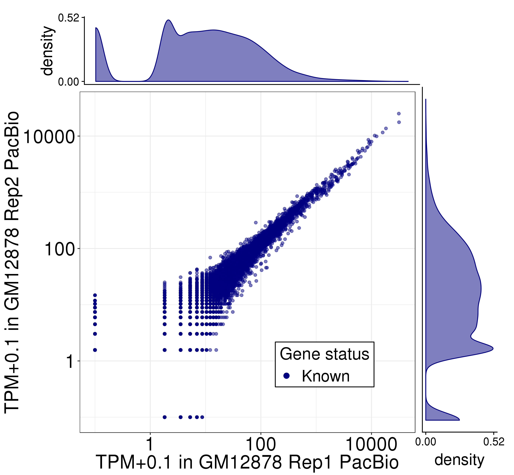
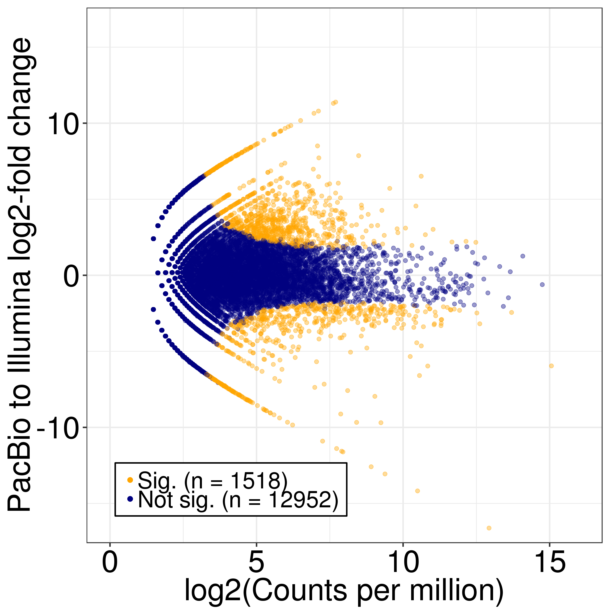
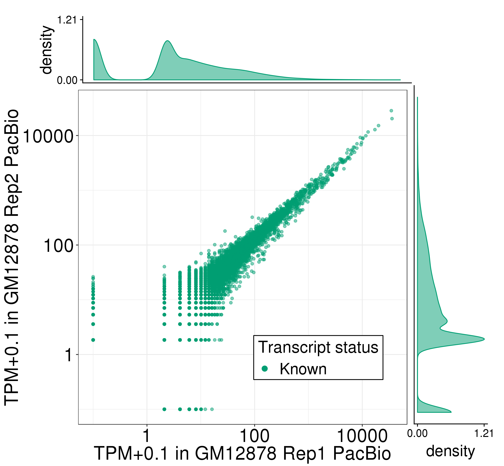
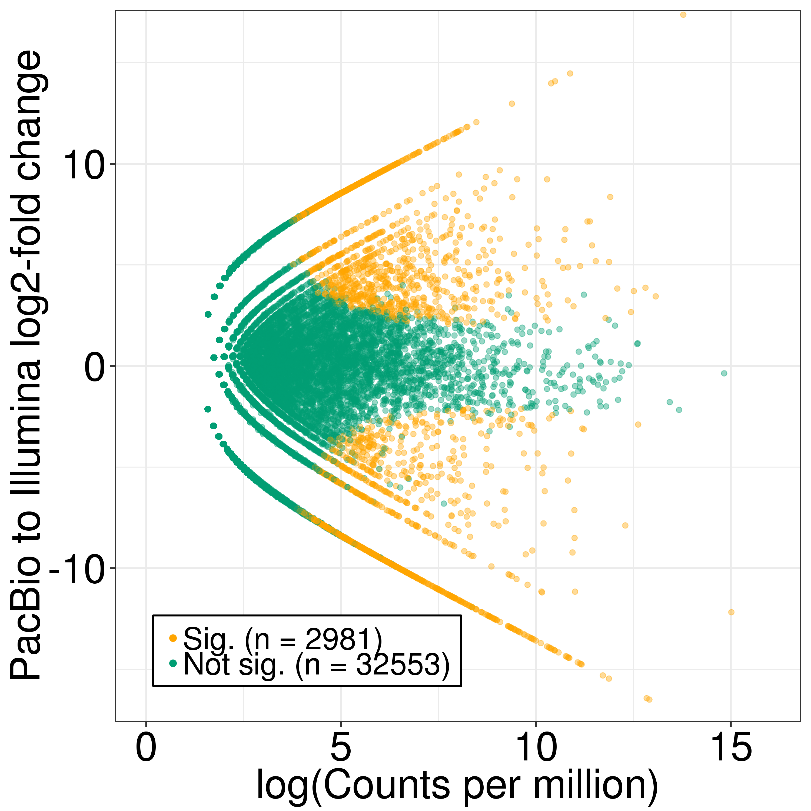

# Figure 2: Performance of TALON on PacBio transcripts from ENCODE human tier 1 cell lines.

Files/paths used to generate the panels of this figure:
```bash
PLOTPATH=../plotting_scripts

abundance=S3_GM12878_talon_abundance.tsv
filt_abundance=S4_GM12878_talon_abundance_filtered.tsv
tier1_filt_abundance=S17_full_gencode_v29_pb_talon_abundance_filtered.tsv
gtf=S15_full_gencode_v29_pb_tracks_talon.gtf
kallisto1=../Illumina/GM12878/Kallisto/Rep1/abundance.tsv
kallisto2=../Illumina/GM12878/Kallisto/Rep2/abundance.tsv
```
Abundance and GTF files are available as supplementary tables of the TALON paper. The Kallisto short-read abundance files are available directly from this repository at the provided relative paths.

Software versions:
* R v3.5.1

## Panel A: Expression level of known genes (GENCODE v29) in each biological replicate of GM12878
```bash
Rscript ${PLOTPATH}/plot_longread_gene_expression_corr.R \
          --f ${abundance} \
          --color blue \
          --d1 PacBio_GM12878_1 \
          --d2 PacBio_GM12878_2 \
          --celltype GM12878 \
          --d1_type 'Rep1 PacBio' \
          --d2_type 'Rep2 PacBio' \
          -o .
```


 Pearson and Spearman correlations are recorded in PacBio_GM12878_1-PacBio_GM12878_2_gene_correlations.txt.

## Panel B: Proportion of genes expressed in Illumina RNA-seq data of GM12878 that are also detected in the PacBio GM12878 data, binned by Illumina expression level 
```bash
Rscript ${PLOTPATH}/plot_detection_by_TPM_for_datasets.R \
         --f ${abundance} \
         --datasets PacBio_GM12878_1,PacBio_GM12878_2 \
         --ik1 ${kallisto1} \
         --ik2 ${kallisto2} \
         --color blue \
         --dtype PacBio \
         -o .
```


## Panel C: Comparison of gene expression levels for known genes in the PacBio and Illumina RNA-seq platforms (GM12878)
```bash
Rscript ${PLOTPATH}/longread_v_illumina_genes_edgeR.R \
         --f ${abundance} \
         --datasets PacBio_GM12878_1,PacBio_GM12878_2 \ 
         --ik1 ${kallisto1} \
         --ik2 ${kallisto2} \
         --color blue \
         -o .
```


## Panel D: Number of distinct transcript isoforms observed in each novelty category (GM12878)
```bash
Rscript ${PLOTPATH}/plot_novelty_categories_distinct_isoforms.R \
         --f ${filt_abundance} \
         --datasets PacBio_GM12878_1,PacBio_GM12878_2 \
         --o .
```


## Panel E: Expression level of known transcript models in each biological replicate of GM12878
```bash
Rscript ${PLOTPATH}/plot_longread_transcript_expression_corr.R \
         --f ${filt_abundance} \ 
         --d1 PacBio_GM12878_1 \
         --d1_type 'Rep1 PacBio' \
         --d2 PacBio_GM12878_2 \
         --d2_type 'Rep2 PacBio' \
         --celltype GM12878 \
         -o .
```

Correlations are in PacBio_GM12878_1-PacBio_GM12878_2_Known_transcript_correlations.txt. 

## Panel F: Expression of transcript models in each biological replicate of GM12878, labeled by their novelty assignments
```bash
Rscript ${PLOTPATH}/plot_longread_transcript_expression_corr.R \
         --f ${filt_abundance} \
         --d1 PacBio_GM12878_1 \
         --d1_type 'Rep1 PacBio' \
         --d2 PacBio_GM12878_2 \
         --d2_type 'Rep2 PacBio' \
         --celltype GM12878 \
         --ISM --NIC --NNC --antisense --intergenic \
         -o .

```

Correlations are in PacBio_GM12878_1-PacBio_GM12878_2_Known-ISM-NIC-NNC-Antisense-Intergenic_transcript_correlations.txt.

## Panel G: Comparison of known transcript expression levels in the PacBio and Illumina RNA-seq platforms (GM12878 Rep 1 and 2). 
```bash
Rscript ${PLOTPATH}/longread_v_illumina_transcripts_edgeR.R \
         --f ${filt_abundance} \
         --datasets PacBio_GM12878_1,PacBio_GM12878_2 \
         --ik1 ${kallisto1} \
         --ik2 ${kallisto2} \
         --color green \
          -o . 

```


## Panel H: Total number of PacBio reads assigned to each novelty category after transcript filtering
Rscript ../plotting_scripts/plot_novelty_category_read_counts.R \
         --f ${filt_abundance}  \
         --datasets PacBio_GM12878_1 \
         --o .


## Panel I: Visualization of PacBio-derived custom GTF annotations in the UCSC genome browser for ENCODE tier 1 cell lines. 

Make abundance bar plots for TCF3 transcripts (for genome browser plot):
```
Rscript ${PLOTPATH}/plot_expression_for_genome_browser.R \
        --f ${tier1_filt_abundance} \
        --groups groups.csv \
        --transcripts TCF3_transcript_names.txt \
        -o .
```

The resulting plot was combined manually with a UCSC genome browser screenshot to create Figure 2i. The bars from left to right are in the same order as the transcript names in TCF3_transcript_names.txt. The groups.csv file provides the dataset groupings needed to average expression values by cell line.
 
