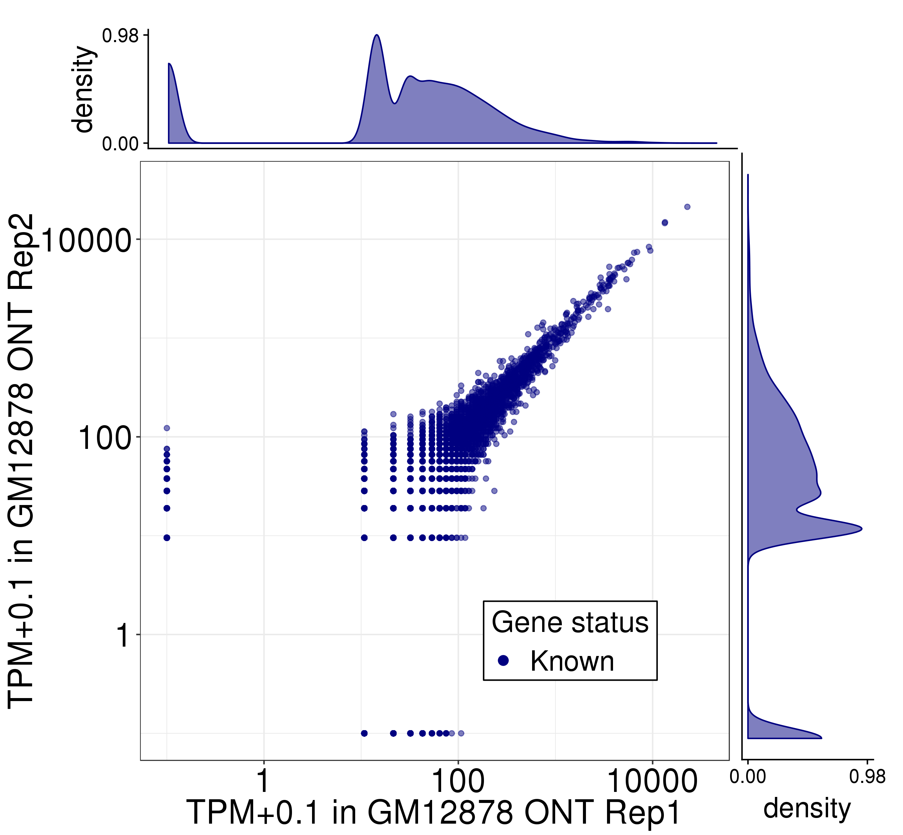
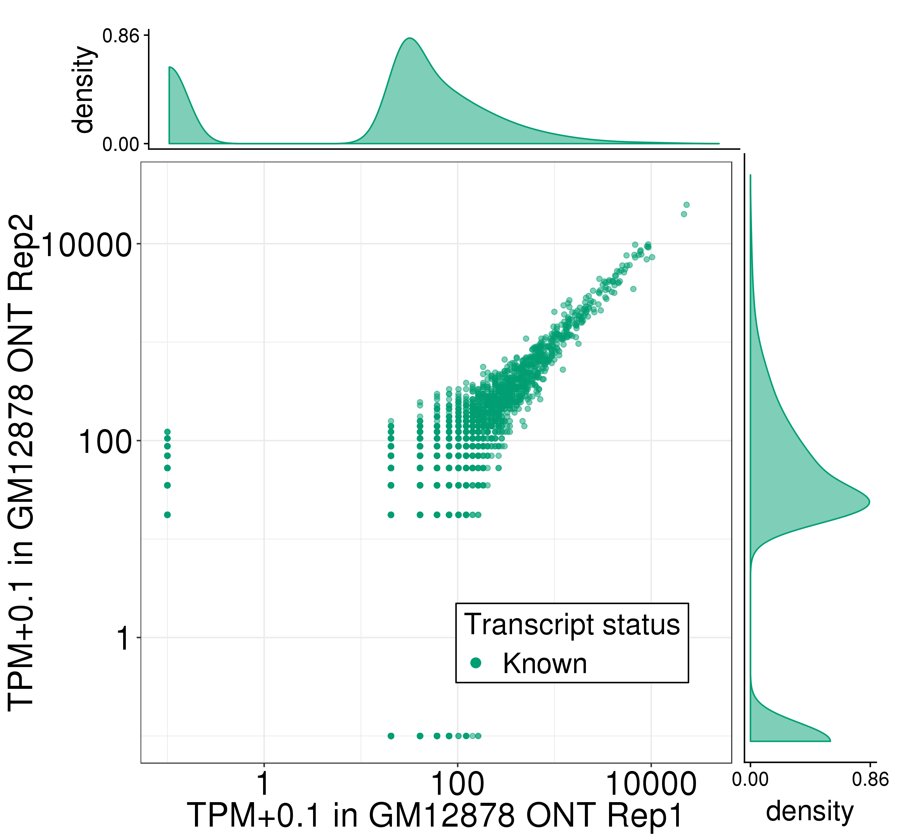
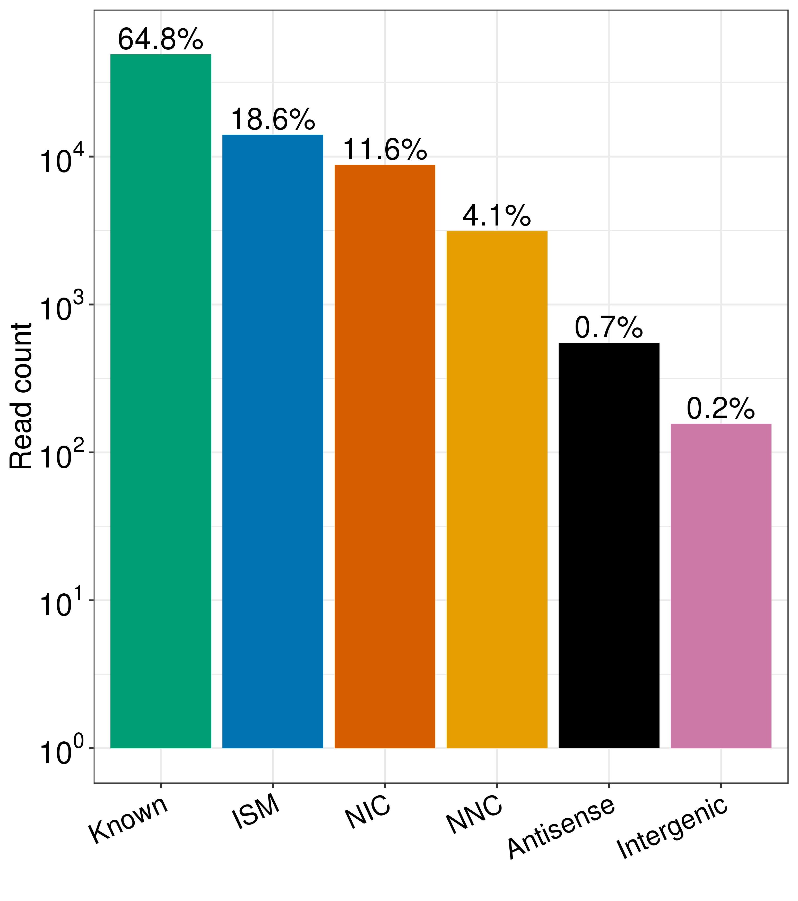
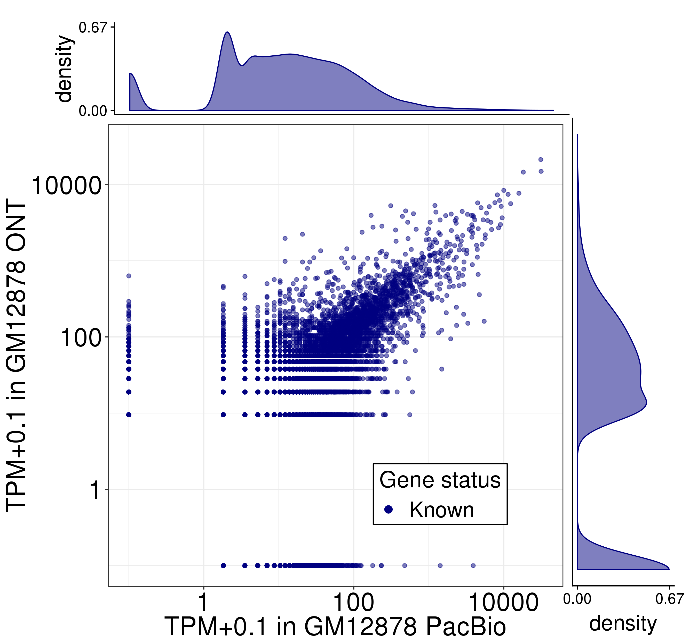
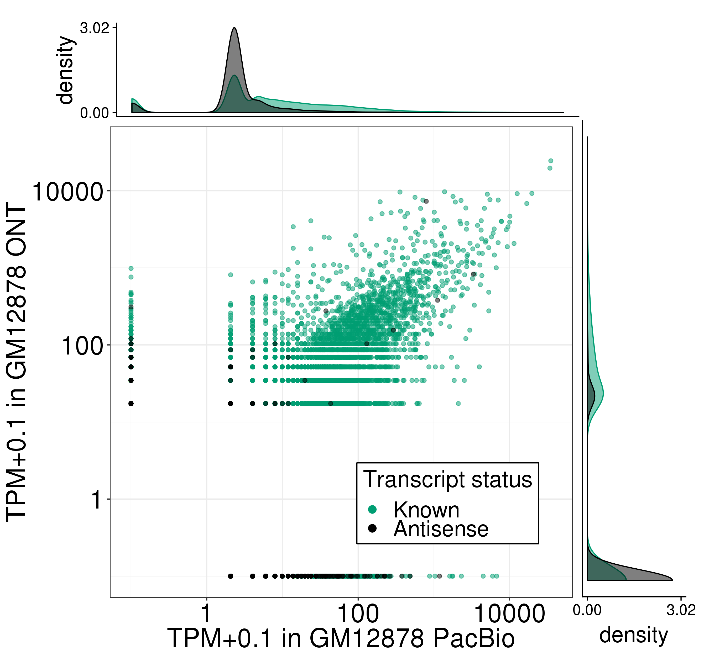

# Figure 3: Comparison of Oxford Nanopore direct RNA-seq transcriptome with Pacbio transcriptome in GM12878.

Files/paths used to generate the panels of this figure:
```bash
PLOTPATH=../plotting_scripts

abundance=S19_GM12878_ont_talon_abundance.tsv
filt_abundance=S20_GM12878_ont_talon_abundance_filtered.tsv
tier1_filt_abundance=S32_full_gencode_v29_ont_talon_abundance_filtered.tsv
gtf=S30_full_gencode_v29_ont_tracks_talon_observedOnly.gtf

# for pb vs. ont plots
pb_ont_abundance_filtered=S28_full_gencode_v29_pb_ont_talon_abundance.tsv
```
Abundance and GTF files are available as supplementary tables of the TALON paper. 

Software versions:
* R v3.5.1

## Panel A: Expression level of known genes (GENCODE v29) in each biological replicate of GM12878 in Oxford Nanopore
```bash
Rscript ${PLOTPATH}/plot_longread_gene_expression_corr.R \
          --f ${abundance} \
          --color blue \
          --d1 ONT_GM12878_1 \
          --d2 ONT_GM12878_2 \
          --celltype GM12878 \
          --d1_type 'Rep1 ONT' \
          --d2_type 'Rep2 ONT' \
          -o .
```


 Pearson and Spearman correlations are recorded in ONT_GM12878_1-ONT_GM12878_2_gene_correlations.txt.

## Panel B: Expression level of known transcript models in each biological replicate of GM12878 in Oxford Nanopore
```bash
Rscript ${PLOTPATH}/plot_longread_transcript_expression_corr.R \
         --f ${filt_abundance} \
         --d1 ONT_GM12878_1 \
         --d1_type 'Rep1 ONT' \
         --d2 ONT_GM12878_2 \
         --d2_type 'Rep2 ONT' \
         --celltype GM12878 \
         -o .
```

Correlations are in ONT_GM12878_1-ONT_GM12878_2_Known_transcript_correlations.txt. 

## Panel C: Total number of Oxford Nanopore reads assigned to each novelty category after transcript filtering
```bash
Rscript ${PLOTPATH}/plot_novelty_category_read_counts.R \
         --f ${filt_abundance}  \
         --datasets ONT_GM12878_1 \
         --o .
```


## Panel D: Number of distinct transcript isoforms observed in each novelty category (Oxford Nanopore GM12878)
```bash
Rscript ${PLOTPATH}/plot_novelty_categories_distinct_isoforms.R \
         --f ${filt_abundance} \
         --datasets ONT_GM12878_1,ONT_GM12878_2 \
         --o .
```


## Panel E: Expression level of known genes (Gencode v29) models in GM12878 as quantified using PacBio (x) and Oxford Nanopore (y)
```bash
Rscript ${PLOTPATH}/plot_longread_gene_expression_corr.R \
         --color blue \
         --f ${pb_ont_abundance_filtered} \
         --d1 PacBio_GM12878_1 \
         --d1_type 'PacBio' \
         --d2 ONT_GM12878_2 \
         --d2_type 'ONT' \
         --celltype GM12878 \
         -o .
```

Correlations are in PacBio_GM12878_1-ONT_GM12878_2_Known_transcript_correlations.txt. 

## Panel F: Expression level of known and antisense transcript (Gencode v29) models in GM12878 as quantified using PacBio (x) and Oxford Nanopore (y)
```bash
Rscript ${PLOTPATH}/plot_longread_transcript_expression_corr.R \
         --f ${pb_ont_abundance_filtered} \
         --d1 PacBio_GM12878_1 \
         --d1_type 'PacBio' \
         --d2 ONT_GM12878_2 \
         --d2_type 'ONT' \
         --celltype GM12878 \
         --antisense \
         -o .
```

Correlations are in PacBio_GM12878_1-ONT_GM12878_2_Known-Antisense_transcript_correlations.txt.

<!-- ## Panel I: Visualization of ONT-derived custom GTF annotations in the UCSC genome browser for ENCODE tier 1 cell lines. 

Make abundance bar plots for XRCC5 transcripts (for genome browser plot):
```
Rscript ${PLOTPATH}/plot_expression_for_genome_browser.R \
        --f ${tier1_filt_abundance} \
        --groups groups.csv \
        --transcripts TCF3_transcript_names.txt \
        -o .
```

The resulting plot was combined manually with a UCSC genome browser screenshot to create Figure 2i. The bars from left to right are in the same order as the transcript names in TCF3_transcript_names.txt. The groups.csv file provides the dataset groupings needed to average expression values by cell line.
  -->
