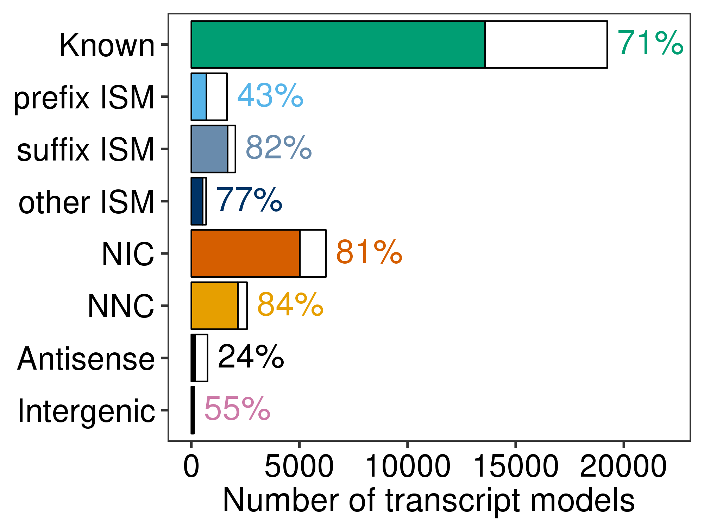
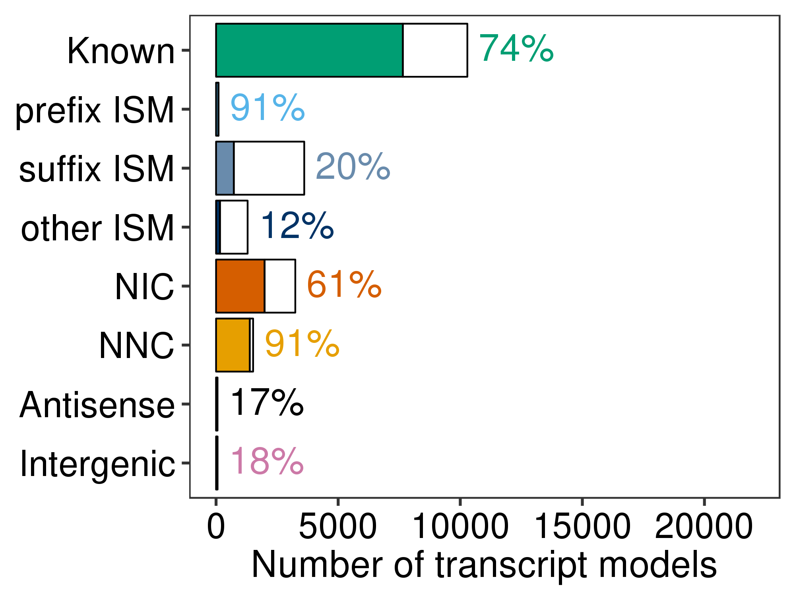
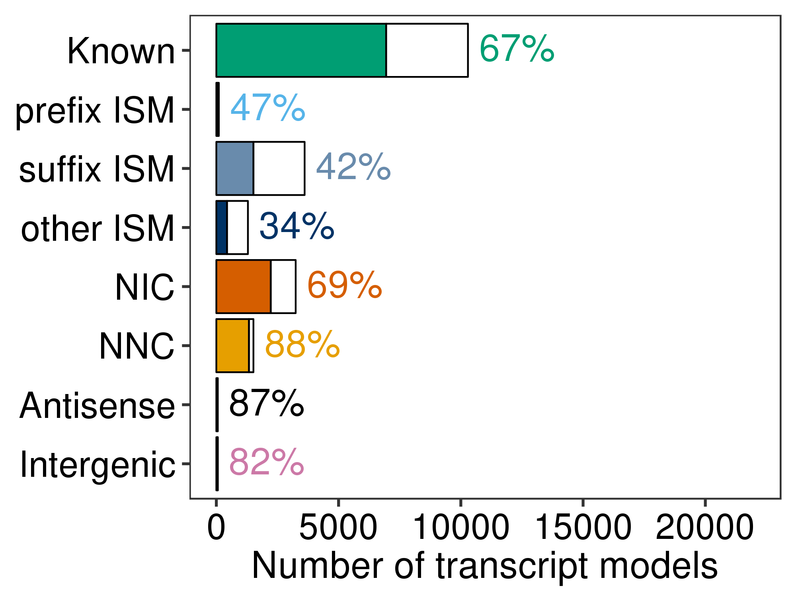

# Figure 4: 5' and 3' completeness by novelty category

Files/paths used to generate the panels of this figure:
```bash
PLOTPATH=../plotting_scripts
OUTPLOTS=plots
mkdir -p ${OUTPLOTS}

data_dir=/share/crsp/lab/seyedam/share/TALON_paper_data/revisions_10-19/human_TALON/analysis/supplementary_tables/
PB_GTF=$data_dir/S2_GM12878_talon_observedOnly.gtf
ONT_GTF=data_dir/S18_GM12878_ont_talon_observedOnly.gtf
CAGE=../CAGE/data/FANTOM5/hg38_CAGE.bed
RNAPET=../RNA-PET/data/GM12878_hg38.bed
GENOME=../refs/hg38/hg38.fa
```
GTF files are available as supplementary tables of the TALON paper.  
To obtain FANTOM5 CAGE data, please see instructions at https://github.com/dewyman/TALON-paper-2019/blob/master/CAGE  
To obtain ENCODE RNA-PET data, please see instructions at https://github.com/dewyman/TALON-paper-2019/tree/master/RNA-PET  
Use this script to get the reference genome: https://github.com/dewyman/TALON-paper-2019/blob/master/refs/download_and_index_human_genome.sh. 

Software versions:  
* Python 3.7.2
* Pyfasta 0.5.2 
* Bedtools v2.27.1
* R v3.5.1

## Panel A: Percentage of TALON transcript models with CAGE support for their 5' end by novelty category (GM12878 PacBio)
```bash
source activate mypython3.7.2
OUT=CAGE/PacBio_GM12878
mkdir -p ${OUT}
python ../CAGE/run_CAGE_analysis.py \
        --gtf ${PB_GTF} \
        --cage ${CAGE} \
        --maxdist 100 \
        --o ${OUT}/GM12878

Rscript ${PLOTPATH}/plot_support_by_novelty_type.R \
    --f ${OUT}/GM12878_CAGE_results.csv \
    --t CAGE \
    --novelty ${OUT}/transcript_beds/GM12878_novelty.csv \
    --splitISM \
    --ymax 22000 \ 
    -o ${OUTPLOTS}/GM12878_PacBio
```


## Panel B: Percentage of TALON transcript models with a poly(A) motif identified at their 3' end (GM12878 PacBio)
```bash
OUT=PAS-comp/PacBio_GM12878
mkdir -p ${OUT}
python ../PAS-computational/run_computational_PAS_analysis.py \
        --gtf ${PB_GTF} \
        --genome ${GENOME} \
        --maxdist 35 \
        --o ${OUT}/GM12878

Rscript ${PLOTPATH}/plot_support_by_novelty_type.R \
    --f ${OUT}/GM12878_polyA_motif.csv \
    --t PAS-comp \
    --novelty ${OUT}/transcript_beds/GM12878_novelty.csv \
    --ymax 22000 \
    --splitISM \
    -o ${OUTPLOTS}/GM12878_PacBio

```


## Panel C: Percentage of TALON transcript models with RNA-PET support for their 5'-3' end pair (GM12878 PacBio)

```bash
OUT=RNA-PET/PacBio_GM12878
mkdir -p ${OUT}
python ../RNA-PET/run_RNA-PET_analysis.py \
    --gtf ${PB_GTF} \
    --rnapet ${RNAPET} \
    --maxdist 100 \
    --o ${OUT}/GM12878

Rscript ${PLOTPATH}/plot_support_by_novelty_type.R \
    --f ${OUT}/GM12878_RNA-PET_results.csv \
    --t RNA-PET \
    --novelty ${OUT}/transcript_beds/GM12878_novelty.csv \
    --ymax 22000 \
    --splitISM \
    -o ${OUTPLOTS}/GM12878_PacBio
```


## Panel D: Percentage of TALON transcript models with CAGE support for their 5' end by novelty category (GM12878 ONT)
```bash
OUT=CAGE/ONT_GM12878
mkdir -p ${OUT}
python ../CAGE/run_CAGE_analysis.py \
        --gtf ${ONT_GTF} \
        --cage ${CAGE} \
        --maxdist 100 \
        --o ${OUT}/GM12878

Rscript ${PLOTPATH}/plot_support_by_novelty_type.R \
    --f ${OUT}/GM12878_CAGE_results.csv \
    --t CAGE \
    --novelty ${OUT}/transcript_beds/GM12878_novelty.csv \
    --splitISM \
    --ymax 22000 \
    -o ${OUTPLOTS}/GM12878_ONT
```


## Panel E: Percentage of TALON transcript models with a poly(A) motif identified at their 3' end (GM12878 ONT)
```bash
OUT=PAS-comp/ONT_GM12878
mkdir -p ${OUT}
python ../PAS-computational/run_computational_PAS_analysis.py \
        --gtf ${ONT_GTF} \
        --genome ${GENOME} \
        --maxdist 35 \
        --o ${OUT}/GM12878

Rscript ${PLOTPATH}/plot_support_by_novelty_type.R \
    --f ${OUT}/GM12878_polyA_motif.csv \
    --t PAS-comp \
    --novelty ${OUT}/transcript_beds/GM12878_novelty.csv \
    --ymax 22000 \
    --splitISM \
    -o ${OUTPLOTS}/GM12878_ONT

```


## Panel F: Percentage of TALON transcript models with RNA-PET support for their 5'-3' end pair (GM12878 ONT)
```bash
OUT=RNA-PET/ONT_GM12878
mkdir -p ${OUT}
python ../RNA-PET/run_RNA-PET_analysis.py \
    --gtf ${ONT_GTF} \
    --rnapet ${RNAPET} \
    --maxdist 100 \
    --o ${OUT}/GM12878

Rscript ${PLOTPATH}/plot_support_by_novelty_type.R \
    --f ${OUT}/GM12878_RNA-PET_results.csv \
    --t RNA-PET \
    --novelty ${OUT}/transcript_beds/GM12878_novelty.csv \
    --ymax 22000 \
    --splitISM \
    -o ${OUTPLOTS}/GM12878_ONT
```

