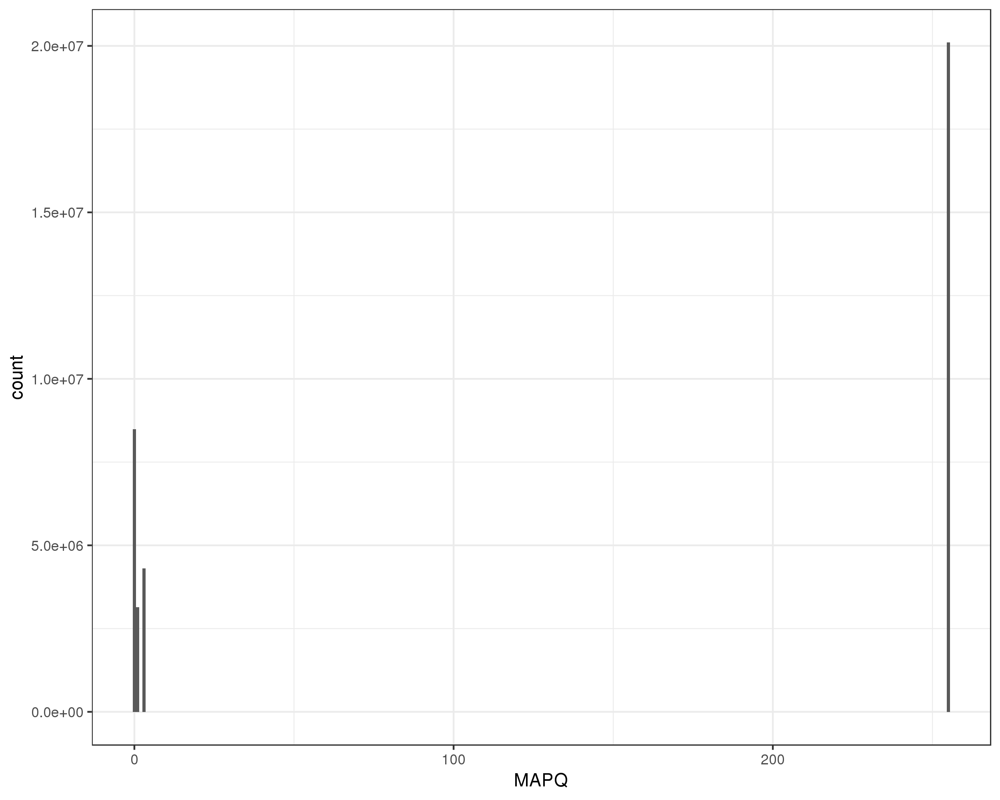

# PAS-seq
We compared the 3' ends of our long-read transcripts to data from the PAS-seq assay in order to validate them.

## Data
K562 PAS-seq data was provided by the Spitale lab.
```
./download_PAS-seq.sh
```

## Analysis
Reads were mapped using STAR
```
./map_PAS-seq_reads.sh
```
After some discussion, we elected to use all of the aligned reads in the downstream analysis. But here are notes on a MAPQ score analysis that can be used to choose a filtering threshold in other cases:
```
module load samtools
samtools view data/mapped_PAS/PAS_Aligned.out.sam | awk '{print $5}' > data/mapped_PAS/MAPQ_scores.csv
Rscript plot_MAPQ_distribution.R --f data/mapped_PAS/MAPQ_scores.csv --o data/mapped_PAS/MAPQ_scores.png
```
According to the STAR manual,
* MAPQ 255 indicates a uniquely mapped read  
* int(-10*log10(1- 1/Nmap)) is used for multimappers  
Plotting the ditribution of MAPQ scores in the reads, we obtained the following:

Filtering example:
```
samtools view -Sq 255 data/mapped_PAS/PAS_Aligned.out.sam > data/mapped_PAS/filt_PAS_Aligned.out.sam
```
