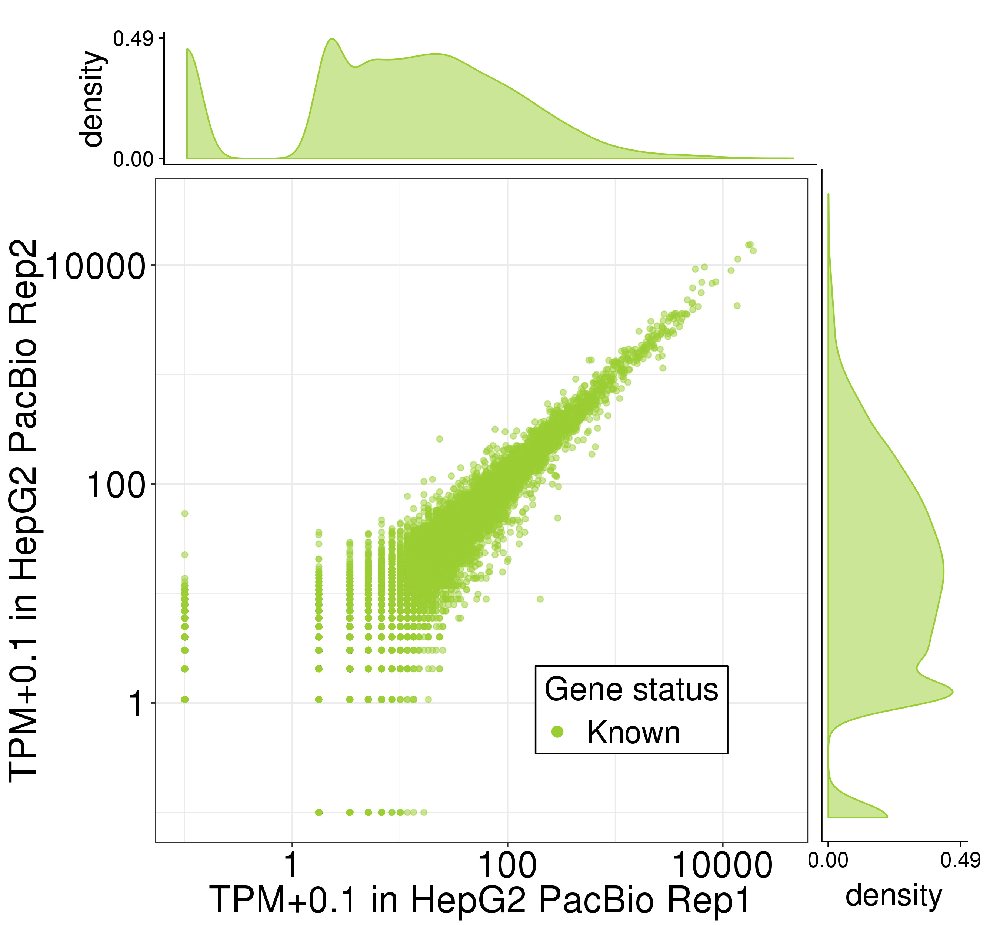
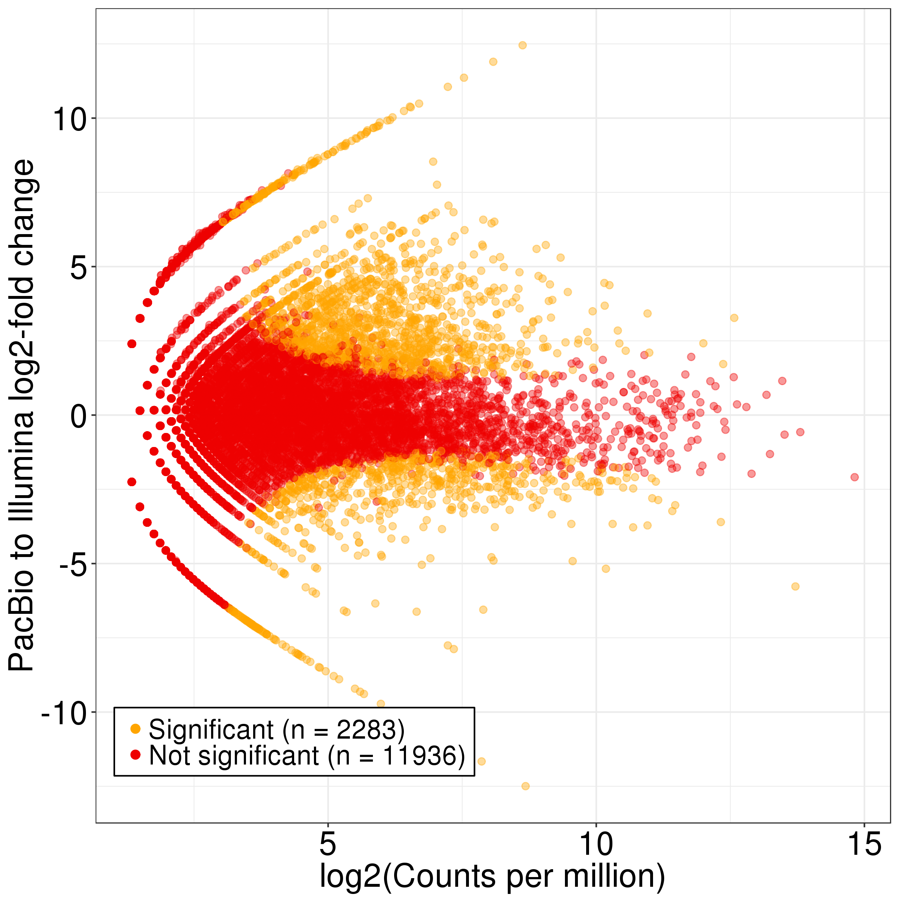
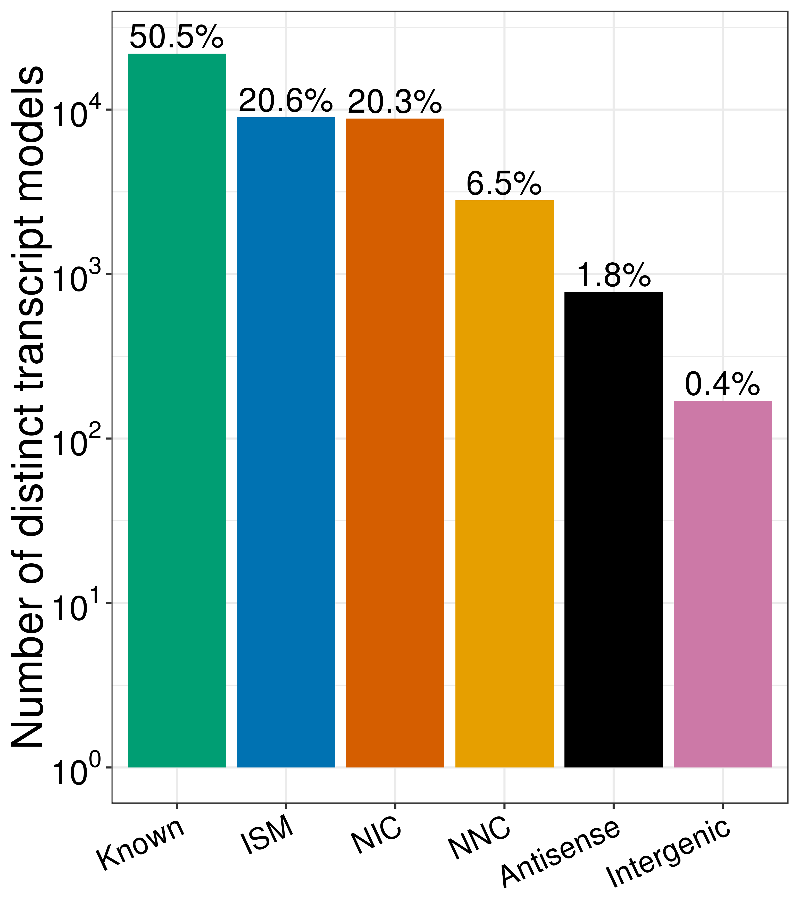
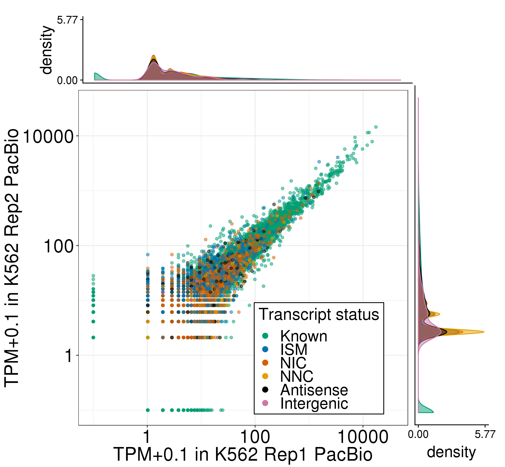
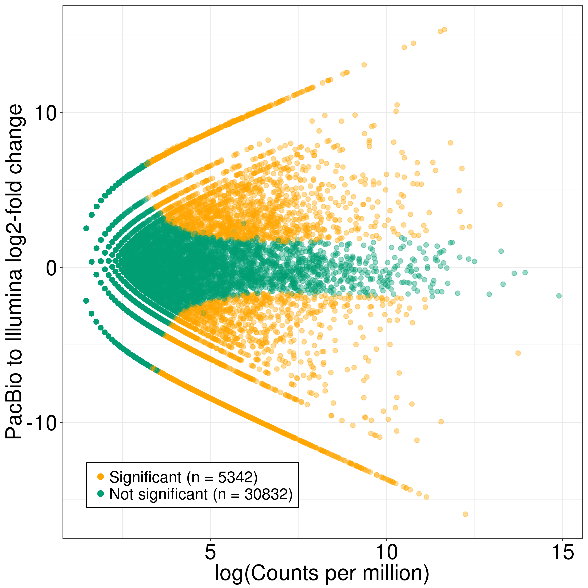

# Figure S3: HepG2 and K562 TALON PacBio gene quantification and expression

Files/paths used to generate the panels of this figure:
```bash
mkdir figures

PLOTPATH=../plotting_scripts

hepg2_abundance=S6_HepG2_talon_abundance.tsv
hepg2_filt_abundance=S7_HepG2_talon_abundance_filtered.tsv
hepg2_kallisto1=../Illumina/HepG2/Kallisto/Rep1/abundance.tsv
hepg2_kallisto2=../Illumina/HepG2/Kallisto/Rep2/abundance.tsv

k562_abundance=S9_K562_talon_abundance.tsv
k562_filt_abundance=S10_K562_talon_abundance_filtered.tsv
k562_kallisto1=../Illumina/K562/Kallisto/Rep1/abundance.tsv
k562_kallisto2=../Illumina/K562/Kallisto/Rep2/abundance.tsv

tier1_filt_abundance=S17_full_gencode_v29_pb_talon_abundance_filtered.tsv
```
Abundance and GTF files are available as supplementary tables of the TALON paper. 

Software versions:
* R v3.5.1

## Panel A: Expression level of known genes (GENCODE v29) in each biological replicate of HepG2 in PacBio
```bash
Rscript ${PLOTPATH}/plot_longread_gene_expression_corr.R \
          --f ${hepg2_abundance} \
          --color green \
          --d1 PacBio_HepG2_1 \
          --d2 PacBio_HepG2_2 \
          --celltype HepG2 \
          --d1_type 'PacBio Rep1' \
          --d2_type 'PacBio Rep2' \
          -o figures/
```


Pearson and Spearman correlations are recorded in PacBio_HepG2_1-PacBio_HepG2_2_gene_correlations.txt.

## Panel B: Expression level of known genes (GENCODE v29) in each biological replicate of K562 in PacBio
```bash
Rscript ${PLOTPATH}/plot_longread_gene_expression_corr.R \
          --f ${k562_abundance} \
          --color red \
          --d1 PacBio_K562_1 \
          --d2 PacBio_K562_2 \
          --celltype K562 \
          --d1_type 'PacBio Rep1' \
          --d2_type 'PacBio Rep2' \
          -o figures/
```


Pearson and Spearman correlations are recorded in PacBio_K562_1-PacBio_K562_2_gene_correlations.txt.

## Panel C: Proportion of genes expressed in Illumina RNA-seq data of HepG2 that are also detected in the PacBio HepG2 data, binned by Illumina expression level
```bash
Rscript ${PLOTPATH}/plot_detection_by_TPM_for_datasets.R \
         --f ${hepg2_abundance} \
         --datasets PacBio_HepG2_1,PacBio_HepG2_2 \
         --ik1 ${hepg2_kallisto1} \
         --ik2 ${hepg2_kallisto2} \
         --color green \
         --dtype PacBio \
         -o figures/
mv figures/gene_detection_by_TPM.png figures/HepG2_gene_detection_by_TPM.png
```


## Panel D: Proportion of genes expressed in Illumina RNA-seq data of K562 that are also detected in the PacBio K562 data, binned by Illumina expression level
```bash
Rscript ${PLOTPATH}/plot_detection_by_TPM_for_datasets.R \
         --f ${k562_abundance} \
         --datasets PacBio_K562_1,PacBio_K562_2 \
         --ik1 ${k562_kallisto1} \
         --ik2 ${k562_kallisto2} \
         --color red \
         --dtype PacBio \
         -o figures/
mv figures/gene_detection_by_TPM.png figures/K562_gene_detection_by_TPM.png
```


# Figure S5: HepG2 and K562 TALON PacBio gene expression compared to Illumina short-read expression

## Panel A: Comparison of gene expression levels for known genes in the PacBio and Illumina RNA-seq platforms (HepG2)
```bash
Rscript ${PLOTPATH}/longread_v_illumina_genes_edgeR.R \
         --f ${hepg2_abundance} \
         --datasets PacBio_HepG2_1,PacBio_HepG2_2 \
         --ik1 ${hepg2_kallisto1} \
         --ik2 ${hepg2_kallisto2} \
         --color green \
         -o figures/
mv figures/edgeR_PacBio_illumina_gene_MA_plot.png HepG2_edgeR_PacBio_illumina_gene_MA_plot.png
```


## Panel B: Comparison of gene expression levels for known genes in the PacBio and Illumina RNA-seq platforms (K562)
```bash
Rscript ${PLOTPATH}/longread_v_illumina_genes_edgeR.R \
         --f ${k562_abundance} \
         --datasets PacBio_K562_1,PacBio_K562_2 \
         --ik1 ${k562_kallisto1} \
         --ik2 ${k562_kallisto2} \
         --color red \
         -o figures/
mv figures/edgeR_PacBio_illumina_gene_MA_plot.png K562_edgeR_PacBio_illumina_gene_MA_plot.png
```


# Figure S6: Number of distinct transcript isoforms observed in each novelty category 

## Panel A: HepG2
```bash
Rscript ${PLOTPATH}/plot_novelty_categories_distinct_isoforms.R \
         --f ${hepg2_filt_abundance} \
         --datasets PacBio_HepG2_1,PacBio_HepG2_2 \
         --o figures/
```


## Panel B: K562
```bash
Rscript ${PLOTPATH}/plot_novelty_categories_distinct_isoforms.R \
         --f ${k562_filt_abundance} \
         --datasets PacBio_K562_1,PacBio_K562_2 \
         --o figures/
```


# Figure S6: Transcript quantification by PacBio and TALON in HepG2 and K562

## Panel A: Expression level of known transcript models in each PacBio biological replicate of HepG2
```bash
Rscript ${PLOTPATH}/plot_longread_transcript_expression_corr.R \
         --f ${hepg2_filt_abundance} \
         --d1 PacBio_HepG2_1 \
         --d1_type 'Rep1 PacBio' \
         --d2 PacBio_HepG2_2 \
         --d2_type 'Rep2 PacBio' \
         --celltype HepG2 \
         -o figures/
```

Correlations are in PacBio_HepG2_1-PacBio_HepG2_2_Known_transcript_correlations.txt. 

## Panel B: Expression level of known transcript models in each PacBio biological replicate of K562
```bash
Rscript ${PLOTPATH}/plot_longread_transcript_expression_corr.R \
         --f ${k562_filt_abundance} \
         --d1 PacBio_K562_1 \
         --d1_type 'Rep1 PacBio' \
         --d2 PacBio_K562_2 \
         --d2_type 'Rep2 PacBio' \
         --celltype K562 \
         -o figures/
```

Correlations are in PacBio_K562_1-PacBio_K562_2_Known_transcript_correlations.txt. 

## Panel C: Expression of transcript models in each biological replicate of HepG2, labeled by their novelty assignments
```bash
Rscript ${PLOTPATH}/plot_longread_transcript_expression_corr.R \
         --f ${hepg2_filt_abundance} \
         --d1 PacBio_HepG2_1 \
         --d1_type 'Rep1 PacBio' \
         --d2 PacBio_HepG2_2 \
         --d2_type 'Rep2 PacBio' \
         --celltype HepG2 \
         --ISM --NIC --NNC --antisense --intergenic \
         -o figures/
```

Correlations are in PacBio_HepG2_1-PacBio_HepG2_2_Known-ISM-NIC-NNC-Antisense-Intergenic_transcript_correlations.txt.

## Panel D: Expression of transcript models in each biological replicate of K562, labeled by their novelty assignments
```bash
Rscript ${PLOTPATH}/plot_longread_transcript_expression_corr.R \
         --f ${k562_filt_abundance} \
         --d1 PacBio_K562_1 \
         --d1_type 'Rep1 PacBio' \
         --d2 PacBio_K562_2 \
         --d2_type 'Rep2 PacBio' \
         --celltype K562 \
         --ISM --NIC --NNC --antisense --intergenic \
         -o figures/
```

Correlations are in PacBio_K562_1-PacBio_K562_2_Known-ISM-NIC-NNC-Antisense-Intergenic_transcript_correlations.txt.

## Panel E: Comparison of known transcript expression levels in the PacBio and Illumina RNA-seq platforms (HepG2 Rep 1 and 2). 
```bash
Rscript ${PLOTPATH}/longread_v_illumina_transcripts_edgeR.R \
         --f ${hepg2_filt_abundance} \
         --datasets PacBio_HepG2_1,PacBio_HepG2_2 \
         --ik1 ${hepg2_kallisto1} \
         --ik2 ${hepg2_kallisto2} \
         --color green \
          -o figures/
mv figures/edgeR_PacBio_illumina_transcript_MA_plot.png figures/HepG2_edgeR_PacBio_illumina_transcript_MA_plot.png
```


## Panel F: Comparison of known transcript expression levels in the PacBio and Illumina RNA-seq platforms (K562 Rep 1 and 2). 
```bash
Rscript ${PLOTPATH}/longread_v_illumina_transcripts_edgeR.R \
         --f ${k562_filt_abundance} \
         --datasets PacBio_K562_1,PacBio_K562_2 \
         --ik1 ${k562_kallisto1} \
         --ik2 ${k562_kallisto2} \
         --color green \
          -o figures/
mv figures/edgeR_PacBio_illumina_transcript_MA_plot.png figures/K562_edgeR_PacBio_illumina_transcript_MA_plot.png
```


## Panel G: Total number of PacBio reads assigned to each novelty category in PacBio HepG2 after transcript filtering
```bash
Rscript ${PLOTPATH}/plot_novelty_category_read_counts.R \
         --f ${hepg2_filt_abundance}  \
         --datasets PacBio_HepG2_1 \
         --o figures/
```


## Panel H: Total number of PacBio reads assigned to each novelty category in PacBio K562 after transcript filtering
```bash
Rscript ${PLOTPATH}/plot_novelty_category_read_counts.R \
         --f ${k562_filt_abundance}  \
         --datasets PacBio_K562_1 \
         --o figures/
```
