# TALON Supplementary Figures

Files/paths used to generate the panels of this figure:
```bash
mkdir figures

PLOTPATH=../plotting_scripts

# download the supplementary tables and change this path!
sup_tables=/share/crsp/lab/seyedam/share/TALON_paper_data/revisions_10-19/human_TALON/analysis/supplementary_tables/

CAGE=../CAGE/data/FANTOM5/hg38_CAGE.bed
HEPG2_RNAPET=../RNA-PET/data/HepG2_hg38.bed
K562_RNAPET=../RNA-PET/data/K562_hg38.bed
genome=../refs/hg38/hg38.fa

GM12878_kallisto1=../Illumina/GM12878/Kallisto/Rep1/abundance.tsv
GM12878_kallisto2=../Illumina/GM12878/Kallisto/Rep2/abundance.tsv

hepg2_abundance=${sup_tables}S6_HepG2_talon_abundance.tsv
hepg2_filt_abundance=${sup_tables}S7_HepG2_talon_abundance_filtered.tsv
pb_hepg2_gtf=${sup_tables}S5_HepG2_talon_observedOnly.gtf
ont_hepg2_gtf=${sup_tables}S21_HepG2_ont_talon_observedOnly.gtf
hepg2_kallisto1=../Illumina/HepG2/Kallisto/Rep1/abundance.tsv
hepg2_kallisto2=../Illumina/HepG2/Kallisto/Rep2/abundance.tsv

k562_abundance=${sup_tables}S9_K562_talon_abundance.tsv
k562_filt_abundance=${sup_tables}S10_K562_talon_abundance_filtered.tsv
pb_k562_gtf=${sup_tables}S8_K562_talon_observedOnly.gtf
ont_k562_gtf=${sup_tables}S24_K562_ont_talon_observedOnly.gtf
k562_kallisto1=../Illumina/K562/Kallisto/Rep1/abundance.tsv
k562_kallisto2=../Illumina/K562/Kallisto/Rep2/abundance.tsv

tier1_filt_abundance=${sup_tables}S17_full_gencode_v29_pb_talon_abundance_filtered.tsv
```
Abundance and GTF files are available as supplementary tables of the TALON paper. 

Software versions:
* R v3.5.1

## Figure S1 and Figure S10: TALON read length distributions for PacBio and ONT Tier 1 ENCODE datasets
```bash
mkdir -p figures/read_lengths
python ${PLOTPATH}/plot_read_length_distributions.py \
    --r /share/crsp/lab/seyedam/share/TALON_paper_data/revisions_10-19/human_TALON/human_tier1_talon_read_annot.tsv \
     --datasets PacBio_HepG2_1,PacBio_HepG2_2,PacBio_GM12878_1,PacBio_GM12878_2,PacBio_GM12878_3,PacBio_GM12878_4,PacBio_K562_1,PacBio_K562_2,ONT_HepG2_1,ONT_HepG2_2,ONT_HepG2_3,ONT_GM12878_1,ONT_GM12878_2,ONT_GM12878_3,ONT_K562_1,ONT_K562_2 \
     --map read_length_name_mapping.csv \
     --o figures/read_lengths
```
See resulting plots [here](https://github.com/dewyman/TALON-paper-2019/tree/master/Supplemental_Figures/figures/read_lengths).

## Panel A: Expression level of known genes (GENCODE v29) in each biological replicate of HepG2 in PacBio
```bash
Rscript ${PLOTPATH}/plot_longread_gene_expression_corr.R \
          --f ${hepg2_abundance} \
          --color green \
          --d1 PacBio_HepG2_1 \
          --d2 PacBio_HepG2_2 \
          --celltype HepG2 \
          --d1_type 'PacBio Rep1' \
          --d2_type 'PacBio Rep2' \
          -o figures/
```


Pearson and Spearman correlations are recorded in PacBio_HepG2_1-PacBio_HepG2_2_gene_correlations.txt.

## Panel B: Expression level of known genes (GENCODE v29) in each biological replicate of K562 in PacBio
```bash
Rscript ${PLOTPATH}/plot_longread_gene_expression_corr.R \
          --f ${k562_abundance} \
          --color red \
          --d1 PacBio_K562_1 \
          --d2 PacBio_K562_2 \
          --celltype K562 \
          --d1_type 'PacBio Rep1' \
          --d2_type 'PacBio Rep2' \
          -o figures/
```
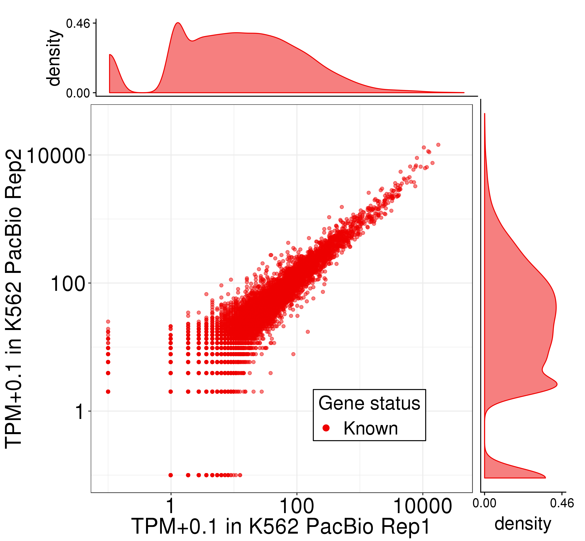

Pearson and Spearman correlations are recorded in PacBio_K562_1-PacBio_K562_2_gene_correlations.txt.

## Panel C: Proportion of genes expressed in Illumina RNA-seq data of HepG2 that are also detected in the PacBio HepG2 data, binned by Illumina expression level
```bash
Rscript ${PLOTPATH}/plot_detection_by_TPM_for_datasets.R \
         --f ${hepg2_abundance} \
         --datasets PacBio_HepG2_1,PacBio_HepG2_2 \
         --ik1 ${hepg2_kallisto1} \
         --ik2 ${hepg2_kallisto2} \
         --color green \
         --dtype PacBio \
         -o figures/
mv figures/gene_detection_by_TPM.png figures/HepG2_gene_detection_by_TPM.png
```
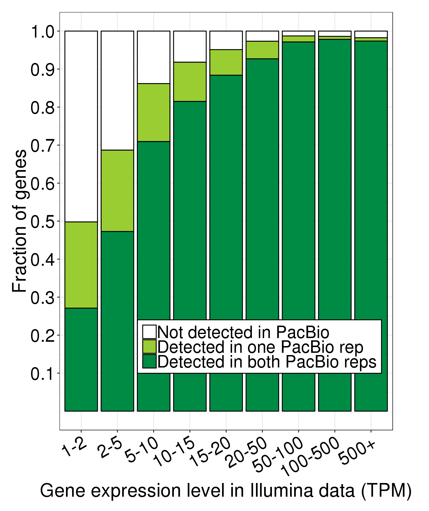

## Panel D: Proportion of genes expressed in Illumina RNA-seq data of K562 that are also detected in the PacBio K562 data, binned by Illumina expression level
```bash
Rscript ${PLOTPATH}/plot_detection_by_TPM_for_datasets.R \
         --f ${k562_abundance} \
         --datasets PacBio_K562_1,PacBio_K562_2 \
         --ik1 ${k562_kallisto1} \
         --ik2 ${k562_kallisto2} \
         --color red \
         --dtype PacBio \
         -o figures/
mv figures/gene_detection_by_TPM.png figures/K562_gene_detection_by_TPM.png
```


# Figure S4: Further characterization of gene detection in GM12878 by short reads and PacBio long reads.

## Panel A: Length of known genes binned by short-read expression level in GM12878 and colored by PacBio detection status. Gene length was computed by taking the median length of all known transcripts per gene.
```
Rscript ${PLOTPATH}/plot_gene_length_by_detection_for_datasets.R \
           --db /share/crsp/lab/seyedam/share/TALON_paper_data/revisions_10-19/human_TALON/full_gencode_v29_2019-06-19.db \
           --datasets PacBio_GM12878_1,PacBio_GM12878_2 \
           --ik1 ${GM12878_kallisto1} \
           --ik2 ${GM12878_kallisto2} \
           --color blue \
           -o figures
```
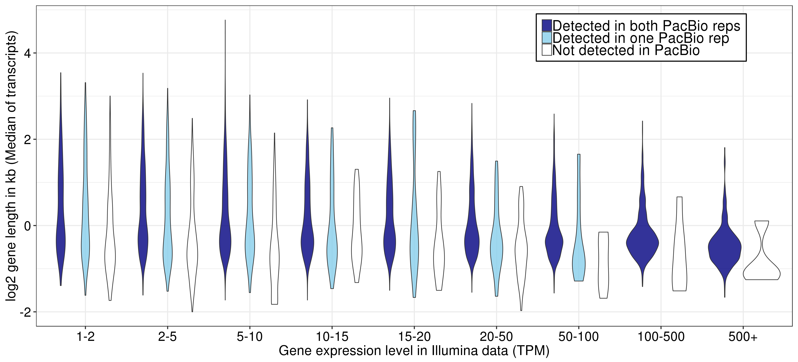

## Panel B: Detection of known genes as a function of PacBio read depth in GM12878. The number of short-read genes that were detected in PacBio is shown cumulatively for each possible ordering of four PacBio datasets. The total number of Illumina genes was 10367.
```
Rscript ${PLOTPATH}/plot_discovery_curve_knownOnly.R \
    --f /share/crsp/lab/seyedam/share/TALON_paper_data/revisions_10-19/human_TALON/PacBio_GM12878_files/all_4_reps/PacBio_GM12878_all4_talon_abundance.tsv \
    --color blue \
    --rc PacBio_GM12878_read_counts.csv \
    --ik1 ${GM12878_kallisto1} \
    --ik2 ${GM12878_kallisto2} \
    -o figures/

```
This script call also creates the file: figures/gene_detection.csv, which is needed for Panel C.
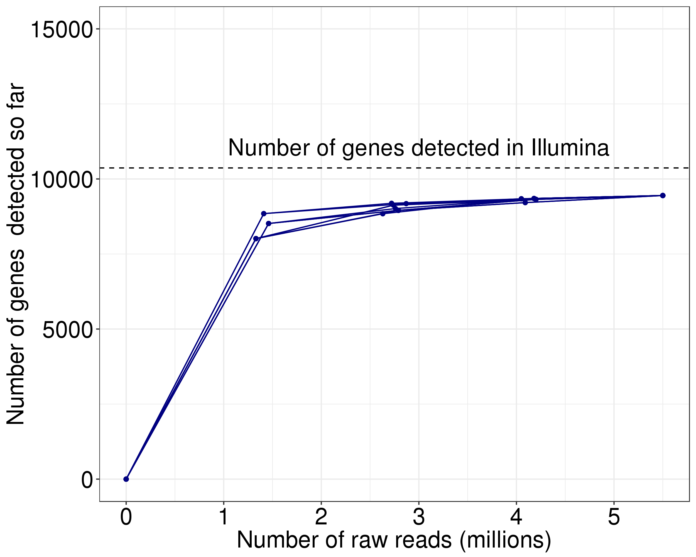

## Panel C: GC content of known genes that were detected in at least one of four PacBio replicates, versus those that were detected in short reads only.
```
python ../GC-content/run_GC_analysis.py \
    --genes figures/gene_detection.csv \
    --fasta ../refs/gencode.v29.transcripts.fa.gz \
    --o figures
```
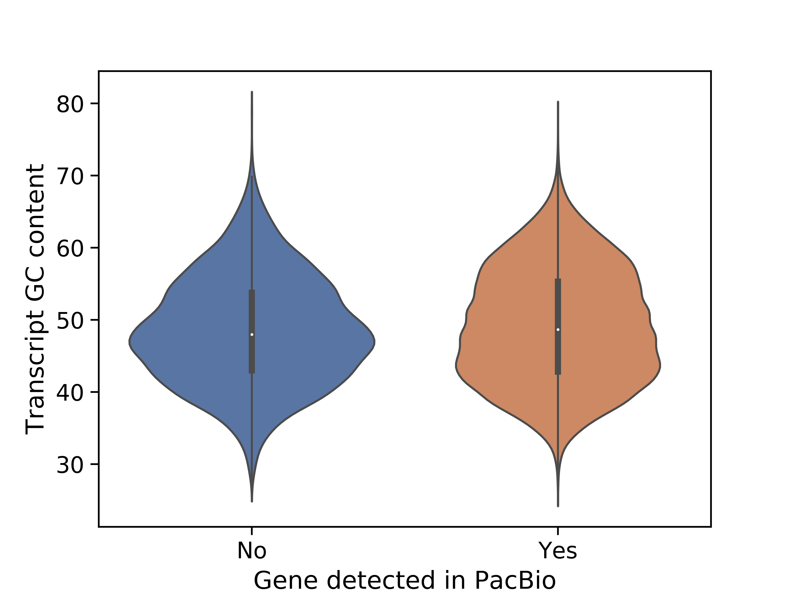

# Figure S5: HepG2 and K562 TALON PacBio gene expression compared to Illumina short-read expression

## Panel A: Comparison of gene expression levels for known genes in the PacBio and Illumina RNA-seq platforms (HepG2)
```bash
Rscript ${PLOTPATH}/longread_v_illumina_genes_edgeR.R \
         --f ${hepg2_abundance} \
         --datasets PacBio_HepG2_1,PacBio_HepG2_2 \
         --ik1 ${hepg2_kallisto1} \
         --ik2 ${hepg2_kallisto2} \
         --color green \
         -o figures/
mv figures/edgeR_PacBio_illumina_gene_MA_plot.png figures/HepG2_edgeR_PacBio_illumina_gene_MA_plot.png
```


## Panel B: Comparison of gene expression levels for known genes in the PacBio and Illumina RNA-seq platforms (K562)
```bash
Rscript ${PLOTPATH}/longread_v_illumina_genes_edgeR.R \
         --f ${k562_abundance} \
         --datasets PacBio_K562_1,PacBio_K562_2 \
         --ik1 ${k562_kallisto1} \
         --ik2 ${k562_kallisto2} \
         --color red \
         -o figures/
mv figures/edgeR_PacBio_illumina_gene_MA_plot.png figures/K562_edgeR_PacBio_illumina_gene_MA_plot.png
```


# Figure S6: Number of distinct transcript isoforms observed in each novelty category 

## Panel A: HepG2
```bash
Rscript ${PLOTPATH}/plot_novelty_categories_distinct_isoforms.R \
         --f ${hepg2_filt_abundance} \
         --datasets PacBio_HepG2_1,PacBio_HepG2_2 \
         --o figures/
```


## Panel B: K562
```bash
Rscript ${PLOTPATH}/plot_novelty_categories_distinct_isoforms.R \
         --f ${k562_filt_abundance} \
         --datasets PacBio_K562_1,PacBio_K562_2 \
         --o figures/
```
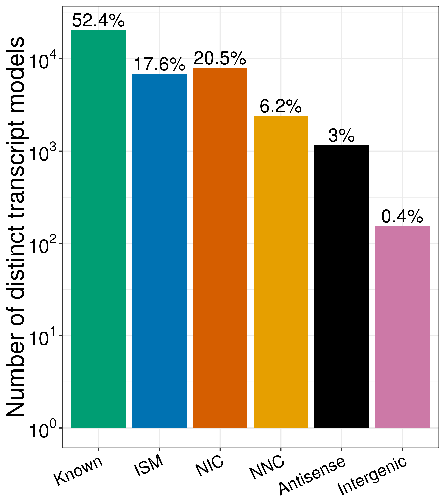

# Figure S7: Transcript quantification by PacBio and TALON in HepG2 and K562

## Panel A: Expression level of known transcript models in each PacBio biological replicate of HepG2
```bash
Rscript ${PLOTPATH}/plot_longread_transcript_expression_corr.R \
         --f ${hepg2_filt_abundance} \
         --d1 PacBio_HepG2_1 \
         --d1_type 'Rep1 PacBio' \
         --d2 PacBio_HepG2_2 \
         --d2_type 'Rep2 PacBio' \
         --celltype HepG2 \
         -o figures/
```
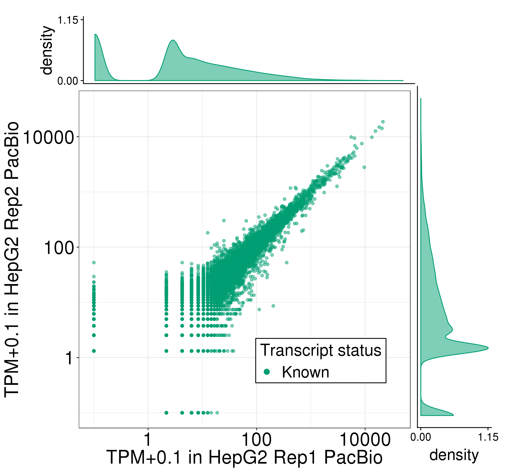
Correlations are in PacBio_HepG2_1-PacBio_HepG2_2_Known_transcript_correlations.txt. 

## Panel B: Expression level of known transcript models in each PacBio biological replicate of K562
```bash
Rscript ${PLOTPATH}/plot_longread_transcript_expression_corr.R \
         --f ${k562_filt_abundance} \
         --d1 PacBio_K562_1 \
         --d1_type 'Rep1 PacBio' \
         --d2 PacBio_K562_2 \
         --d2_type 'Rep2 PacBio' \
         --celltype K562 \
         -o figures/
```
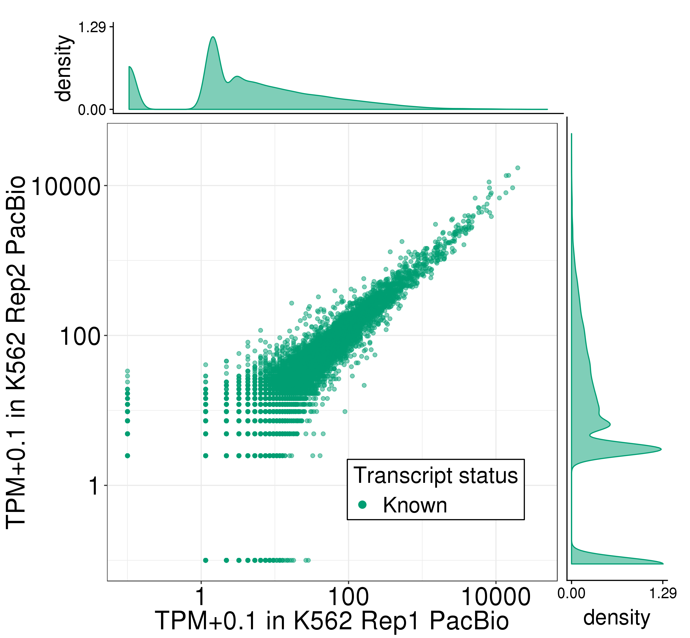
Correlations are in PacBio_K562_1-PacBio_K562_2_Known_transcript_correlations.txt. 

## Panel C: Expression of transcript models in each biological replicate of HepG2, labeled by their novelty assignments
```bash
Rscript ${PLOTPATH}/plot_longread_transcript_expression_corr.R \
         --f ${hepg2_filt_abundance} \
         --d1 PacBio_HepG2_1 \
         --d1_type 'Rep1 PacBio' \
         --d2 PacBio_HepG2_2 \
         --d2_type 'Rep2 PacBio' \
         --celltype HepG2 \
         --ISM --NIC --NNC --antisense --intergenic \
         -o figures/
```
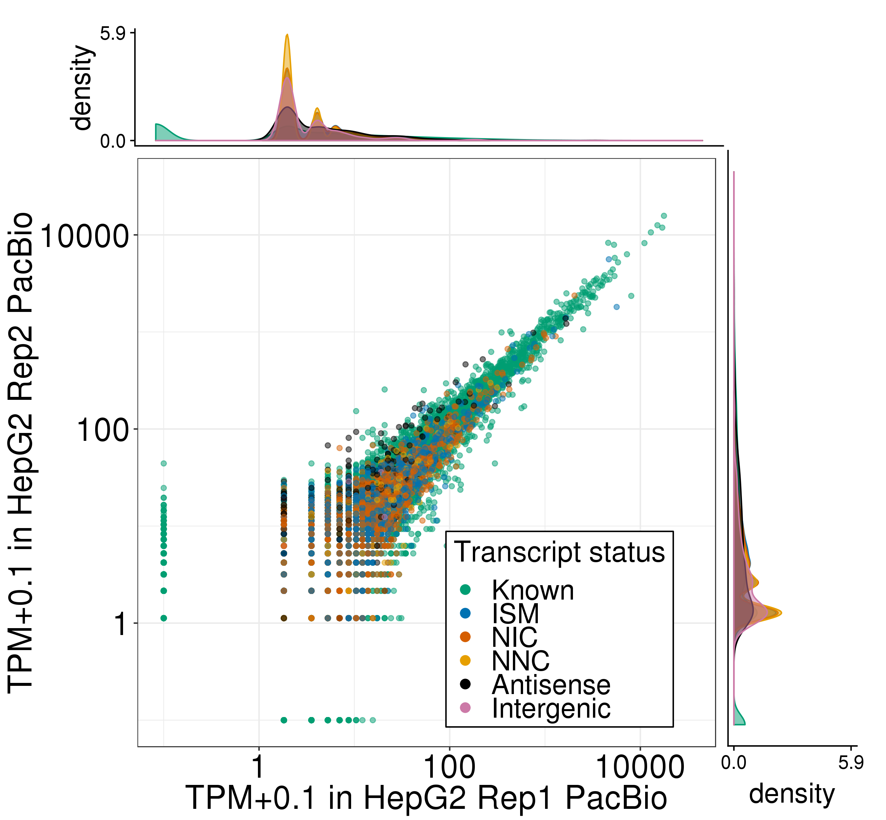
Correlations are in PacBio_HepG2_1-PacBio_HepG2_2_Known-ISM-NIC-NNC-Antisense-Intergenic_transcript_correlations.txt.

## Panel D: Expression of transcript models in each biological replicate of K562, labeled by their novelty assignments
```bash
Rscript ${PLOTPATH}/plot_longread_transcript_expression_corr.R \
         --f ${k562_filt_abundance} \
         --d1 PacBio_K562_1 \
         --d1_type 'Rep1 PacBio' \
         --d2 PacBio_K562_2 \
         --d2_type 'Rep2 PacBio' \
         --celltype K562 \
         --ISM --NIC --NNC --antisense --intergenic \
         -o figures/
```

Correlations are in PacBio_K562_1-PacBio_K562_2_Known-ISM-NIC-NNC-Antisense-Intergenic_transcript_correlations.txt.

## Panel E: Comparison of known transcript expression levels in the PacBio and Illumina RNA-seq platforms (HepG2 Rep 1 and 2). 
```bash
Rscript ${PLOTPATH}/longread_v_illumina_transcripts_edgeR.R \
         --f ${hepg2_filt_abundance} \
         --datasets PacBio_HepG2_1,PacBio_HepG2_2 \
         --ik1 ${hepg2_kallisto1} \
         --ik2 ${hepg2_kallisto2} \
         --color green \
          -o figures/
mv figures/edgeR_PacBio_illumina_transcript_MA_plot.png figures/HepG2_edgeR_PacBio_illumina_transcript_MA_plot.png
```
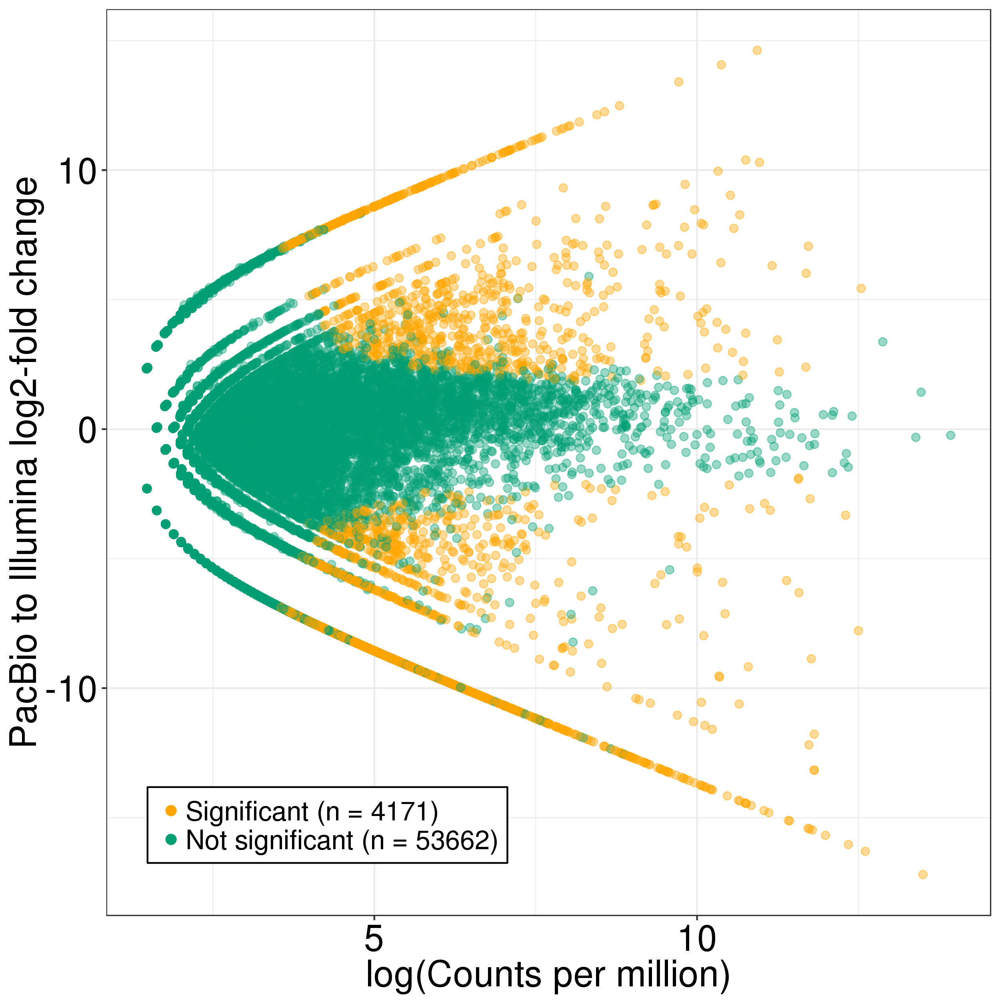

## Panel F: Comparison of known transcript expression levels in the PacBio and Illumina RNA-seq platforms (K562 Rep 1 and 2). 
```bash
Rscript ${PLOTPATH}/longread_v_illumina_transcripts_edgeR.R \
         --f ${k562_filt_abundance} \
         --datasets PacBio_K562_1,PacBio_K562_2 \
         --ik1 ${k562_kallisto1} \
         --ik2 ${k562_kallisto2} \
         --color green \
          -o figures/
mv figures/edgeR_PacBio_illumina_transcript_MA_plot.png figures/K562_edgeR_PacBio_illumina_transcript_MA_plot.png
```


## Panel G: Total number of PacBio reads assigned to each novelty category in PacBio HepG2 after transcript filtering
```bash
Rscript ${PLOTPATH}/plot_novelty_category_read_counts.R \
         --f ${hepg2_filt_abundance}  \
         --datasets PacBio_HepG2_1 \
         --o figures/
```


## Panel H: Total number of PacBio reads assigned to each novelty category in PacBio K562 after transcript filtering
```bash
Rscript ${PLOTPATH}/plot_novelty_category_read_counts.R \
         --f ${k562_filt_abundance}  \
         --datasets PacBio_K562_1 \
         --o figures/
```


# Figure S8: Number of exons per transcript model detected in PacBio ENCODE tier 1 cell line transcriptomes. Transcripts are grouped by novelty type assignment.
```
Rscript ${PLOTPATH}/plot_n_exons_by_novelty.R \
    --f ${tier1_filt_abundance} \
    -o figures/
```
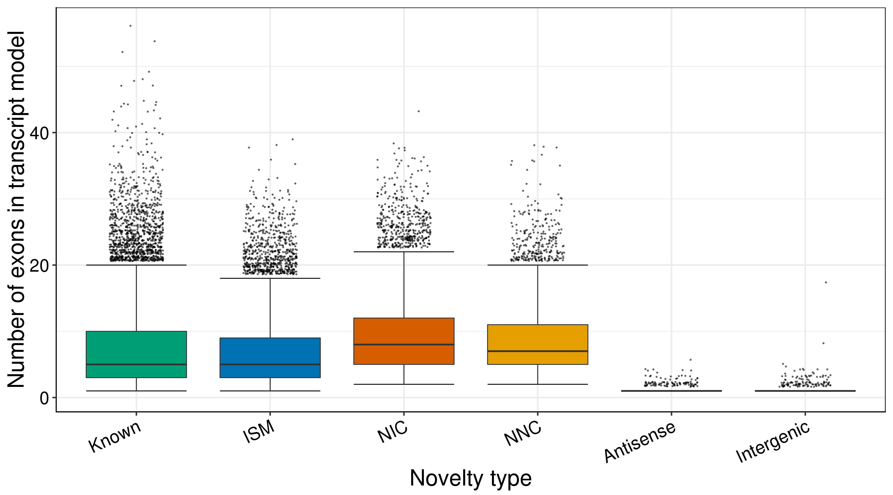

# Figure S9: Epstein-Barr Virus transcriptome characterization in GM12878

Run TALON and post-processing scripts as detailed in https://github.com/dewyman/TALON-paper-2019/tree/master/ebv/.
 
## Panel A: Gene expression levels in GM12878 from the EBV chromosome and from the human chromosomes, labelled by gene novelty
```bash
ebv_dir=../ebv/
python ${ebv_dir}ebv_compute_tpms.py --c ${ebv_dir}ebv_expression_config.csv
Rscript ${ebv_dir}plot_ebv_v_human_abundances.R \
          --gene_csv ${ebv_dir}ebv_human_gene_abundance.csv \
          --transcript_csv ${ebv_dir}ebv_human_transcript_abundance.csv \
          --datasets combined
```
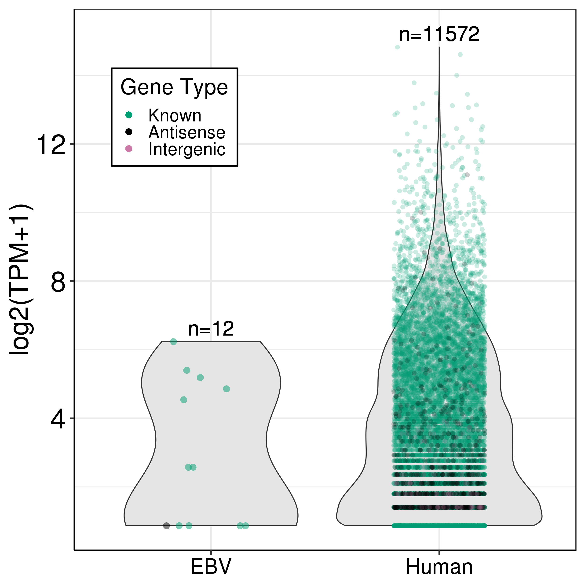

## Panel B: Transcript expression levels in GM12878 from the EBV chromosome and from the human chromosomes, labelled by transcript novelty.
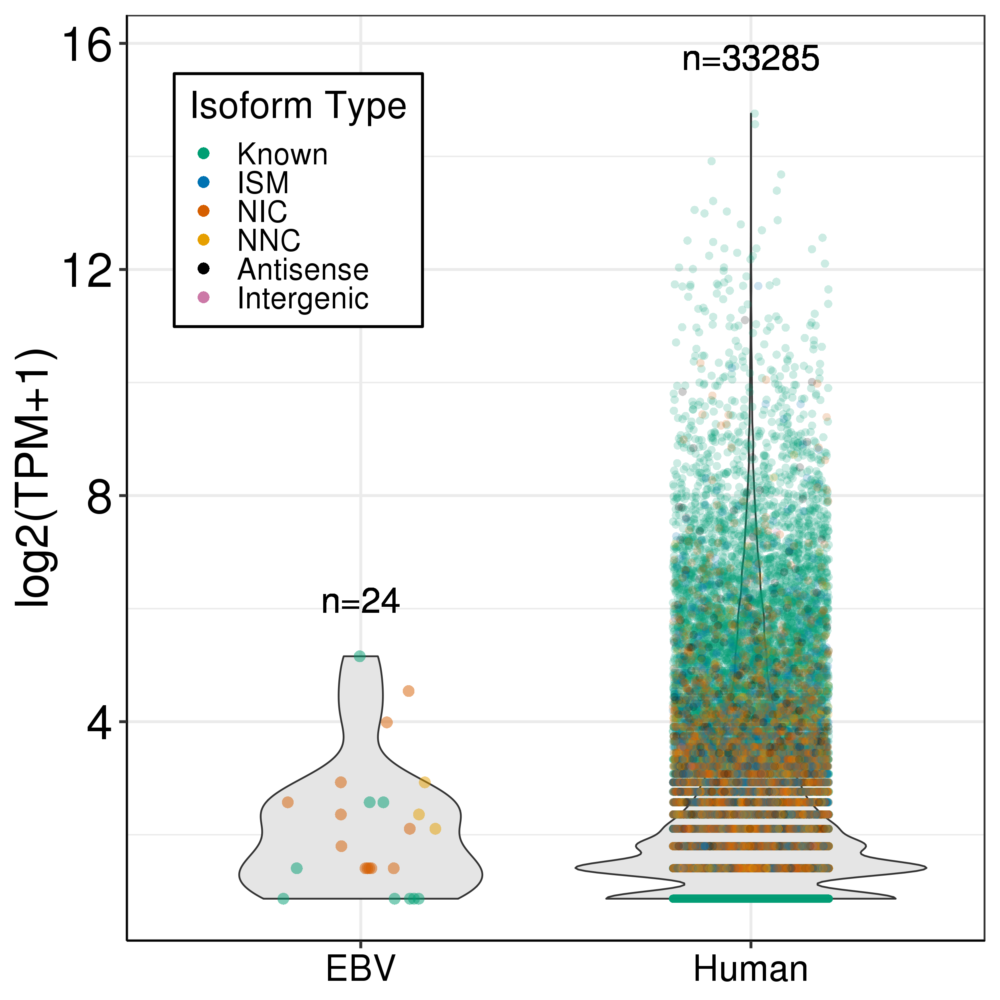

## Panel C: Visualization of TALON GTF annotations in the UCSC genome browser for EBV transcripts in GM12878.
```bash
python ../analysis_scripts/gen_novelty_tracks_gtf.py \
          --c ${ebv_dir}ebv_gtf_track_config.csv
url=`cut -d, -f5 ${ebv_dir}ebv_gtf_track_config.csv`
n=`cut -d, -f2 ${ebv_dir}ebv_gtf_track_config.csv`
cp ${ebv_dir}ebv_chr1.gtf ${ebv_dir}ebv_talon_observedOnly_tracks/
printf 'track name="EBV Reference" visibility=pack color=0,0,128\n%s/ebv_chr1.gtf' "$url" >> ${ebv_dir}ebv_talon_observedOnly_tracks/ebv_talon_observedOnly_${n}_tracks
```
Then, load the tracks into the genome browswer (after moving them to a public-facing directory on your computer/cluster), and take a screenshot or use the genome browser's PDF screenshot functionality

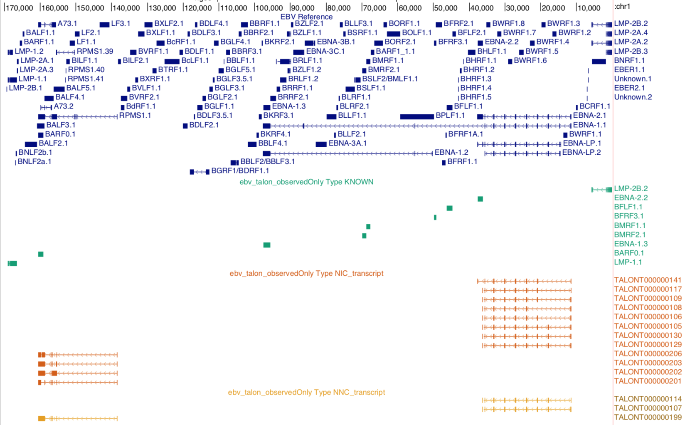

# Figure S11: Transcript and gene quantification by PacBio/ONT and TALON 

## Panel A: Expression level of known and ISM transcript models in PacBio/ONT in GM12878
```bash
abundance=${sup_tables}S28_full_gencode_v29_pb_ont_talon_abundance.tsv
filt_abundance=${sup_tables}S29_full_gencode_v29_pb_ont_talon_abundance_filtered.tsv
```

```bash
Rscript ${PLOTPATH}/plot_longread_transcript_expression_corr.R \
         --f ${filt_abundance} \
         --d1 PacBio_GM12878_1 \
         --d1_type 'PacBio' \
         --d2 ONT_GM12878_2 \
         --d2_type 'ONT' \
         --celltype GM12878 \
         --ISM \
         -o figures/
```
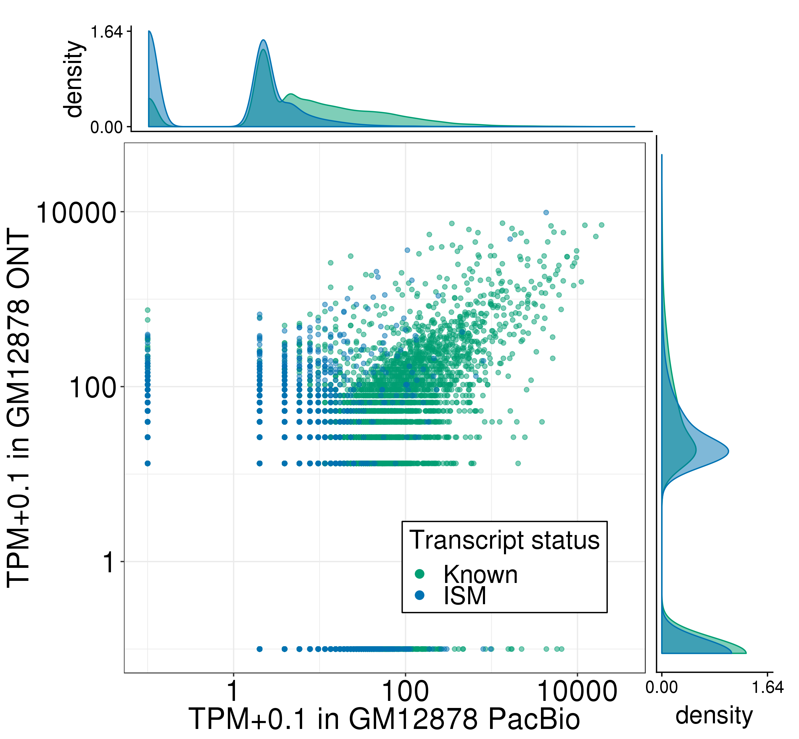
Correlations are in PacBio_GM12878_1-ONT_GM12878_2_Known-ISM_transcript_correlations.txt. 

## Panel B: Expression level of known genes (GENCODE v29) in each biological replicate of HepG2 in ONT
```bash
hepg2_abundance=${sup_tables}S22_HepG2_talon_abundance.tsv
hepg2_filt_abundance=${sup_tables}S23_HepG2_ont_talon_abundance_filtered.tsv

k562_abundance=${sup_tables}S25_K562_talon_abundance.tsv
k562_filt_abundance=${sup_tables}S26_K562_ont_talon_abundance_filtered.tsv
```

```bash
Rscript ${PLOTPATH}/plot_longread_gene_expression_corr.R \
          --f ${hepg2_abundance} \
          --color green \
          --d1 ONT_HepG2_3 \
          --d2 ONT_HepG2_1 \
          --celltype HepG2 \
          --d1_type 'ONT Rep1' \
          --d2_type 'ONT Rep2' \
          -o figures/
```
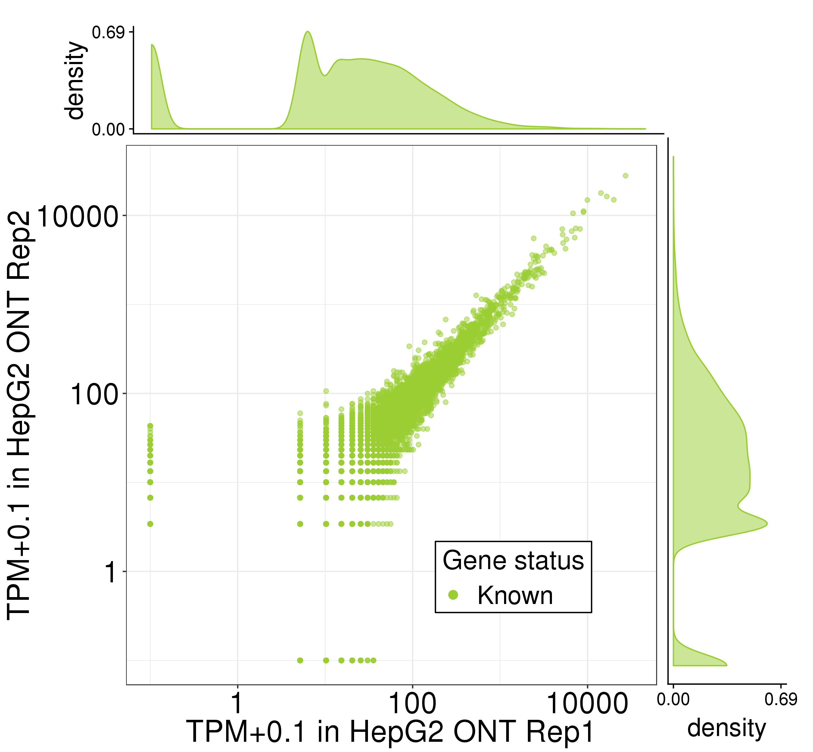

Pearson and Spearman correlations are recorded in ONT_HepG2_1-ONT_HepG2_2_gene_correlations.txt

## Panel C: Expression level of known genes (GENCODE v29) in each biological replicate of K562 in ONT
```bash
Rscript ${PLOTPATH}/plot_longread_gene_expression_corr.R \
          --f ${k562_abundance} \
          --color red \
          --d1 ONT_K562_1 \
          --d2 ONT_K562_2 \
          --celltype K562 \
          --d1_type 'ONT Rep1' \
          --d2_type 'ONT Rep2' \
          -o figures/
```
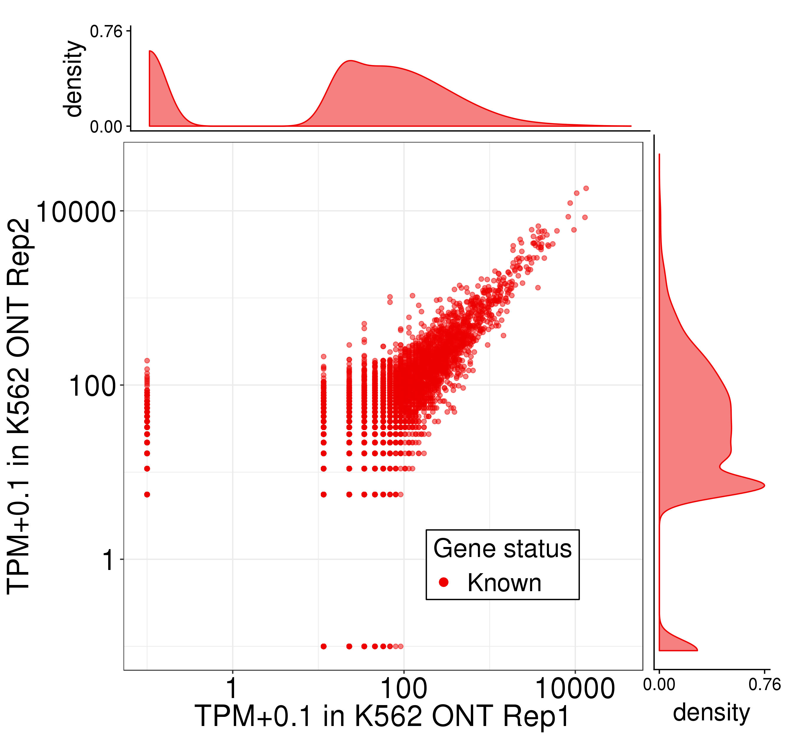

Pearson and Spearman correlations are recorded in ONT_K562_1-ONT_K562_2_gene_correlations.txt

## Panel D: Expression level of known and ISM transcript models in ONT in HepG2

```bash
Rscript ${PLOTPATH}/plot_longread_transcript_expression_corr.R \
         --f ${hepg2_filt_abundance} \
         --d1 ONT_HepG2_3 \
         --d1_type 'ONT Rep1' \
         --d2 ONT_HepG2_1 \
         --d2_type 'ONT Rep2' \
         --celltype HepG2 \
         --ISM \
         -o figures/
```

Correlations are in ONT_HepG2_1-ONT_HepG2_3_Known-ISM_transcript_correlations.txt.

## Panel E: Expression level of known and ISM transcript models in ONT in K562

```bash
Rscript ${PLOTPATH}/plot_longread_transcript_expression_corr.R \
         --f ${k562_filt_abundance} \
         --d1 ONT_K562_1 \
         --d1_type 'ONT Rep1' \
         --d2 ONT_K562_2 \
         --d2_type 'ONT Rep2' \
         --celltype K562 \
         --ISM \
         -o figures/
```

Correlations are in ONT_K562_1-ONT_K562_2_Known-ISM_transcript_correlations.txt.  

# Figure S12: Gene and transcript reproducibility across long-read platforms ONT and PacBio in HepG2 and K562
```bash
abundance=${sup_tables}S28_full_gencode_v29_pb_ont_talon_abundance.tsv
filt_abundance=${sup_tables}S29_full_gencode_v29_pb_ont_talon_abundance_filtered.tsv
hepg2_abundance=${sup_tables}S22_HepG2_talon_abundance.tsv
hepg2_filt_abundance=${sup_tables}S23_HepG2_ont_talon_abundance_filtered.tsv
k562_abundance=${sup_tables}S25_K562_talon_abundance.tsv
k562_filt_abundance=${sup_tables}S26_K562_ont_talon_abundance_filtered.tsv
```

## Panel A: Expression level of known and antisense genes in PacBio/ONT in HepG2

```bash
Rscript ${PLOTPATH}/plot_longread_gene_expression_corr.R \
          --f ${abundance} \
          --color green \
          --antisense \
          --d1 PacBio_HepG2_1 \
          --d2 ONT_HepG2_1 \
          --celltype HepG2 \
          --d1_type 'PacBio' \
          --d2_type 'ONT' \
          -o figures/
```
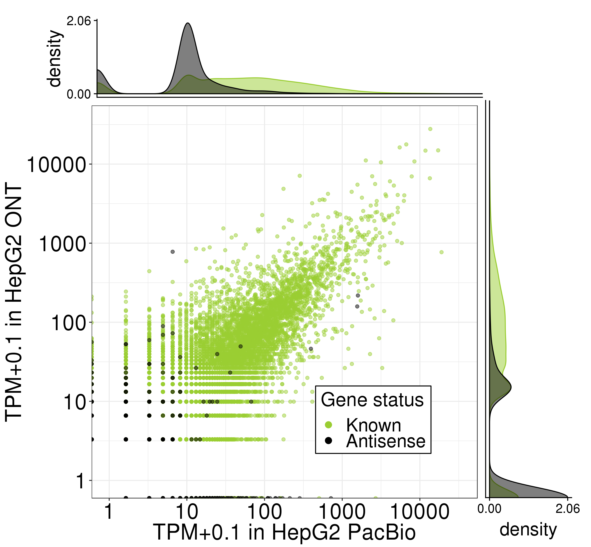

Pearson and Spearman correlations are recorded in PacBio_HepG2_1-ONT_HepG2_1_gene_correlations.txt.

## Panel B: Expression level of known and antisense genes in PacBio/ONT in HepG2

```bash
Rscript ${PLOTPATH}/plot_longread_gene_expression_corr.R \
          --f ${abundance} \
          --color red \
          --antisense \
          --d1 PacBio_K562_1 \
          --d2 ONT_K562_1 \
          --celltype HepG2 \
          --d1_type 'PacBio' \
          --d2_type 'ONT' \
          -o figures/
```
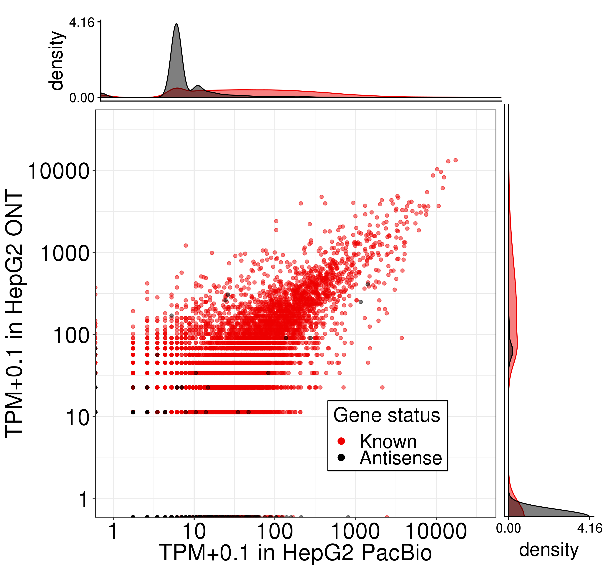

Pearson and Spearman correlations are recorded in PacBio_K562_1-ONT_K562_1_gene_correlations.txt.

## Panel C: Expression level of known and ISM transcript models in PacBio/ONT in HepG2

```bash
Rscript ${PLOTPATH}/plot_longread_transcript_expression_corr.R \
         --f ${filt_abundance} \
         --d1 PacBio_HepG2_1 \
         --d1_type 'PacBio' \
         --d2 ONT_HepG2_1 \
         --d2_type 'ONT' \
         --celltype HepG2 \
         --ISM \
         -o figures/
```

Correlations are in PacBio_HepG2_1-ONT_HepG2_1_Known-ISM_transcript_correlations.txt. 

## Panel D: Expression level of known and ISM transcript models in PacBio/ONT in K562

```bash
Rscript ${PLOTPATH}/plot_longread_transcript_expression_corr.R \
         --f ${filt_abundance} \
         --d1 PacBio_K562_1 \
         --d1_type 'PacBio' \
         --d2 ONT_K562_2 \
         --d2_type 'ONT' \
         --celltype K562 \
         --ISM \
         -o figures/
```
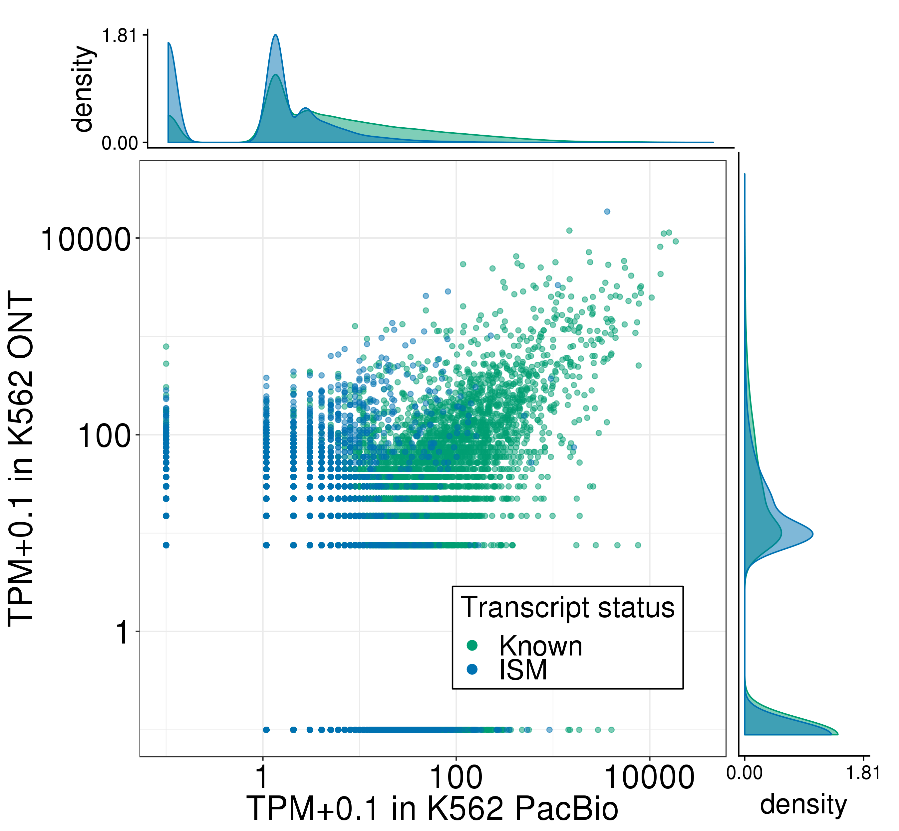
Correlations are in PacBio_K562_1-ONT_K562_2_Known-ISM_transcript_correlations.txt. 

# Figure S15: Splice junction novelty and reproducibility across platforms

Check out this readme for a detailed explanation of the analysis and figure generation: https://github.com/dewyman/TALON-paper-2019/tree/master/splicing_analysis/SJ_novelty_analysis

## Panel A: Percent Illumina support for known and novel (NNC and NIC) splice junctions in PacBio long-read GM12878 data

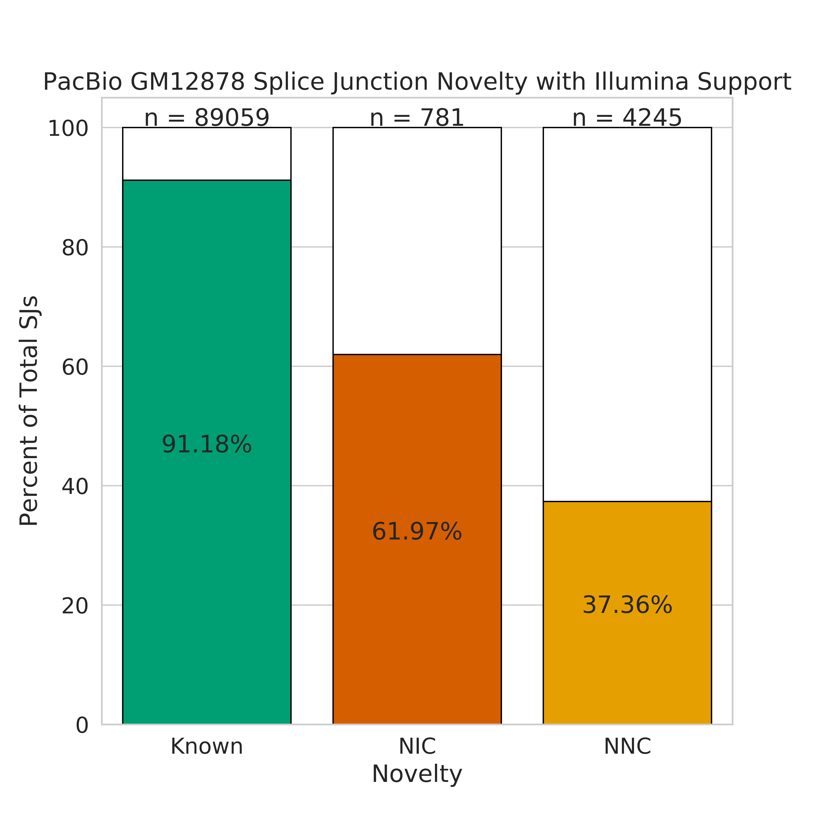 

## Panel B: Percent Illumina support for known and novel (NNC and NIC) splice junctions in Oxford Nanopore long-read GM12878 data

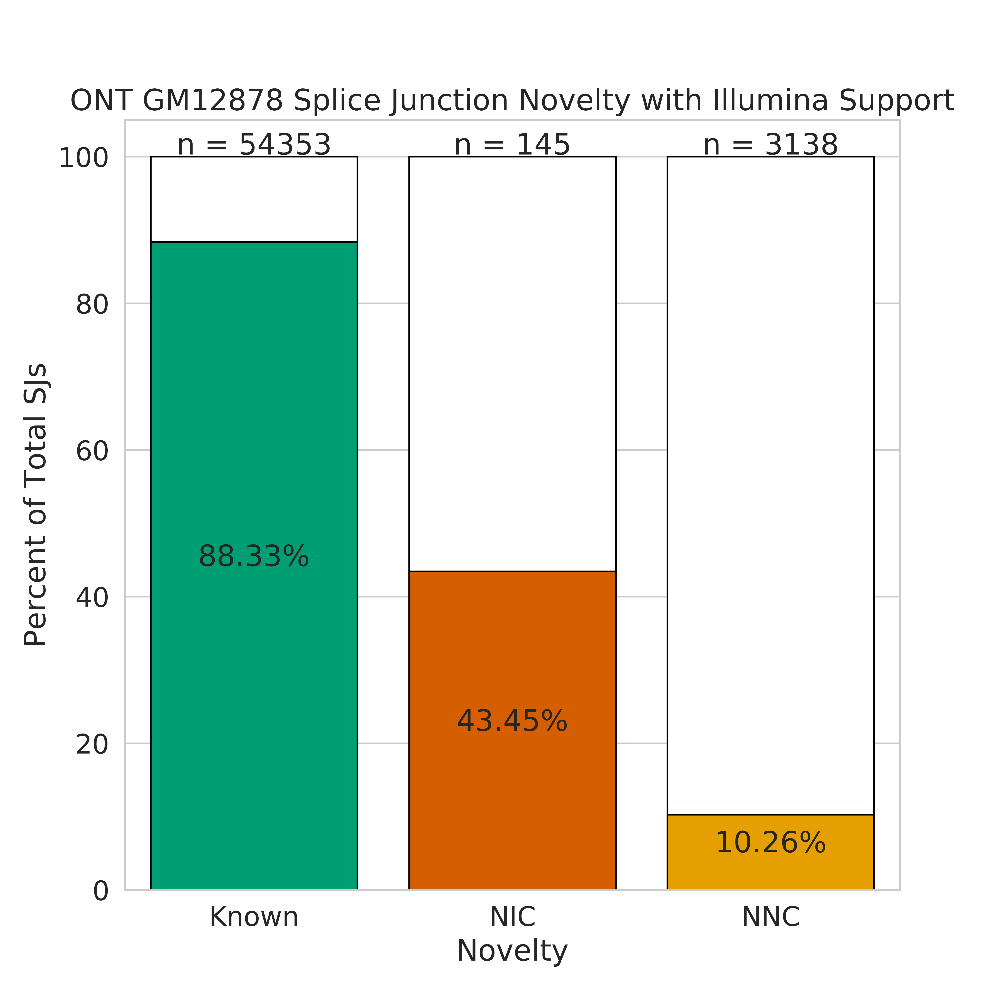 

## Panel C: Venn diagram of splice junctions that are unsupported by GENCODE in PacBio

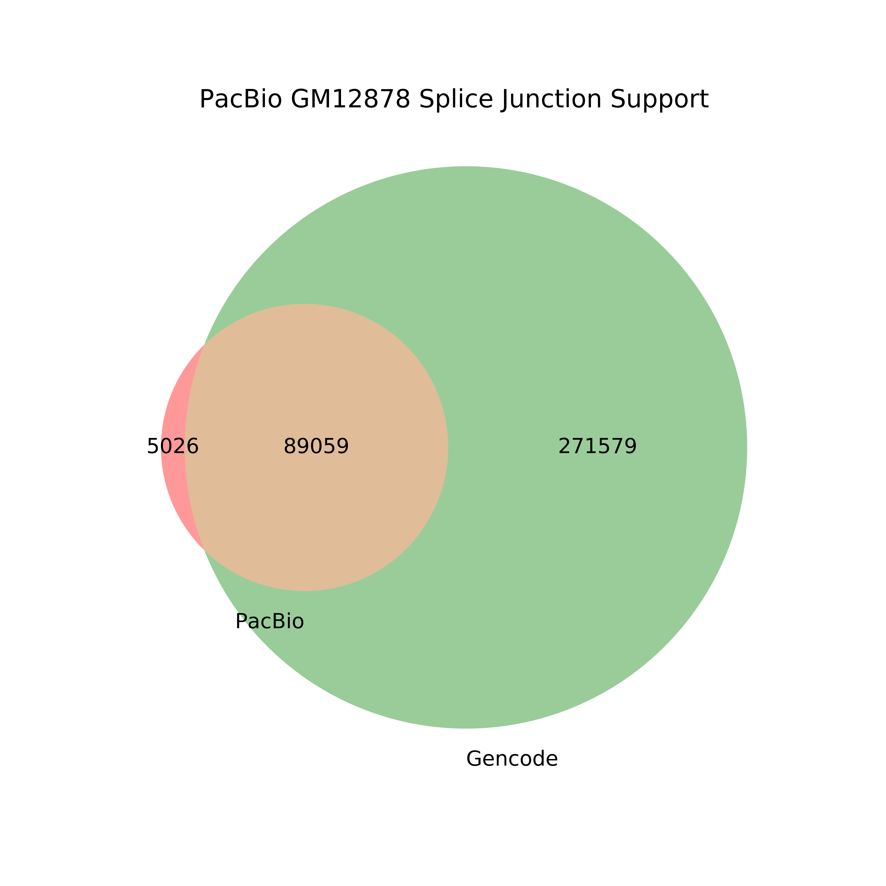 

## Panel D: Venn diagram of splice junctions that are unsupported by GENCODE in PacBio

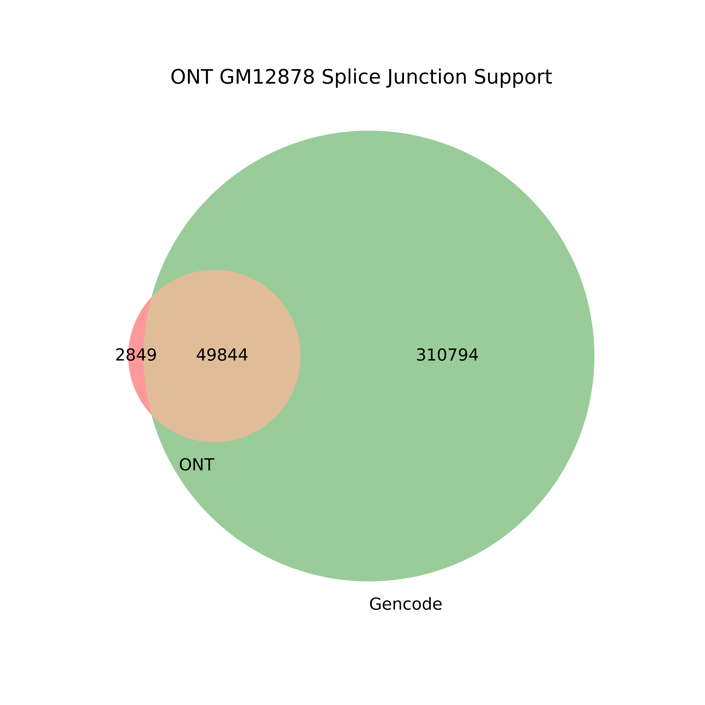 

## Panel E: Venn diagram showing overlap and reproducibility of splice junctions not supported by GENCODE between PacBio, ONT, and Illumina

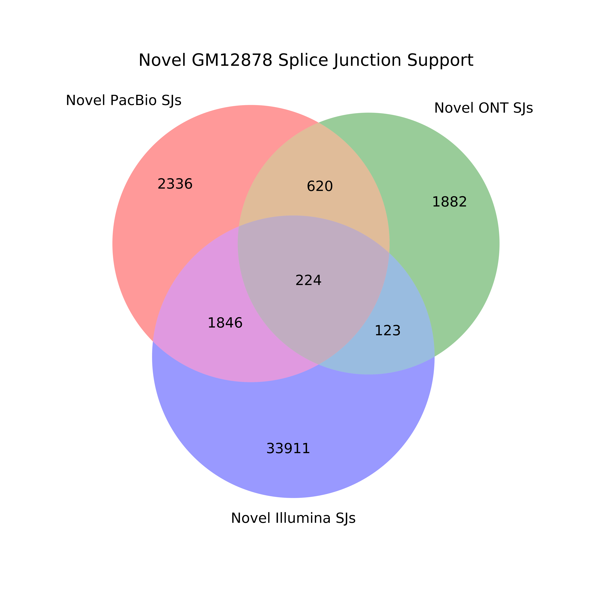 

## Panel F: Venn diagram showing overlap and reproducibility of splice junctions supported by GENCODE between PacBio, ONT, and Illumina

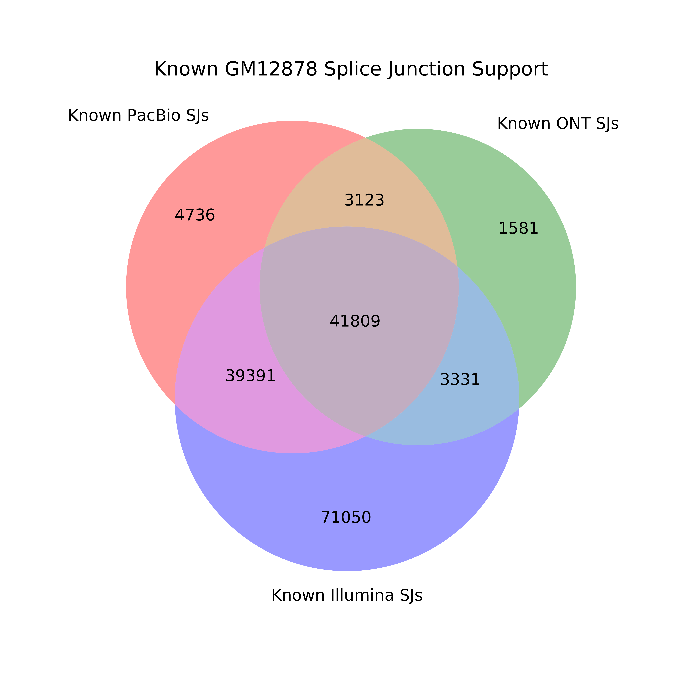 

# Figure S16: TALON and FLAIR gene detection across sequencing platforms and samples

See READMEs in the (compare_to_FLAIR)[https://github.com/dewyman/TALON-paper-2019/tree/master/compare_to_FLAIR/] directory to see how the data is generated

## Panel A: Proportion of genes expressed in Illumina RNA-seq data that are also detected by TALON, FLAIR, or both in the corresponding PacBio GM12878

```bash 
sup_tables=/data/users/freese/TALON_data/revisions_10-19/human_TALON/analysis/supplementary_tables/
abundance=${sup_tables}S3_GM12878_talon_abundance.tsv

Rscript ../compare_to_FLAIR/compare_TALON_FLAIR_detection_to_Illumina.R \
    --talon ${abundance} \
    --flair ../compare_to_FLAIR/GM12878/counts_matrix_talon_abd.tsv \
    --talonD PacBio_GM12878_1,PacBio_GM12878_2 \
    --flairD GM12878_Rep1_GM12878_batch1,GM12878_Rep2_GM12878_batch1 \
    --ik1 ../Illumina/GM12878/Kallisto/Rep1/abundance.tsv \
    --ik2 ../Illumina/GM12878/Kallisto/Rep2/abundance.tsv \
    -o .
```

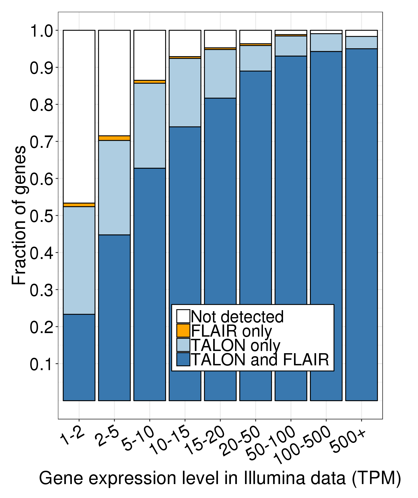

## Panel B: Proportion of genes expressed in Illumina RNA-seq data that are also detected by TALON, FLAIR, or both in the corresponding PacBio K562

```bash
sup_tables=/data/users/freese/TALON_data/revisions_10-19/human_TALON/analysis/supplementary_tables/
abundance=${sup_tables}S9_K562_talon_abundance.tsv
Rscript ../compare_to_FLAIR/compare_TALON_FLAIR_detection_to_Illumina.R \
    --talon ${abundance} \
    --flair ../compare_to_FLAIR/K562/counts_matrix_talon_abd.tsv \
    --talonD PacBio_K562_1,PacBio_K562_2 \
    --flairD K562_Rep1_K562_batch1,K562_Rep2_K562_batch1 \
    --ik1 ../Illumina/K562/Kallisto/Rep1/abundance.tsv \
    --ik2 ../Illumina/K562/Kallisto/Rep2/abundance.tsv \
    -o FLAIR
```

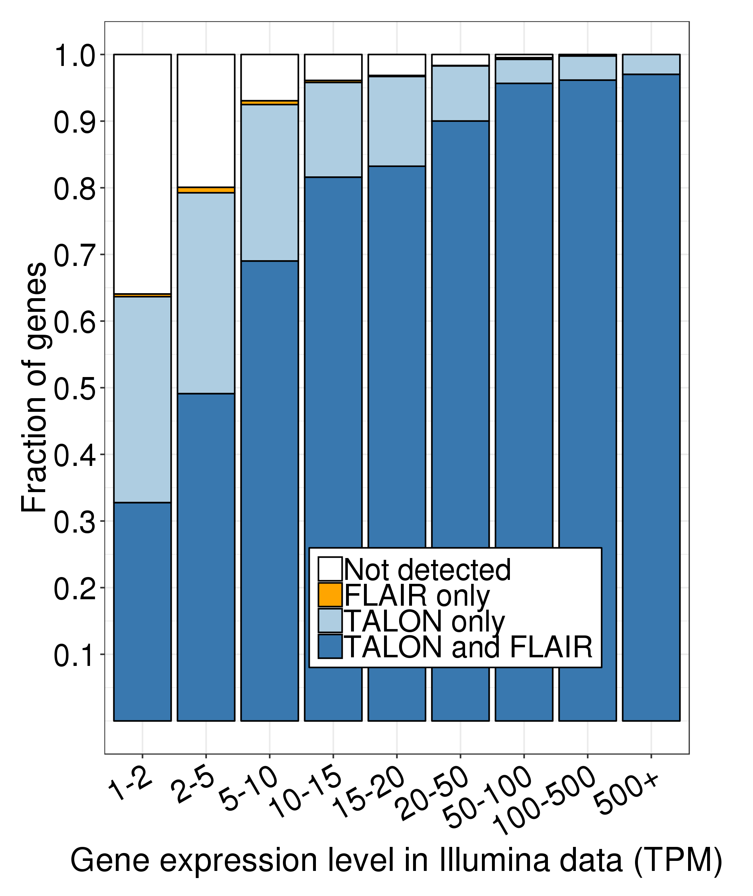

## Panel C: Proportion of genes expressed in Illumina RNA-seq data that are also detected by TALON, FLAIR, or both in the corresponding PacBio HepG2
```bash
sup_tables=/data/users/freese/TALON_data/revisions_10-19/human_TALON/analysis/supplementary_tables/
abundance=${sup_tables}S6_HepG2_talon_abundance.tsvRscript ../compare_to_FLAIR/compare_TALON_FLAIR_detection_to_Illumina.R \
    --talon ${abundance} \
    --flair ../compare_to_FLAIR/HepG2/counts_matrix_talon_abd.tsv \
    --talonD PacBio_HepG2_1,PacBio_HepG2_2 \
    --flairDD HepG2_Rep1_HepG2_batch1,HepG2_Rep2_HepG2_batch1 \
    --ik1 ../Illumina/HepG2/Kallisto/Rep1/abundance.tsv \
    --ik2 ../Illumina/HepG2/Kallisto/Rep2/abundance.tsv \
    -o FLAIR
```

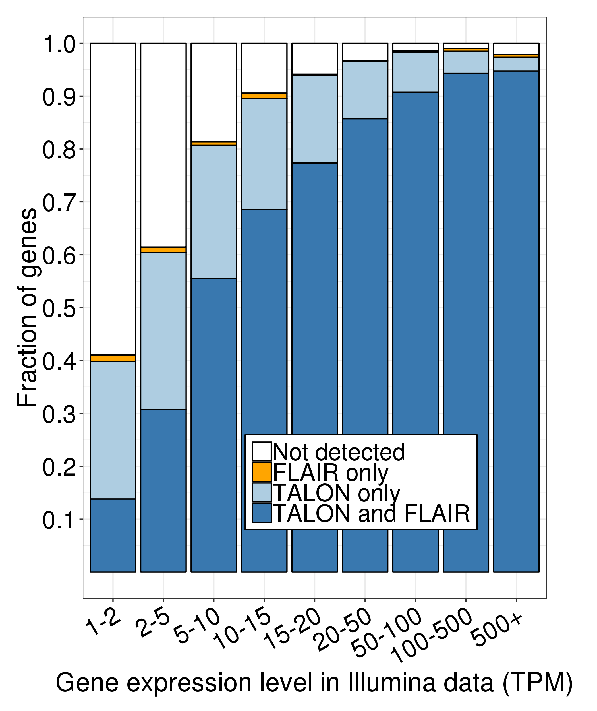

## Panel D: Proportion of genes expressed in Illumina RNA-seq data that are also detected by TALON, FLAIR, or both in the corresponding ONT GM12878

```bash 
sup_tables=/data/users/freese/TALON_data/revisions_10-19/human_TALON/analysis/supplementary_tables/
abundance=${sup_tables}S19_GM12878_talon_abundance.tsv

Rscript ../compare_to_FLAIR/compare_TALON_FLAIR_detection_to_Illumina.R \
    --talon ${abundance} \
    --flair ../compare_to_FLAIR/ONT_GM12878/counts_matrix_talon_abd.tsv \
    --talonD ONT_GM12878_1,ONT_GM12878_2 \
    --flairD GM12878_ONT_Rep1_GM12878_batch1,GM12878_ONT_Rep2_GM12878_batch1 \
    --ik1 ../Illumina/GM12878/Kallisto/Rep1/abundance.tsv \
    --ik2 ../Illumina/GM12878/Kallisto/Rep2/abundance.tsv \
    -o .
```

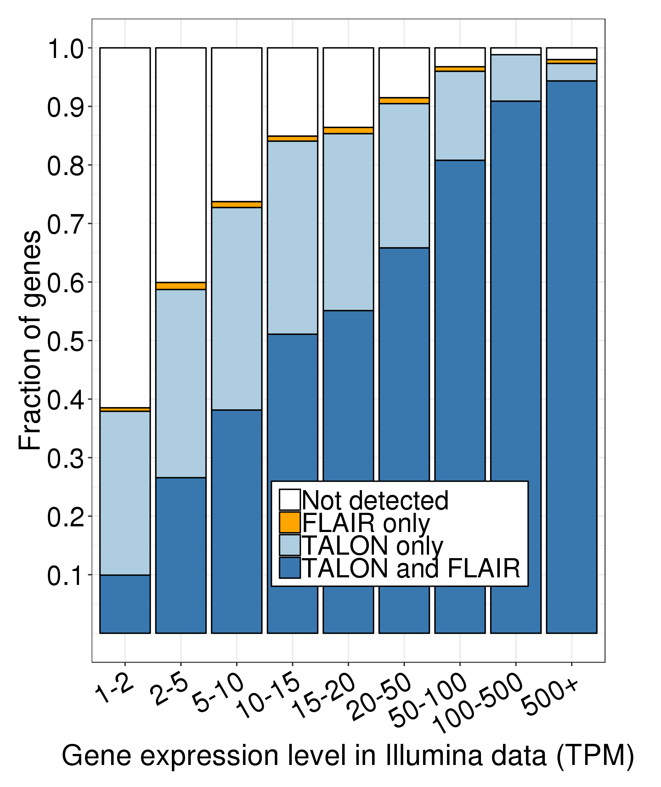

## Panel E: Proportion of genes expressed in Illumina RNA-seq data that are also detected by TALON, FLAIR, or both in the corresponding ONT K562

```bash
sup_tables=/data/users/freese/TALON_data/revisions_10-19/human_TALON/analysis/supplementary_tables/
abundance=${sup_tables}S25_K562_talon_abundance.tsv
Rscript ../compare_to_FLAIR/compare_TALON_FLAIR_detection_to_Illumina.R \
    --talon ${abundance} \
    --flair ../compare_to_FLAIR/ONT_K562/counts_matrix_talon_abd.tsv \
    --talonD ONT_K562_1,ONT_K562_2 \
    --flairD K562_ONT_Rep1_K562_batch1,K562_ONT_Rep2_K562_batch1 \
    --ik1 ../Illumina/K562/Kallisto/Rep1/abundance.tsv \
    --ik2 ../Illumina/K562/Kallisto/Rep2/abundance.tsv \
    -o FLAIR
```

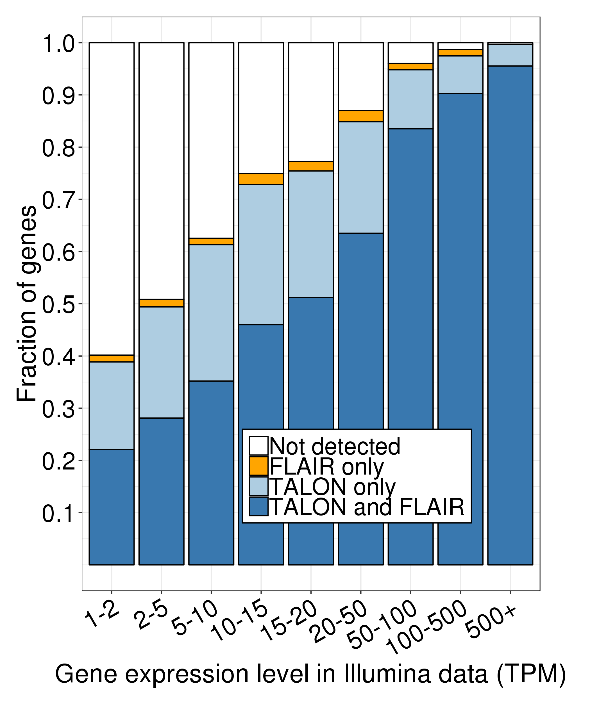

## Panel F: Proportion of genes expressed in Illumina RNA-seq data that are also detected by TALON, FLAIR, or both in the corresponding ONT HepG2
```bash
sup_tables=/data/users/freese/TALON_data/revisions_10-19/human_TALON/analysis/supplementary_tables/
abundance=${sup_tables}S22_HepG2_talon_abundance.tsv 
Rscript ../compare_to_FLAIR/compare_TALON_FLAIR_detection_to_Illumina.R \
    --talon ${abundance} \
    --flair ../compare_to_FLAIR/ONT_HepG2/counts_matrix_talon_abd.tsv \
    --talonD ONT_HepG2_1,ONT_PacBio_HepG2_2 \
    --flairDD HepG2_ONT_Rep1_HepG2_batch1,HepG2_ONT_Rep2_HepG2_batch1 \
    --ik1 ../Illumina/HepG2/Kallisto/Rep1/abundance.tsv \
    --ik2 ../Illumina/HepG2/Kallisto/Rep2/abundance.tsv \
    -o FLAIR
```

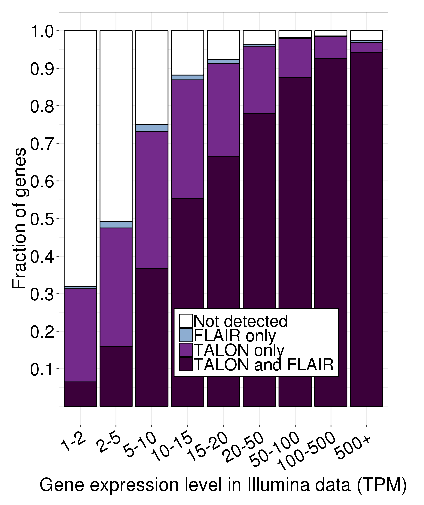

# Figure S17: CAGE support by novelty category in HepG2 and K562.
## Panel A: Percentage of TALON transcript models with CAGE support for their 5' end by novelty category in HepG2 PacBio
```bash
source activate mypython3.7.2
OUT=figures/S17/PacBio_HepG2
mkdir -p ${OUT}
python ../CAGE/run_CAGE_analysis.py \
        --gtf ${pb_hepg2_gtf} \
        --cage ${CAGE} \
        --maxdist 100 \
        --o ${OUT}/PacBio_HepG2

Rscript ${PLOTPATH}/plot_support_by_novelty_type.R \
    --f ${OUT}/PacBio_HepG2_CAGE_results.csv \
    --t CAGE \
    --novelty ${OUT}/transcript_beds/PacBio_HepG2_novelty.csv \
    --splitISM \
    --ymax 26000 \
    -o figures/S17/HepG2_PacBio
```
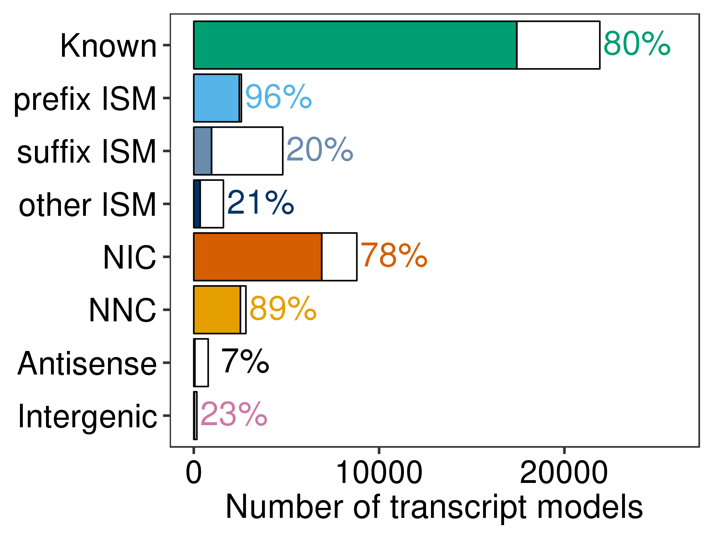

## Panel B: Percentage of TALON transcript models with CAGE support for their 5' end by novelty category in K562 PacBio
```bash
source activate mypython3.7.2
OUT=figures/S17/PacBio_K562
mkdir -p ${OUT}
python ../CAGE/run_CAGE_analysis.py \
        --gtf ${pb_k562_gtf} \
        --cage ${CAGE} \
        --maxdist 100 \
        --o ${OUT}/PacBio_K562

Rscript ${PLOTPATH}/plot_support_by_novelty_type.R \
    --f ${OUT}/PacBio_K562_CAGE_results.csv \
    --t CAGE \
    --novelty ${OUT}/transcript_beds/PacBio_K562_novelty.csv \
    --splitISM \
    --ymax 26000 \
    -o figures/S17/K562_PacBio
```
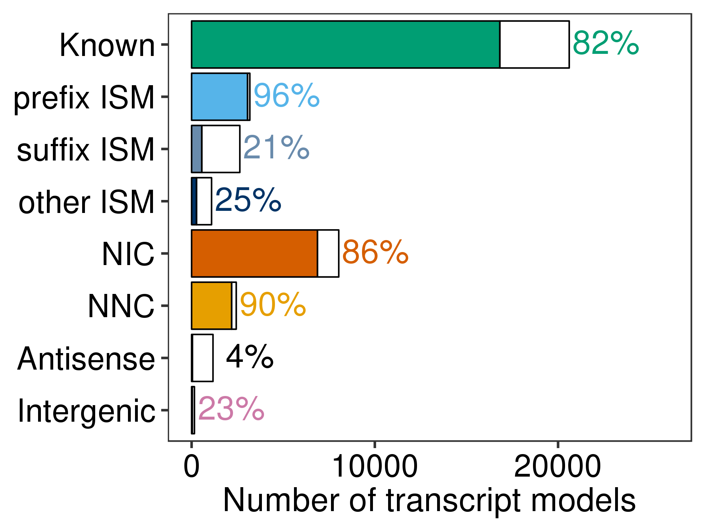

## Panel C: Percentage of TALON transcript models with CAGE support for their 5' end by novelty category in HepG2 ONT
```bash
source activate mypython3.7.2
OUT=figures/S17/ONT_HepG2
mkdir -p ${OUT}
python ../CAGE/run_CAGE_analysis.py \
        --gtf ${ont_hepg2_gtf} \
        --cage ${CAGE} \
        --maxdist 100 \
        --o ${OUT}/ONT_HepG2

Rscript ${PLOTPATH}/plot_support_by_novelty_type.R \
    --f ${OUT}/ONT_HepG2_CAGE_results.csv \
    --t CAGE \
    --novelty ${OUT}/transcript_beds/ONT_HepG2_novelty.csv \
    --splitISM \
    --ymax 26000 \
    -o figures/S17/HepG2_ONT
```
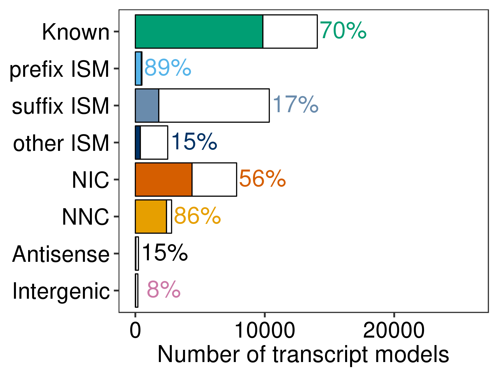

## Panel D: Percentage of TALON transcript models with CAGE support for their 5' end by novelty category in K562 ONT
```bash
source activate mypython3.7.2
OUT=figures/S17/ONT_K562
mkdir -p ${OUT}
python ../CAGE/run_CAGE_analysis.py \
        --gtf ${ont_k562_gtf} \
        --cage ${CAGE} \
        --maxdist 100 \
        --o ${OUT}/ONT_K562

Rscript ${PLOTPATH}/plot_support_by_novelty_type.R \
    --f ${OUT}/ONT_K562_CAGE_results.csv \
    --t CAGE \
    --novelty ${OUT}/transcript_beds/ONT_K562_novelty.csv \
    --splitISM \
    --ymax 26000 \
    -o figures/S17/K562_ONT
```
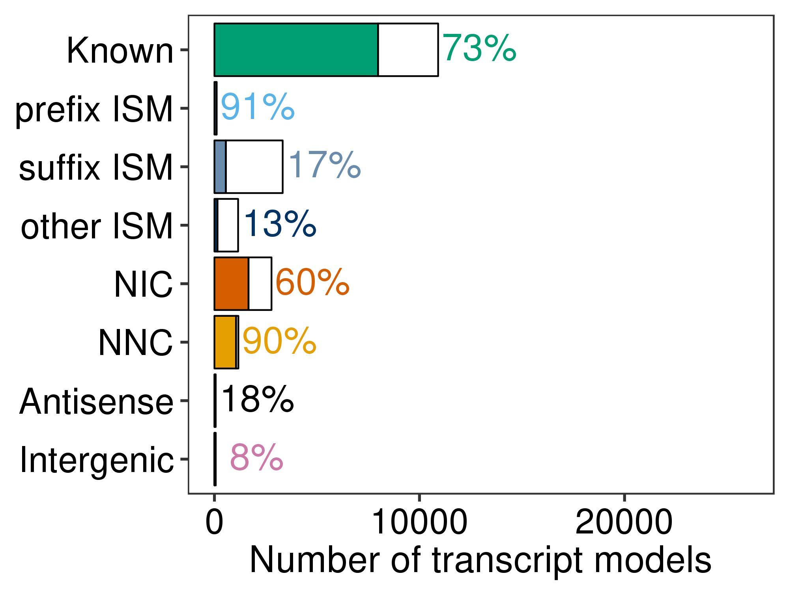

# Figure S18: Poly(A) motif support by novelty category in HepG2 and K562. 
## Panel A: Percentage of TALON transcript models with a computationally predicted poly(A) motif within 35 nt of the 3' end by novelty category in HepG2 PacBio
```bash
source activate mypython3.7.2
OUT=figures/S18/PacBio_HepG2/PAS
mkdir -p ${OUT}
python ../PAS-computational/run_computational_PAS_analysis.py \
        --gtf ${pb_hepg2_gtf} \
        --genome ${genome} \
        --maxdist 35 \
        --o ${OUT}/HepG2_PacBio

Rscript ${PLOTPATH}/plot_support_by_novelty_type.R \
    --f ${OUT}/HepG2_PacBio_polyA_motif.csv \
    --t PAS-comp \
    --novelty ${OUT}/transcript_beds/HepG2_PacBio_novelty.csv \
    --splitISM \
    --ymax 26000 \
    -o figures/S18/HepG2_PacBio
```
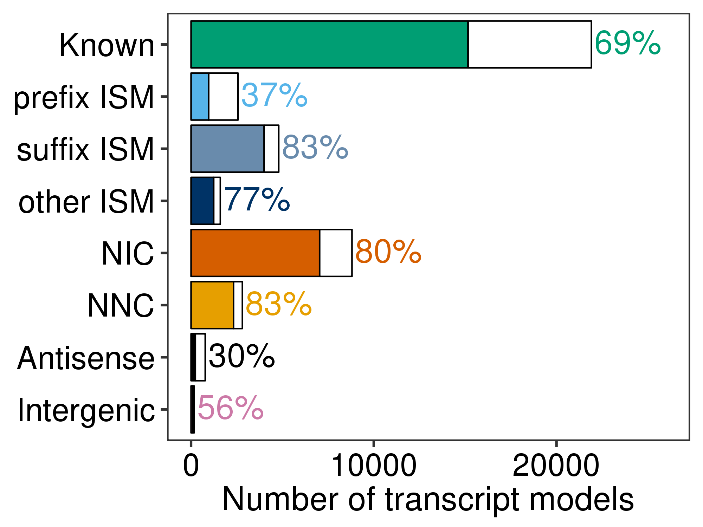

## Panel B: Percentage of TALON transcript models with a computationally predicted poly(A) motif within 35 nt of the 3' end by novelty category in K562 PacBio
```bash
source activate mypython3.7.2
OUT=figures/S18/PacBio_K562/PAS
mkdir -p ${OUT}
python ../PAS-computational/run_computational_PAS_analysis.py \
        --gtf ${pb_k562_gtf} \
        --genome ${genome} \
        --maxdist 35 \
        --o ${OUT}/K562_PacBio

Rscript ${PLOTPATH}/plot_support_by_novelty_type.R \
    --f ${OUT}/K562_PacBio_polyA_motif.csv \
    --t PAS-comp \
    --novelty ${OUT}/transcript_beds/K562_PacBio_novelty.csv \
    --splitISM \
    --ymax 26000 \
    -o figures/S18/K562_PacBio
```
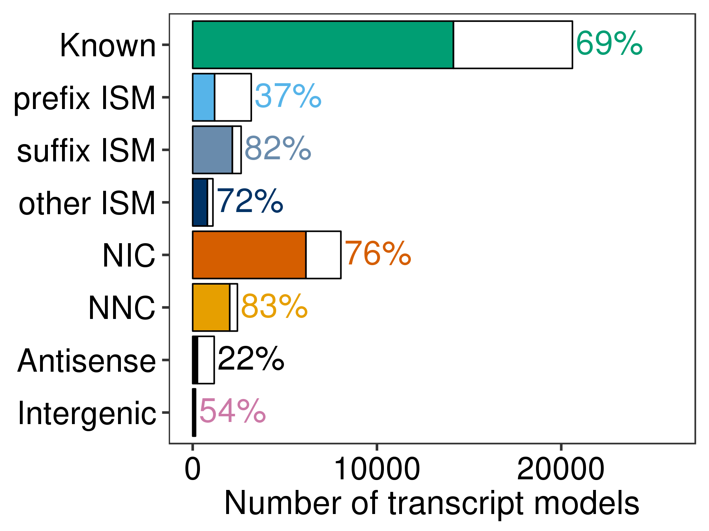


## Panel C: Percentage of TALON transcript models with a computationally predicted poly(A) motif within 35 nt of the 3' end by novelty category in HepG2 ONT
```bash
source activate mypython3.7.2
OUT=figures/S18/ONT_HepG2/PAS
mkdir -p ${OUT}
python ../PAS-computational/run_computational_PAS_analysis.py \
        --gtf ${ont_hepg2_gtf} \
        --genome ${genome} \
        --maxdist 35 \
        --o ${OUT}/HepG2_ONT

Rscript ${PLOTPATH}/plot_support_by_novelty_type.R \
    --f ${OUT}/HepG2_ONT_polyA_motif.csv \
    --t PAS-comp \
    --novelty ${OUT}/transcript_beds/HepG2_ONT_novelty.csv \
    --splitISM \
    --ymax 26000 \
    -o figures/S18/HepG2_ONT
```
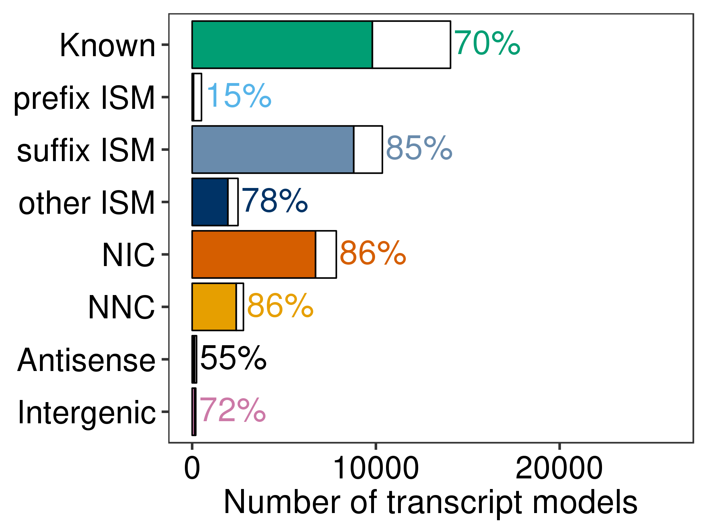

## Panel D: Percentage of TALON transcript models with a computationally predicted poly(A) motif within 35 nt of the 3' end by novelty category in K562 ONT
```bash
source activate mypython3.7.2
OUT=figures/S18/ONT_K562/PAS
mkdir -p ${OUT}
python ../PAS-computational/run_computational_PAS_analysis.py \
        --gtf ${ont_k562_gtf} \
        --genome ${genome} \
        --maxdist 35 \
        --o ${OUT}/K562_ONT

Rscript ${PLOTPATH}/plot_support_by_novelty_type.R \
    --f ${OUT}/K562_ONT_polyA_motif.csv \
    --t PAS-comp \
    --novelty ${OUT}/transcript_beds/K562_ONT_novelty.csv \
    --splitISM \
    --ymax 26000 \
    -o figures/S18/K562_ONT
```
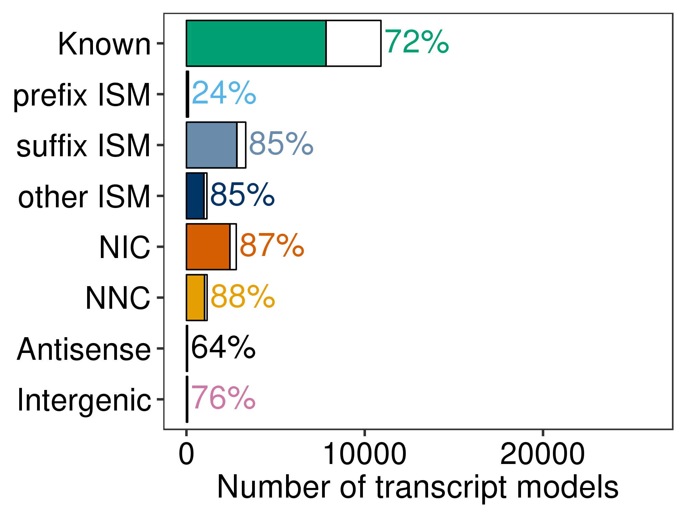

# Figure S19: RNA-PET support by novelty category in HepG2 and K562.

## Panel A: Percentage of TALON transcript models with RNA-PET support for their 5'-3' end pair by novelty category in HepG2 PacBio
```bash
source activate mypython3.7.2
OUT=figures/S19/PacBio_HepG2
mkdir -p ${OUT}

python ../RNA-PET/run_RNA-PET_analysis.py \
    --gtf ${pb_hepg2_gtf} \
    --rnapet ${HEPG2_RNAPET} \
    --maxdist 100 \
    --o ${OUT}/HepG2_PacBio

Rscript ${PLOTPATH}/plot_support_by_novelty_type.R \
    --f ${OUT}/HepG2_PacBio_RNA-PET_results.csv \
    --t RNA-PET \
    --novelty ${OUT}/transcript_beds/HepG2_PacBio_novelty.csv \
    --ymax 26000 \
    --splitISM \
    -o figures/S19/HepG2_PacBio
```
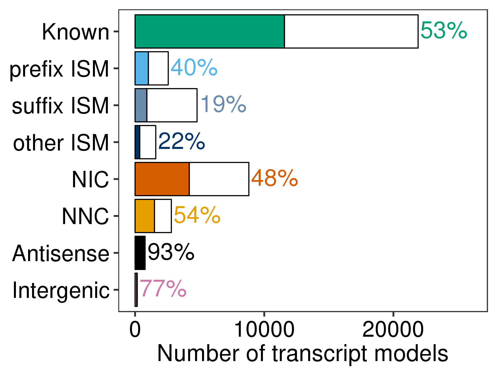

## Panel B: Percentage of TALON transcript models with RNA-PET support for their 5'-3' end pair by novelty category in K562 PacBio
```bash
source activate mypython3.7.2
OUT=figures/S19/PacBio_K562
mkdir -p ${OUT}

python ../RNA-PET/run_RNA-PET_analysis.py \
    --gtf ${pb_k562_gtf} \
    --rnapet ${K562_RNAPET} \
    --maxdist 100 \
    --o ${OUT}/K562_PacBio

Rscript ${PLOTPATH}/plot_support_by_novelty_type.R \
    --f ${OUT}/K562_PacBio_RNA-PET_results.csv \
    --t RNA-PET \
    --novelty ${OUT}/transcript_beds/K562_PacBio_novelty.csv \
    --ymax 26000 \
    --splitISM \
    -o figures/S19/K562_PacBio
```
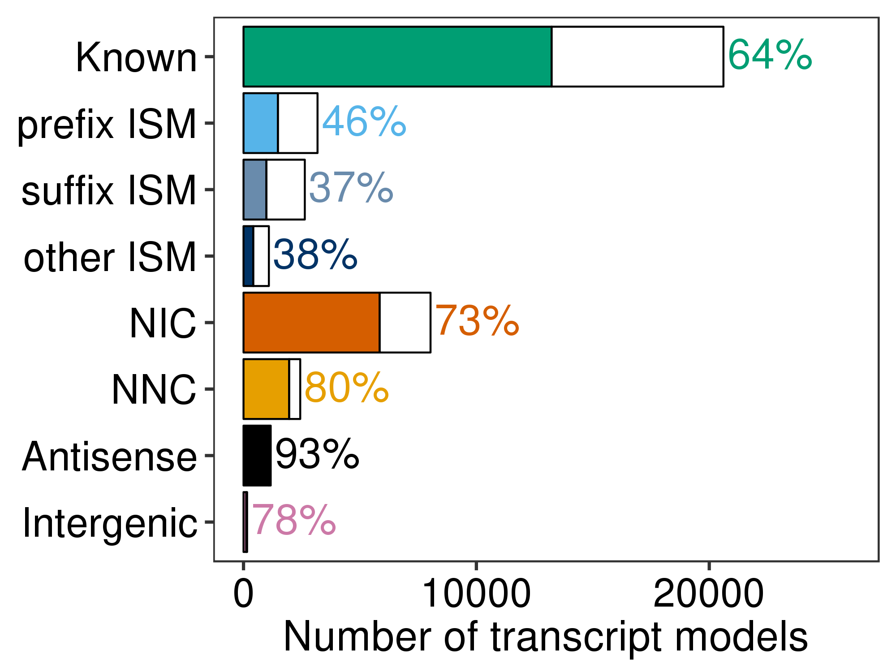

## Panel C: Percentage of TALON transcript models with RNA-PET support for their 5'-3' end pair by novelty category in HepG2 ONT
```bash
source activate mypython3.7.2
OUT=figures/S19/ONT_HepG2
mkdir -p ${OUT}

python ../RNA-PET/run_RNA-PET_analysis.py \
    --gtf ${ont_hepg2_gtf} \
    --rnapet ${HEPG2_RNAPET} \
    --maxdist 100 \
    --o ${OUT}/HepG2_ONT

Rscript ${PLOTPATH}/plot_support_by_novelty_type.R \
    --f ${OUT}/HepG2_ONT_RNA-PET_results.csv \
    --t RNA-PET \
    --novelty ${OUT}/transcript_beds/HepG2_ONT_novelty.csv \
    --ymax 26000 \
    --splitISM \
    -o figures/S19/HepG2_ONT
```
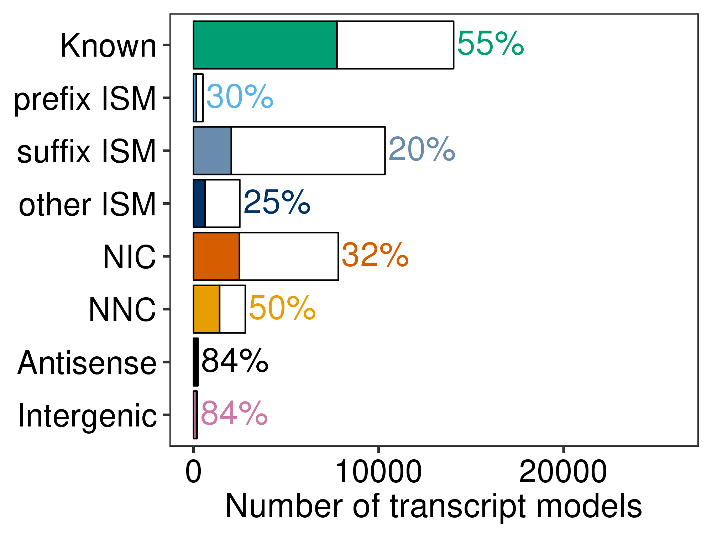

## Panel D: Percentage of TALON transcript models with RNA-PET support for their 5'-3' end pair by novelty category in K562 ONT
```bash
source activate mypython3.7.2
OUT=figures/S19/ONT_K562
mkdir -p ${OUT}

python ../RNA-PET/run_RNA-PET_analysis.py \
    --gtf ${ont_k562_gtf} \
    --rnapet ${K562_RNAPET} \
    --maxdist 100 \
    --o ${OUT}/K562_ONT

Rscript ${PLOTPATH}/plot_support_by_novelty_type.R \
    --f ${OUT}/K562_ONT_RNA-PET_results.csv \
    --t RNA-PET \
    --novelty ${OUT}/transcript_beds/K562_ONT_novelty.csv \
    --ymax 26000 \
    --splitISM \
    -o figures/S19/K562_ONT
```
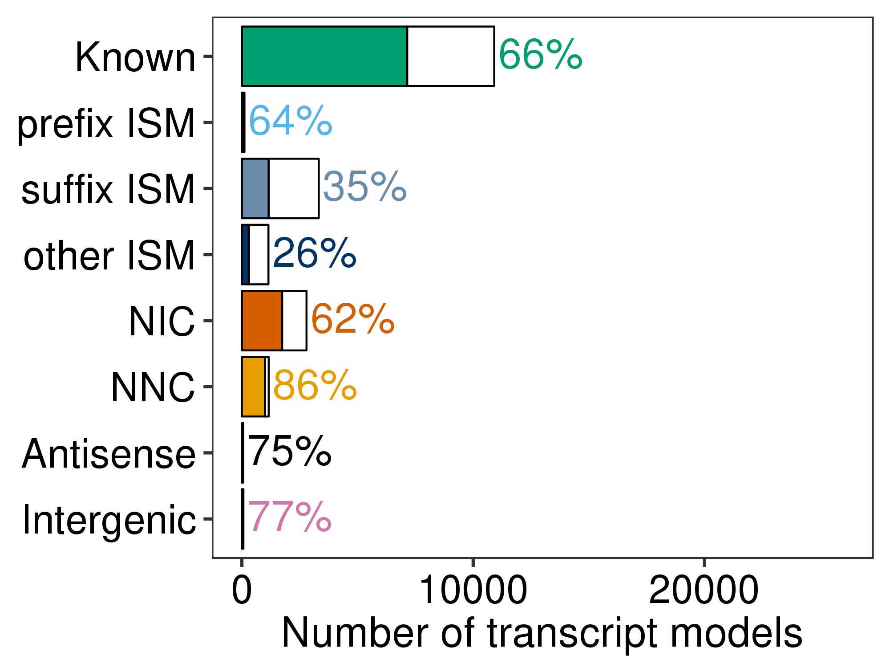


# Figure S22: PacBio Cortex and Hippocampus Splice Junction Support in GENCODE and Illumina short reads

Check out the (mouse_brain)[https://github.com/dewyman/TALON-paper-2019/tree/master/splicing_analysis/mouse_brain] readme for a detailed explanation of the analysis and figure generation

## Panel A: Venn diagram of cortex PacBio splice junction support from Illumina and GENCODE post-TranscriptClean and pre-TALON

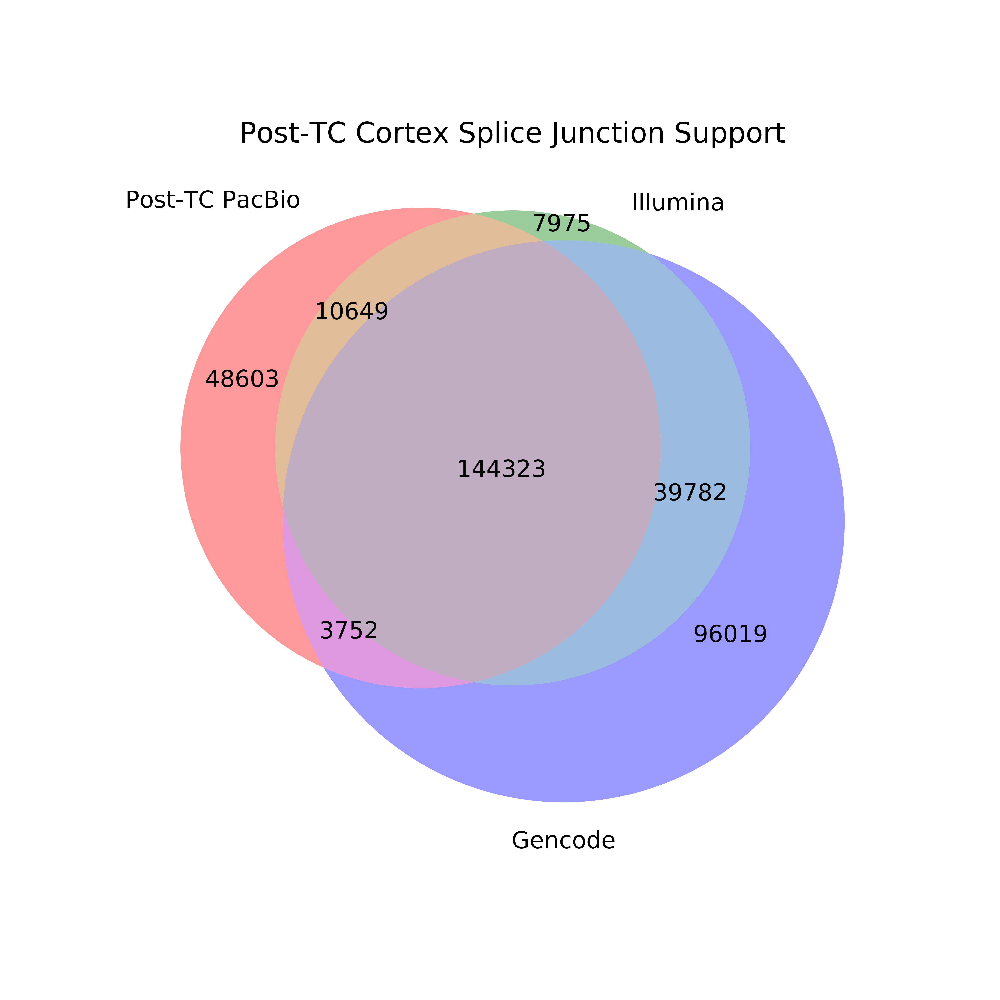

## Panel B : Venn diagram of cortex PacBio splice junction support from Illumina and GENCODE post-TALON

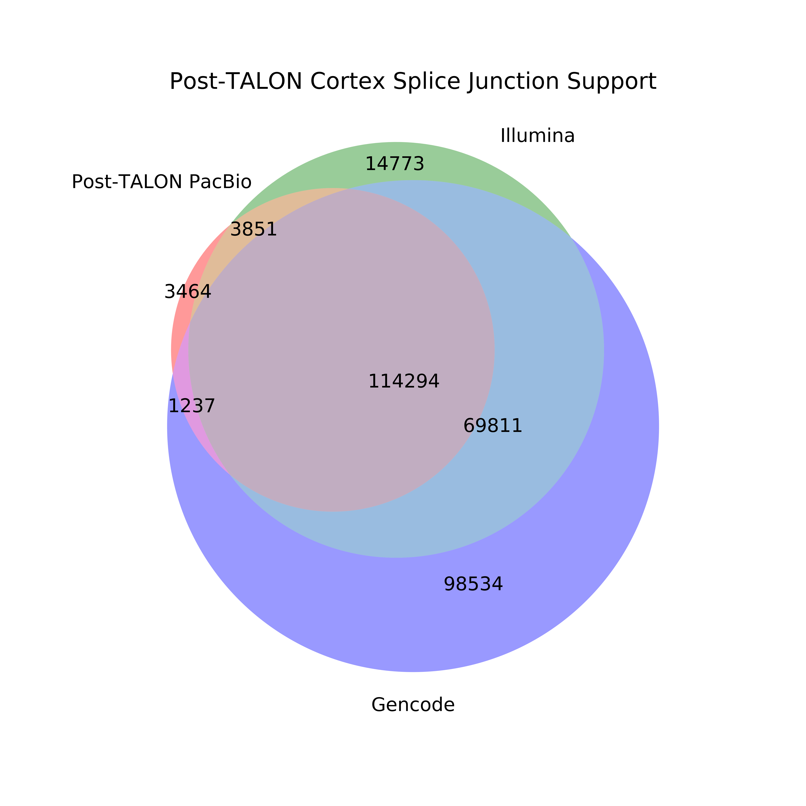

## Panel C: Venn diagram of hippocampus PacBio splice junction support from Illumina and GENCODE post-TranscriptClean and pre-TALON


## Panel D : Venn diagram of hippocampus PacBio splice junction support from Illumina and GENCODE post-TALON


