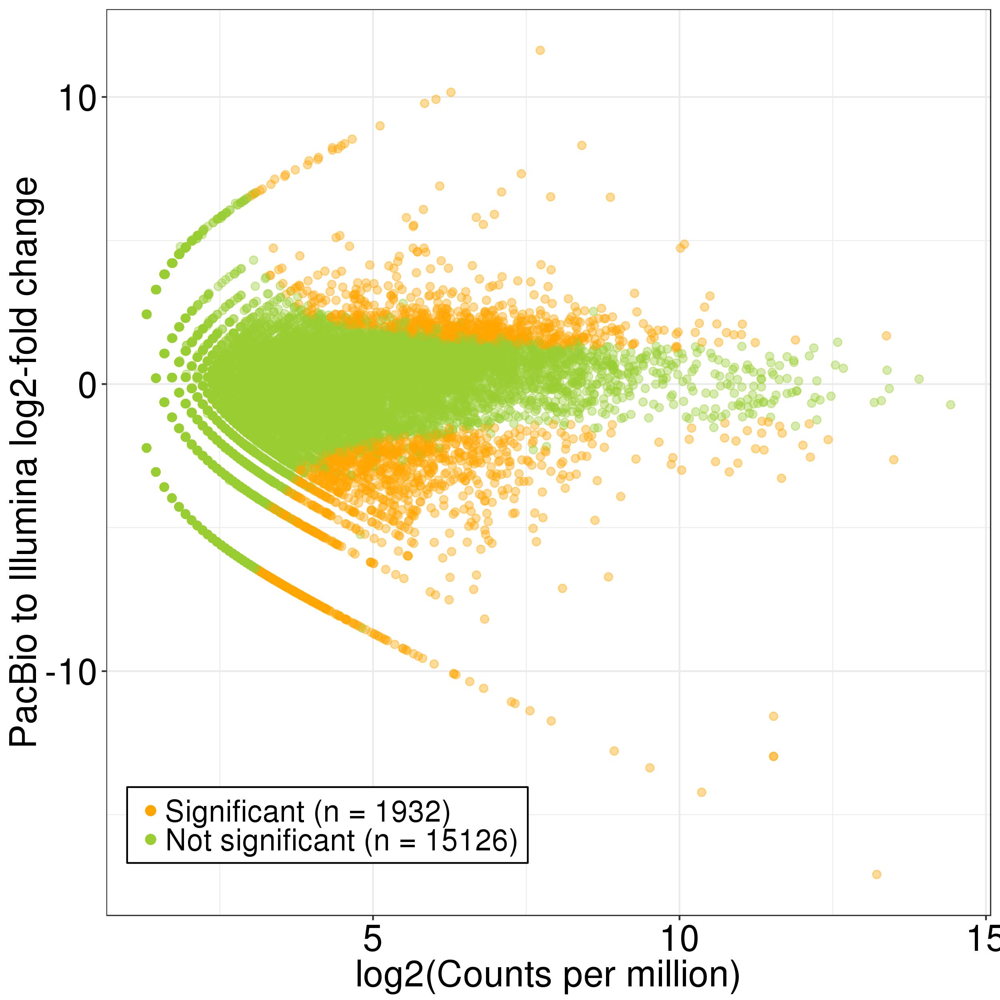
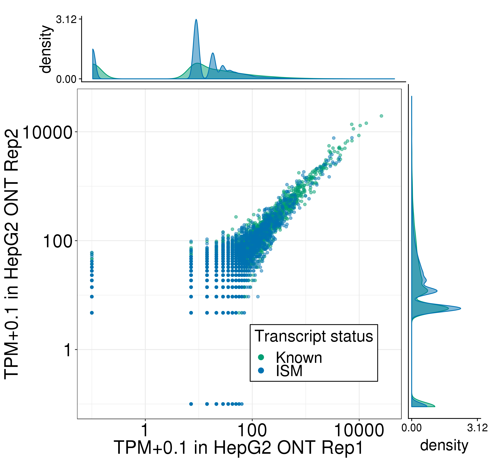
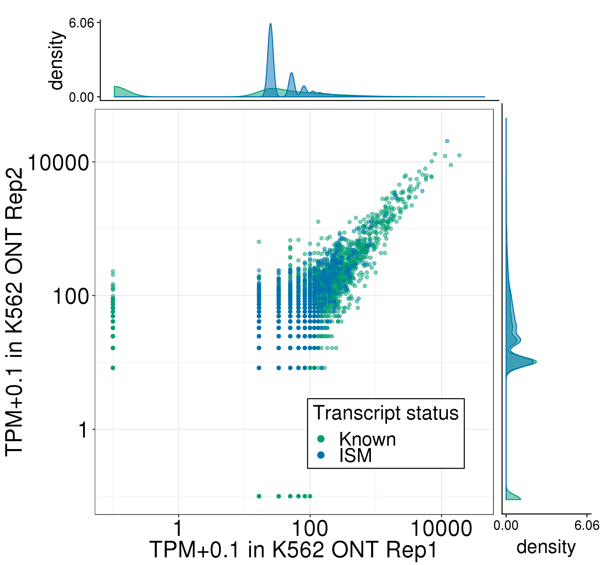

# Figure S3: HepG2 and K562 TALON PacBio gene quantification and expression

Files/paths used to generate the panels of this figure:
```bash
mkdir figures

PLOTPATH=../plotting_scripts

# download the supplementary tables and change this path!
sup_tables=/share/crsp/lab/seyedam/share/TALON_paper_data/revisions_10-19/human_TALON/analysis/supplementary_tables/

hepg2_abundance=${sup_tables}S6_HepG2_talon_abundance.tsv
hepg2_filt_abundance=${sup_tables}S7_HepG2_talon_abundance_filtered.tsv
hepg2_kallisto1=../Illumina/HepG2/Kallisto/Rep1/abundance.tsv
hepg2_kallisto2=../Illumina/HepG2/Kallisto/Rep2/abundance.tsv

k562_abundance=${sup_tables}S9_K562_talon_abundance.tsv
k562_filt_abundance=${sup_tables}S10_K562_talon_abundance_filtered.tsv
k562_kallisto1=../Illumina/K562/Kallisto/Rep1/abundance.tsv
k562_kallisto2=../Illumina/K562/Kallisto/Rep2/abundance.tsv

tier1_filt_abundance=${sup_tables}S17_full_gencode_v29_pb_talon_abundance_filtered.tsv
```
Abundance and GTF files are available as supplementary tables of the TALON paper. 

Software versions:
* R v3.5.1

## Panel A: Expression level of known genes (GENCODE v29) in each biological replicate of HepG2 in PacBio
```bash
Rscript ${PLOTPATH}/plot_longread_gene_expression_corr.R \
          --f ${hepg2_abundance} \
          --color green \
          --d1 PacBio_HepG2_1 \
          --d2 PacBio_HepG2_2 \
          --celltype HepG2 \
          --d1_type 'PacBio Rep1' \
          --d2_type 'PacBio Rep2' \
          -o figures/
```


Pearson and Spearman correlations are recorded in PacBio_HepG2_1-PacBio_HepG2_2_gene_correlations.txt.

## Panel B: Expression level of known genes (GENCODE v29) in each biological replicate of K562 in PacBio
```bash
Rscript ${PLOTPATH}/plot_longread_gene_expression_corr.R \
          --f ${k562_abundance} \
          --color red \
          --d1 PacBio_K562_1 \
          --d2 PacBio_K562_2 \
          --celltype K562 \
          --d1_type 'PacBio Rep1' \
          --d2_type 'PacBio Rep2' \
          -o figures/
```


Pearson and Spearman correlations are recorded in PacBio_K562_1-PacBio_K562_2_gene_correlations.txt.

## Panel C: Proportion of genes expressed in Illumina RNA-seq data of HepG2 that are also detected in the PacBio HepG2 data, binned by Illumina expression level
```bash
Rscript ${PLOTPATH}/plot_detection_by_TPM_for_datasets.R \
         --f ${hepg2_abundance} \
         --datasets PacBio_HepG2_1,PacBio_HepG2_2 \
         --ik1 ${hepg2_kallisto1} \
         --ik2 ${hepg2_kallisto2} \
         --color green \
         --dtype PacBio \
         -o figures/
mv figures/gene_detection_by_TPM.png figures/HepG2_gene_detection_by_TPM.png
```


## Panel D: Proportion of genes expressed in Illumina RNA-seq data of K562 that are also detected in the PacBio K562 data, binned by Illumina expression level
```bash
Rscript ${PLOTPATH}/plot_detection_by_TPM_for_datasets.R \
         --f ${k562_abundance} \
         --datasets PacBio_K562_1,PacBio_K562_2 \
         --ik1 ${k562_kallisto1} \
         --ik2 ${k562_kallisto2} \
         --color red \
         --dtype PacBio \
         -o figures/
mv figures/gene_detection_by_TPM.png figures/K562_gene_detection_by_TPM.png
```


# Figure S5: HepG2 and K562 TALON PacBio gene expression compared to Illumina short-read expression

## Panel A: Comparison of gene expression levels for known genes in the PacBio and Illumina RNA-seq platforms (HepG2)
```bash
Rscript ${PLOTPATH}/longread_v_illumina_genes_edgeR.R \
         --f ${hepg2_abundance} \
         --datasets PacBio_HepG2_1,PacBio_HepG2_2 \
         --ik1 ${hepg2_kallisto1} \
         --ik2 ${hepg2_kallisto2} \
         --color green \
         -o figures/
mv figures/edgeR_PacBio_illumina_gene_MA_plot.png figures/HepG2_edgeR_PacBio_illumina_gene_MA_plot.png
```


## Panel B: Comparison of gene expression levels for known genes in the PacBio and Illumina RNA-seq platforms (K562)
```bash
Rscript ${PLOTPATH}/longread_v_illumina_genes_edgeR.R \
         --f ${k562_abundance} \
         --datasets PacBio_K562_1,PacBio_K562_2 \
         --ik1 ${k562_kallisto1} \
         --ik2 ${k562_kallisto2} \
         --color red \
         -o figures/
mv figures/edgeR_PacBio_illumina_gene_MA_plot.png figures/K562_edgeR_PacBio_illumina_gene_MA_plot.png
```


# Figure S6: Number of distinct transcript isoforms observed in each novelty category 

## Panel A: HepG2
```bash
Rscript ${PLOTPATH}/plot_novelty_categories_distinct_isoforms.R \
         --f ${hepg2_filt_abundance} \
         --datasets PacBio_HepG2_1,PacBio_HepG2_2 \
         --o figures/
```


## Panel B: K562
```bash
Rscript ${PLOTPATH}/plot_novelty_categories_distinct_isoforms.R \
         --f ${k562_filt_abundance} \
         --datasets PacBio_K562_1,PacBio_K562_2 \
         --o figures/
```


# Figure S7: Transcript quantification by PacBio and TALON in HepG2 and K562

## Panel A: Expression level of known transcript models in each PacBio biological replicate of HepG2
```bash
Rscript ${PLOTPATH}/plot_longread_transcript_expression_corr.R \
         --f ${hepg2_filt_abundance} \
         --d1 PacBio_HepG2_1 \
         --d1_type 'Rep1 PacBio' \
         --d2 PacBio_HepG2_2 \
         --d2_type 'Rep2 PacBio' \
         --celltype HepG2 \
         -o figures/
```

Correlations are in PacBio_HepG2_1-PacBio_HepG2_2_Known_transcript_correlations.txt. 

## Panel B: Expression level of known transcript models in each PacBio biological replicate of K562
```bash
Rscript ${PLOTPATH}/plot_longread_transcript_expression_corr.R \
         --f ${k562_filt_abundance} \
         --d1 PacBio_K562_1 \
         --d1_type 'Rep1 PacBio' \
         --d2 PacBio_K562_2 \
         --d2_type 'Rep2 PacBio' \
         --celltype K562 \
         -o figures/
```

Correlations are in PacBio_K562_1-PacBio_K562_2_Known_transcript_correlations.txt. 

## Panel C: Expression of transcript models in each biological replicate of HepG2, labeled by their novelty assignments
```bash
Rscript ${PLOTPATH}/plot_longread_transcript_expression_corr.R \
         --f ${hepg2_filt_abundance} \
         --d1 PacBio_HepG2_1 \
         --d1_type 'Rep1 PacBio' \
         --d2 PacBio_HepG2_2 \
         --d2_type 'Rep2 PacBio' \
         --celltype HepG2 \
         --ISM --NIC --NNC --antisense --intergenic \
         -o figures/
```

Correlations are in PacBio_HepG2_1-PacBio_HepG2_2_Known-ISM-NIC-NNC-Antisense-Intergenic_transcript_correlations.txt.

## Panel D: Expression of transcript models in each biological replicate of K562, labeled by their novelty assignments
```bash
Rscript ${PLOTPATH}/plot_longread_transcript_expression_corr.R \
         --f ${k562_filt_abundance} \
         --d1 PacBio_K562_1 \
         --d1_type 'Rep1 PacBio' \
         --d2 PacBio_K562_2 \
         --d2_type 'Rep2 PacBio' \
         --celltype K562 \
         --ISM --NIC --NNC --antisense --intergenic \
         -o figures/
```

Correlations are in PacBio_K562_1-PacBio_K562_2_Known-ISM-NIC-NNC-Antisense-Intergenic_transcript_correlations.txt.

## Panel E: Comparison of known transcript expression levels in the PacBio and Illumina RNA-seq platforms (HepG2 Rep 1 and 2). 
```bash
Rscript ${PLOTPATH}/longread_v_illumina_transcripts_edgeR.R \
         --f ${hepg2_filt_abundance} \
         --datasets PacBio_HepG2_1,PacBio_HepG2_2 \
         --ik1 ${hepg2_kallisto1} \
         --ik2 ${hepg2_kallisto2} \
         --color green \
          -o figures/
mv figures/edgeR_PacBio_illumina_transcript_MA_plot.png figures/HepG2_edgeR_PacBio_illumina_transcript_MA_plot.png
```


## Panel F: Comparison of known transcript expression levels in the PacBio and Illumina RNA-seq platforms (K562 Rep 1 and 2). 
```bash
Rscript ${PLOTPATH}/longread_v_illumina_transcripts_edgeR.R \
         --f ${k562_filt_abundance} \
         --datasets PacBio_K562_1,PacBio_K562_2 \
         --ik1 ${k562_kallisto1} \
         --ik2 ${k562_kallisto2} \
         --color green \
          -o figures/
mv figures/edgeR_PacBio_illumina_transcript_MA_plot.png figures/K562_edgeR_PacBio_illumina_transcript_MA_plot.png
```


## Panel G: Total number of PacBio reads assigned to each novelty category in PacBio HepG2 after transcript filtering
```bash
Rscript ${PLOTPATH}/plot_novelty_category_read_counts.R \
         --f ${hepg2_filt_abundance}  \
         --datasets PacBio_HepG2_1 \
         --o figures/
```


## Panel H: Total number of PacBio reads assigned to each novelty category in PacBio K562 after transcript filtering
```bash
Rscript ${PLOTPATH}/plot_novelty_category_read_counts.R \
         --f ${k562_filt_abundance}  \
         --datasets PacBio_K562_1 \
         --o figures/
```


# Figure S9: Epstein-Barr Virus transcriptome characterization in GM12878

Run TALON and post-processing scripts as detailed in https://github.com/dewyman/TALON-paper-2019/tree/master/ebv/.
 
## Panel A: Gene expression levels in GM12878 from the EBV chromosome and from the human chromosomes, labelled by gene novelty
```bash
ebv_dir=../ebv/
python ${ebv_dir}ebv_compute_tpms.py --c ${ebv_dir}ebv_expression_config.csv
Rscript ${ebv_dir}plot_ebv_v_human_abundances.R \
          --gene_csv ${ebv_dir}ebv_human_gene_abundance.csv \
          --transcript_csv ${ebv_dir}ebv_human_transcript_abundance.csv \
          --datasets combined
```


## Panel B: Transcript expression levels in GM12878 from the EBV chromosome and from the human chromosomes, labelled by transcript novelty.


## Panel C: Visualization of TALON GTF annotations in the UCSC genome browser for EBV transcripts in GM12878.
```bash
python ../analysis_scripts/gen_novelty_tracks_gtf.py \
          --c ${ebv_dir}ebv_gtf_track_config.csv
url=`cut -d, -f5 ${ebv_dir}ebv_gtf_track_config.csv`
n=`cut -d, -f2 ${ebv_dir}ebv_gtf_track_config.csv`
cp ${ebv_dir}ebv_chr1.gtf ${ebv_dir}ebv_talon_observedOnly_tracks/
printf 'track name="EBV Reference" visibility=pack color=0,0,128\n%s/ebv_chr1.gtf' "$url" >> ${ebv_dir}ebv_talon_observedOnly_tracks/ebv_talon_observedOnly_${n}_tracks
```
Then, load the tracks into the genome browswer (after moving them to a public-facing directory on your computer/cluster), and take a screenshot or use the genome browser's PDF screenshot functionality


# Figure S11: Transcript and gene quantification by PacBio/ONT and TALON 

## Panel A: Expression level of known and ISM transcript models in PacBio/ONT in GM12878
```bash
abundance=S28_full_gencode_v29_pb_ont_talon_abundance.tsv
filt_abundance=S29_full_gencode_v29_pb_ont_talon_abundance_filtered.tsv
```

```bash
Rscript ${PLOTPATH}/plot_longread_transcript_expression_corr.R \
         --f ${filt_abundance} \
         --d1 PacBio_GM12878_1 \
         --d1_type 'PacBio' \
         --d2 ONT_GM12878_2 \
         --d2_type 'ONT' \
         --celltype GM12878 \
         --ISM \
         -o figures/
```

Correlations are in PacBio_GM12878_1-ONT_GM12878_2_Known-ISM_transcript_correlations.txt. 

## Panel B: Expression level of known genes (GENCODE v29) in each biological replicate of HepG2 in ONT
```bash
hepg2_abundance=S22_HepG2_ont_talon_abundance.tsv
hepg2_filt_abundance=S23_HepG2_ont_talon_abundance_filtered.tsv

k562_abundance=S25_K562_ont_talon_abundance.tsv
k562_filt_abundance=S26_K562_ont_talon_abundance_filtered.tsv
```

```bash
Rscript ${PLOTPATH}/plot_longread_gene_expression_corr.R \
          --f ${hepg2_abundance} \
          --color green \
          --d1 ONT_HepG2_3 \
          --d2 ONT_HepG2_1 \
          --celltype HepG2 \
          --d1_type 'ONT Rep1' \
          --d2_type 'ONT Rep2' \
          -o figures/
```


Pearson and Spearman correlations are recorded in ONT_HepG2_1-ONT_HepG2_2_gene_correlations.txt

## Panel C: Expression level of known genes (GENCODE v29) in each biological replicate of K562 in ONT
```bash
Rscript ${PLOTPATH}/plot_longread_gene_expression_corr.R \
          --f ${k562_abundance} \
          --color red \
          --d1 ONT_K562_1 \
          --d2 ONT_K562_2 \
          --celltype K562 \
          --d1_type 'ONT Rep1' \
          --d2_type 'ONT Rep2' \
          -o figures/
```


Pearson and Spearman correlations are recorded in ONT_K562_1-ONT_K562_2_gene_correlations.txt

## Panel D: Expression level of known and ISM transcript models in ONT in HepG2

```bash
Rscript ${PLOTPATH}/plot_longread_transcript_expression_corr.R \
         --f ${hepg2_filt_abundance} \
         --d1 ONT_HepG2_3 \
         --d1_type 'ONT Rep1' \
         --d2 ONT_HepG2_1 \
         --d2_type 'ONT Rep2' \
         --celltype HepG2 \
         --ISM \
         -o figures/
```

Correlations are in ONT_HepG2_1-ONT_HepG2_3_Known-ISM_transcript_correlations.txt.

## Panel E: Expression level of known and ISM transcript models in ONT in K562

```bash
Rscript ${PLOTPATH}/plot_longread_transcript_expression_corr.R \
         --f ${k562_filt_abundance} \
         --d1 ONT_K562_1 \
         --d1_type 'ONT Rep1' \
         --d2 ONT_K562_2 \
         --d2_type 'ONT Rep2' \
         --celltype K562 \
         --ISM \
         -o figures/
```

Correlations are in ONT_K562_1-ONT_K562_2_Known-ISM_transcript_correlations.txt.  

# Figure S12: Gene and transcript reproducibility across long-read platforms ONT and PacBio in HepG2 and K562

## Panel A: Expression level of known and antisense genes in PacBio/ONT in HepG2

```bash
Rscript ${PLOTPATH}/plot_longread_gene_expression_corr.R \
          --f ${abundance} \
          --color green \
          --d1 PacBio_HepG2_1 \
          --d2 ONT_HepG2_1 \
          --celltype HepG2 \
          --d1_type 'PacBio' \
          --d2_type 'ONT' \
          -o figures/
```


Pearson and Spearman correlations are recorded in PacBio_HepG2_1-ONT_HepG2_1_gene_correlations.txt.

## Panel B: Expression level of known and antisense genes in PacBio/ONT in HepG2

```bash
Rscript ${PLOTPATH}/plot_longread_gene_expression_corr.R \
          --f ${abundance} \
          --color red \
          --d1 PacBio_K562_1 \
          --d2 ONT_K562_1 \
          --celltype HepG2 \
          --d1_type 'PacBio' \
          --d2_type 'ONT' \
          -o figures/
```


Pearson and Spearman correlations are recorded in PacBio_K562_1-ONT_K562_1_gene_correlations.txt.

## Panel C: Expression level of known and ISM transcript models in PacBio/ONT in HepG2

```bash
Rscript ${PLOTPATH}/plot_longread_transcript_expression_corr.R \
         --f ${filt_abundance} \
         --d1 PacBio_HepG2_1 \
         --d1_type 'PacBio' \
         --d2 ONT_HepG2_1 \
         --d2_type 'ONT' \
         --celltype HepG2 \
         --ISM \
         -o figures/
```

Correlations are in PacBio_HepG2_1-ONT_HepG2_1_Known-ISM_transcript_correlations.txt. 

## Panel D: Expression level of known and ISM transcript models in PacBio/ONT in K562

```bash
Rscript ${PLOTPATH}/plot_longread_transcript_expression_corr.R \
         --f ${filt_abundance} \
         --d1 PacBio_K562_1 \
         --d1_type 'PacBio' \
         --d2 ONT_K562_2 \
         --d2_type 'ONT' \
         --celltype K562 \
         --ISM \
         -o figures/
```

Correlations are in PacBio_K562_1-ONT_K562_2_Known-ISM_transcript_correlations.txt. 

# Figure S15: Splice junction novelty and reproducibility across platforms

Check out this readme for a detailed explanation of the analysis and figure generation: https://github.com/dewyman/TALON-paper-2019/tree/master/analysis_scripts/compare_sjs


