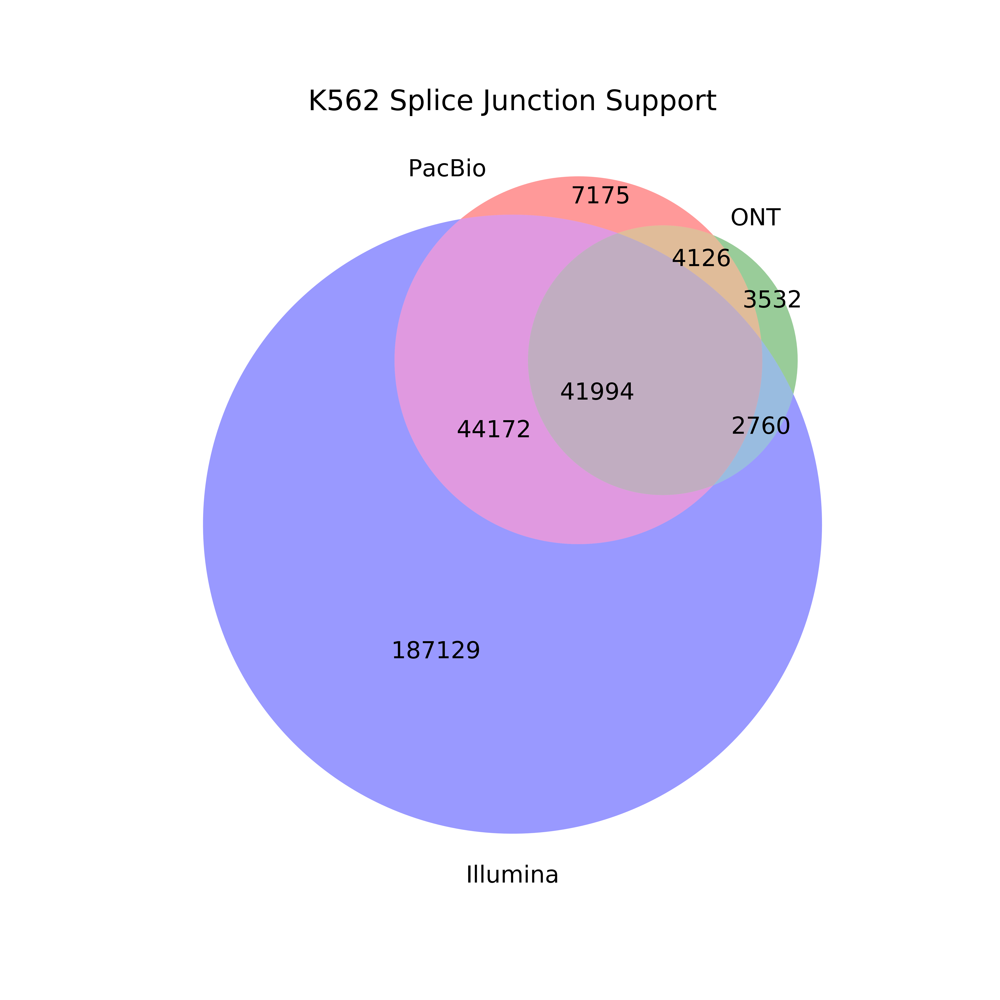

## Splice junction comparison

1. We will use GM12878 to compare splice junctions across sequencing platforms. We need the GM12878 PacBio and ONT GTFs from the supplement, tables S2 and S17. These will be stored in pb_gtfs/ and ont_gtfs/ respectively.

2. Extract splice junctions from GM12878 PacBio and ONT gtfs using TranscriptClean
```
conda activate python2.7
TCPATH=~/mortazavi_lab/bin/TranscriptClean/accessory_scripts/
REFPATH=~/mortazavi_lab/ref/hg38/

python ${TCPATH}get_SJs_from_gtf.py \
	--f pb_gtfs/GM12878_talon_observedOnly.gtf \
	--g ${REFPATH}hg38.fa \
	--o pb_talon_GM12878_sjs.tab

python ${TCPATH}get_SJs_from_gtf.py \
	--f ont_gtfs/GM12878_ont_talon_observedOnly.gtf \
	--g ${REFPATH}hg38.fa \
	--o ont_talon_GM12878_sjs.tab
```

3. Now, let's get the splice junctions present in the Illumina data by mapping with STAR. 
```
qsub run_STAR_illumina_GM12878.sh
```

4. Create a venn diagram demonstrating which splice junctions are present in which dataset.
```
conda activate base
mkdir figures
python compare_sjs_venn.py \
	-pb pb_talon_GM12878_sjs.tab \
	-ont ont_talon_GM12878_sjs.tab \
	-illumina GM12878_alignedSJ.out.tab \
	-sample GM12878
```

5. We wanted to see how TranscriptClean alters SJ support by other technologies, so we pulled the SJs out of the pre-TranscriptClean sam files
```

```

5. We also ran the above analysis for the other 2 cell lines:
 ```
# HepG2 (requires tables S5 and S20)
conda activate python2.7
TCPATH=~/mortazavi_lab/bin/TranscriptClean/accessory_scripts/
REFPATH=~/mortazavi_lab/ref/hg38/

python ${TCPATH}get_SJs_from_gtf.py \
	--f pb_gtfs/HepG2_talon_observedOnly.gtf \
	--g ${REFPATH}hg38.fa \
	--o pb_talon_HepG2_sjs.tab

python ${TCPATH}get_SJs_from_gtf.py \
	--f ont_gtfs/HepG2_ont_talon_observedOnly.gtf \
	--g ${REFPATH}hg38.fa \
	--o ont_talon_HepG2_sjs.tab

qsub run_STAR_illumina_HepG2.sh

conda activate base
python compare_sjs_venn.py \
	-pb pb_talon_HepG2_sjs.tab \
	-ont ont_talon_HepG2_sjs.tab \
	-illumina HepG2_alignedSJ.out.tab \
	-sample HepG2

# K562 (requires tables S8 and S23)
conda activate python2.7
TCPATH=~/mortazavi_lab/bin/TranscriptClean/accessory_scripts/
REFPATH=~/mortazavi_lab/ref/hg38/

python ${TCPATH}get_SJs_from_gtf.py \
	--f pb_gtfs/K562_talon_observedOnly.gtf \
	--g ${REFPATH}hg38.fa \
	--o pb_talon_K562_sjs.tab

python ${TCPATH}get_SJs_from_gtf.py \
	--f ont_gtfs/K562_ont_talon_observedOnly.gtf
	--g ${REFPATH}hg38.fa \
	--o ont_talon_K562_sjs.tab

qsub run_STAR_illumina_K562.sh

conda activate base
python compare_sjs_venn.py \
	-pb pb_talon_K562_sjs.tab \
	-ont ont_talon_K562_sjs.tab \
	-illumina K562_alignedSJ.out.tab \
	-sample K562
 ```




