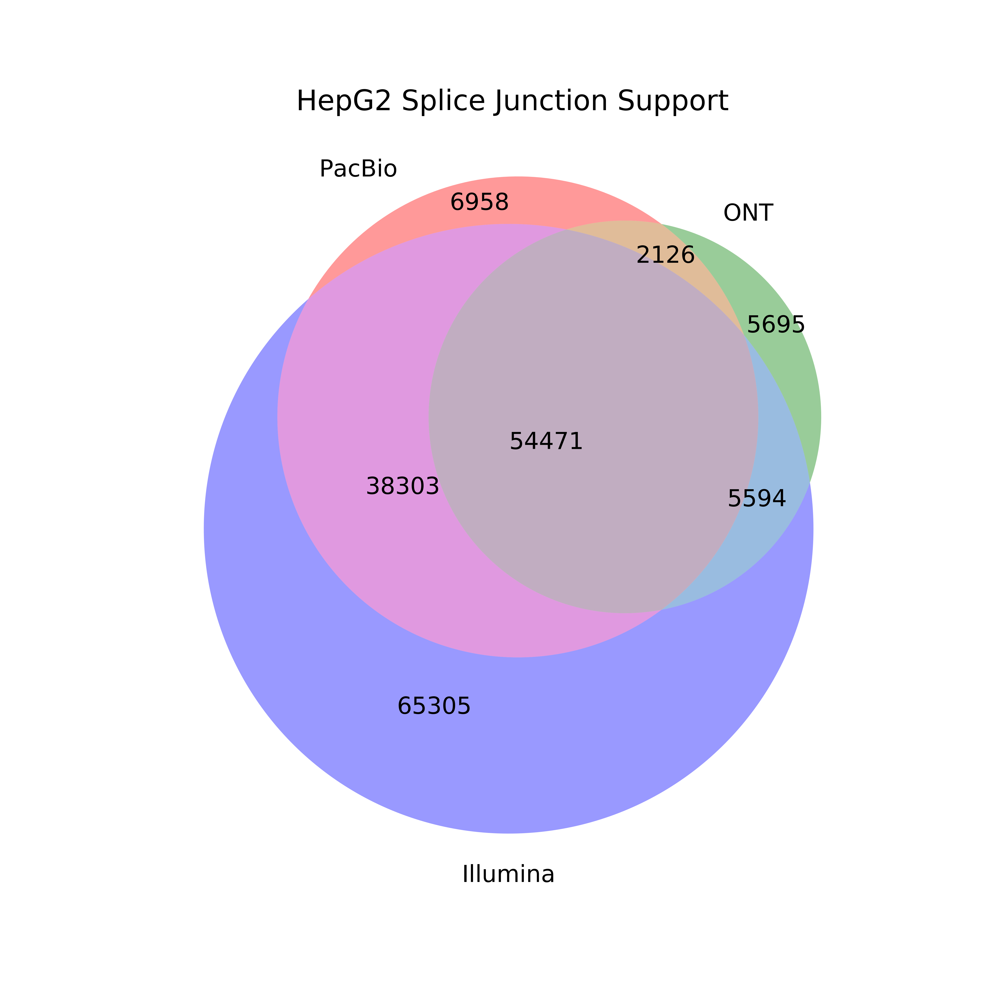
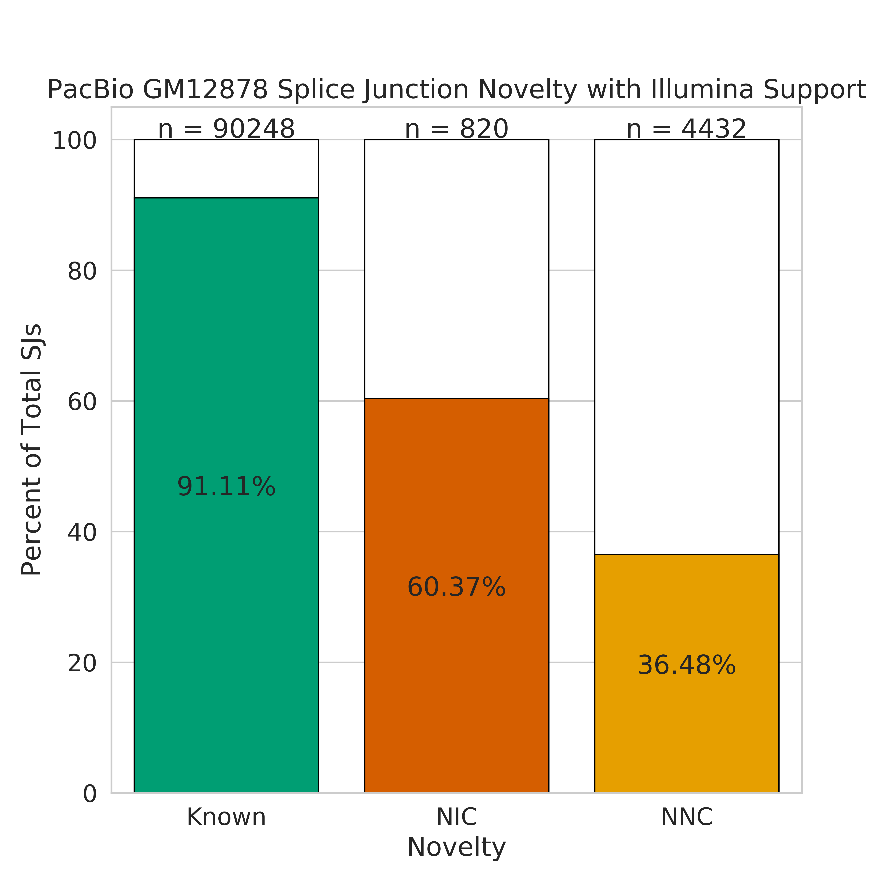
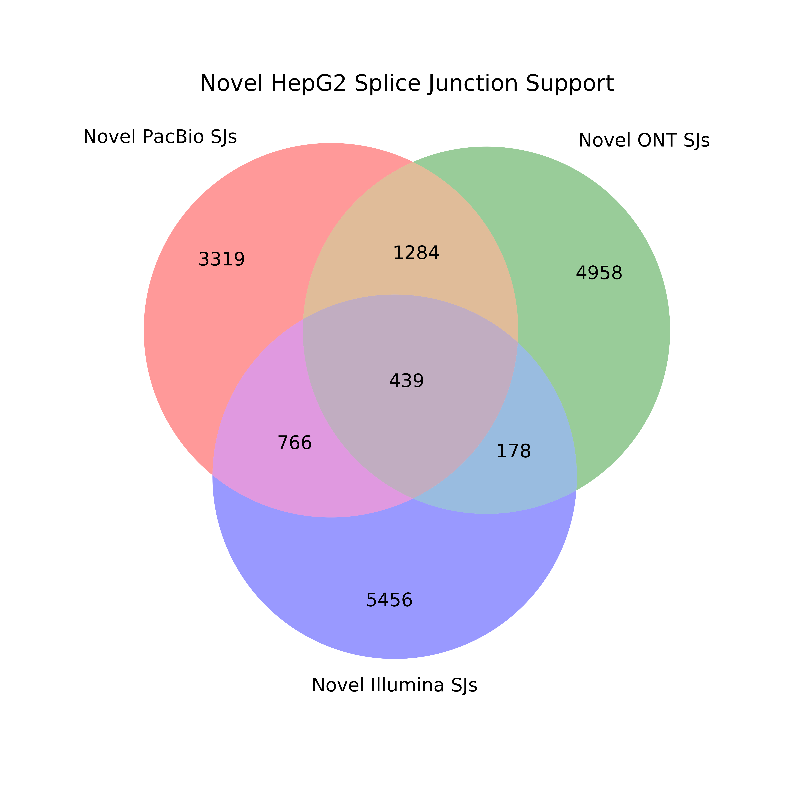
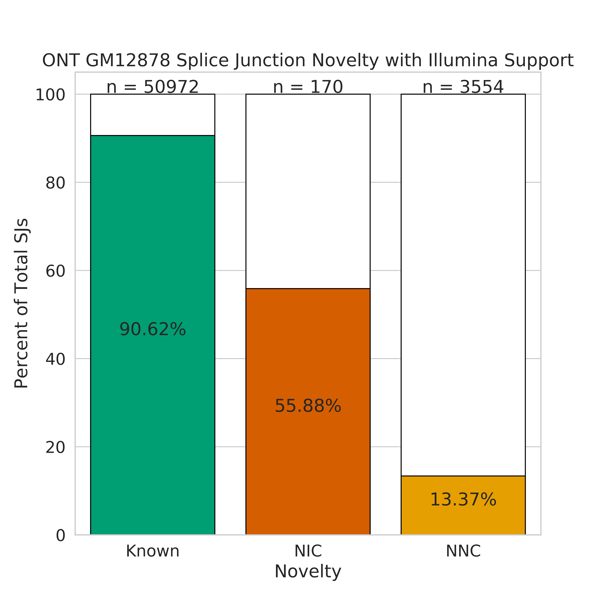
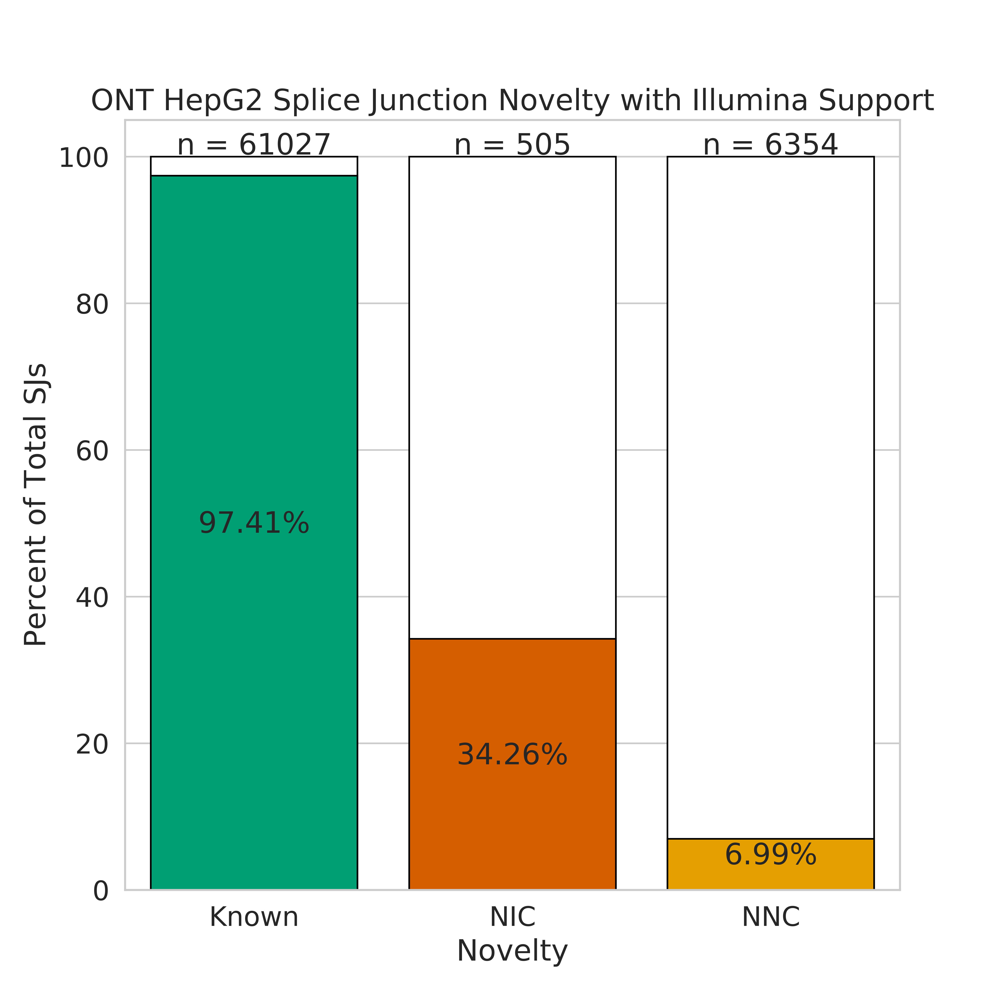
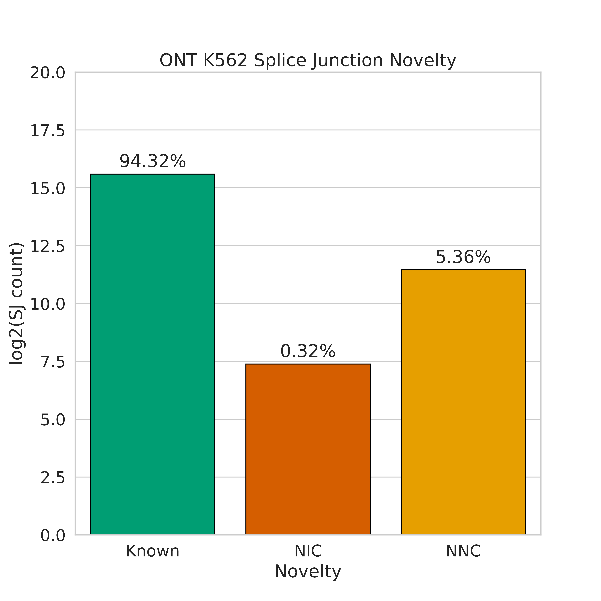
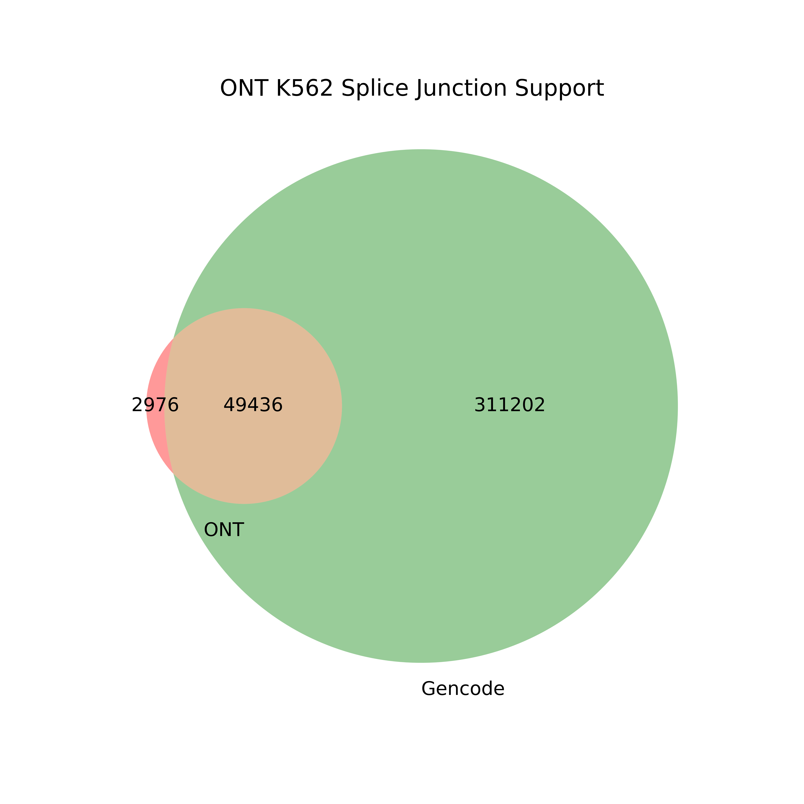

## Technology (PacBio vs. ONT vs. Illumina) splice junction comparison

1. We will use GM12878 to compare splice junctions across sequencing platforms. We need the GM12878 PacBio and ONT GTFs from the supplement, tables S2 and S17. These will be stored in pb_gtfs/ and ont_gtfs/ respectively.

2. Extract splice junctions from GM12878 PacBio and ONT gtfs using TranscriptClean
```bash
conda activate python2.7
TCPATH=~/mortazavi_lab/bin/TranscriptClean/accessory_scripts/
REFPATH=~/mortazavi_lab/ref/hg38/

python ${TCPATH}get_SJs_from_gtf.py \
	--f pb_gtfs/GM12878_talon_observedOnly.gtf \
	--g ${REFPATH}hg38.fa \
	--o pb_talon_GM12878_sjs.tab

python ${TCPATH}get_SJs_from_gtf.py \
	--f ont_gtfs/GM12878_ont_talon_observedOnly.gtf \
	--g ${REFPATH}hg38.fa \
	--o ont_talon_GM12878_sjs.tab
```

3. Now, let's get the splice junctions present in the Illumina data by mapping with STAR. 
```bash
qsub run_STAR_illumina_GM12878_Rep1.sh
qsub run_STAR_illumina_GM12878_Rep2.sh
```

4. Filter out novel Illumina SJs that don't have support from both reps and known Illumina SJs that have no read support.
```bash
conda activate base
python filter_illumina_sjs.py \
	-sj_1 GM12878_Rep1_alignedSJ.out.tab \
	-sj_2 GM12878_Rep2_alignedSJ.out.tab 
```
<!-- 
testing.
```
python compare_sjs_venn.py \
	-pb pb_talon_GM12878_sjs.tab \
	-ont ont_talon_GM12878_sjs.tab \
	-illumina test_Gm12878_short.tab \
	-sample GM12878_filtered_illumina
``` -->

5. Create a venn diagram demonstrating which splice junctions are present in which dataset.
```bash
mkdir figures
python compare_sjs_venn.py \
	-pb pb_talon_GM12878_sjs.tab \
	-ont ont_talon_GM12878_sjs.tab \
	-illumina GM12878_alignedSJ.out.tab \
	-sample GM12878
```

6. We also ran the above analysis for the other 2 cell lines:
 ```bash
# HepG2 (requires tables S5 and S20)
conda activate python2.7
TCPATH=~/mortazavi_lab/bin/TranscriptClean/accessory_scripts/
REFPATH=~/mortazavi_lab/ref/hg38/

python ${TCPATH}get_SJs_from_gtf.py \
	--f pb_gtfs/HepG2_talon_observedOnly.gtf \
	--g ${REFPATH}hg38.fa \
	--o pb_talon_HepG2_sjs.tab

python ${TCPATH}get_SJs_from_gtf.py \
	--f ont_gtfs/HepG2_ont_talon_observedOnly.gtf \
	--g ${REFPATH}hg38.fa \
	--o ont_talon_HepG2_sjs.tab

qsub run_STAR_illumina_HepG2_Rep1.sh
qsub run_STAR_illumina_HepG2_Rep2.sh

conda activate base
python filter_illumina_sjs.py \
	-sj_1 HepG2_Rep1_alignedSJ.out.tab \
	-sj_2 HepG2_Rep2_alignedSJ.out.tab 

python compare_sjs_venn.py \
	-pb pb_talon_HepG2_sjs.tab \
	-ont ont_talon_HepG2_sjs.tab \
	-illumina HepG2_alignedSJ.out.tab \
	-sample HepG2

# K562 (requires tables S8 and S23)
conda activate python2.7
TCPATH=~/mortazavi_lab/bin/TranscriptClean/accessory_scripts/
REFPATH=~/mortazavi_lab/ref/hg38/

python ${TCPATH}get_SJs_from_gtf.py \
	--f pb_gtfs/K562_talon_observedOnly.gtf \
	--g ${REFPATH}hg38.fa \
	--o pb_talon_K562_sjs.tab

python ${TCPATH}get_SJs_from_gtf.py \
	--f ont_gtfs/K562_ont_talon_observedOnly.gtf \
	--g ${REFPATH}hg38.fa \
	--o ont_talon_K562_sjs.tab

qsub run_STAR_illumina_K562_Rep1.sh
qsub run_STAR_illumina_K562_Rep2.sh

conda activate base
python filter_illumina_sjs.py \
	-sj_1 K562_Rep1_alignedSJ.out.tab \
	-sj_2 K562_Rep2_alignedSJ.out.tab 

python compare_sjs_venn.py \
	-pb pb_talon_K562_sjs.tab \
	-ont ont_talon_K562_sjs.tab \
	-illumina K562_alignedSJ.out.tab \
	-sample K562 
 ```





## Splice junction novelty types

We wanted to investigate the support for and percent makeup for splice junctions of different novelty types. In this case we define splice junction novelty as the following: 

* **Known junction:** A splice junction with the whole splice junction (splice donor and acceptor) seen in the Gencode annotation
* **NIC junction:** A splice junction where both the splice donor and acceptor individually are in the Gencode annotation, but are never seen together
* **NNC junction:** A splice junction where at least one of the splice donor or acceptor is not present in the Gencode annotation

1. Going off of this, we first obtain the splice junction file from Gencode v29 using the TranscriptClean utility.
```bash
conda activate python2.7
TCPATH=~/mortazavi_lab/bin/TranscriptClean/accessory_scripts/
ANNPATH=~/mortazavi_lab/ref/gencode.v29/
REFPATH=~/mortazavi_lab/ref/hg38/


python ${TCPATH}get_SJs_from_gtf.py \
    --f ${ANNPATH}gencode.v29.annotation.gtf \
	--g ${REFPATH}hg38.fa \
	--o gencode_v29_sjs.tab
```

2. We then use the splice junctions we extracted from the PacBio GM12878 gtf (Table S2) to label each splice junction with its novelty type
```bash
conda activate base
python label_sj_novelty.py \
	-sj pb_talon_GM12878_sjs.tab \
	-ref_sj gencode_v29_sjs.tab 
```

3. Now we can look at the proportions of known, nnc, and nic splice junctions present in our data in the form of a bar chart
```bash
python plot_sj_novelty_counts.py \
	-sj pb_talon_GM12878_sjs_novelty.tab \
	-sample "PacBio GM12878"
```


4. Get splice junction novelty types for our Illumina splice junction file so we can look for support for novel splice junctions in our short-read data
```bash
python label_sj_novelty.py \
	-sj GM12878_alignedSJ.out.tab \
	-ref_sj gencode_v29_sjs.tab 
```

5. Let's see what percentage of novel splice junctions are supported by Illumina data. 
```bash
python plot_sj_novelty_counts.py \
	-sj pb_talon_GM12878_sjs_novelty.tab \
	-sample "PacBio GM12878" \
	--extra_support GM12878_alignedSJ.out_novelty.tab \
	--support_name Illumina
```



<!-- 
6. Look at NNC makeup with finer resolution, are both the donor and acceptor completely novel or is has one or the other been seen before?
```
# coming soon
``` -->

6. Let's visualize the novel splice junction support in a different way, in a series of venn diagrams 
```bash
# get the novel PacBio splice junctions
python compare_sjs_venn2.py \
	-sj_1 pb_talon_GM12878_sjs_novelty.tab \
	-sj_1_name "PacBio" \
	-sj_2 gencode_v29_sjs.tab \
	-sj_2_name "Gencode" \
	-sample "PacBio GM12878"

# get the novel Illumina splice junctions
python compare_sjs_venn2.py \
 	-sj_1 GM12878_alignedSJ.out_novelty.tab \
	-sj_1_name "Illumina" \
	-sj_2 gencode_v29_sjs.tab \
	-sj_2_name "Gencode" \
	-sample "Illumina GM12878"

# get the novel ONT splice junctions
python label_sj_novelty.py \
	-sj ont_talon_GM12878_sjs.tab \
	-ref_sj gencode_v29_sjs.tab 

python plot_sj_novelty_counts.py \
	-sj ont_talon_GM12878_sjs_novelty.tab \
	-sample "ONT GM12878"

python plot_sj_novelty_counts.py \
	-sj ont_talon_GM12878_sjs_novelty.tab \
	-sample "ONT GM12878" \
	--extra_support GM12878_alignedSJ.out_novelty.tab \
	--support_name Illumina

python compare_sjs_venn2.py \
	-sj_1 ont_talon_GM12878_sjs_novelty.tab \
	-sj_1_name "ONT" \
	-sj_2 gencode_v29_sjs.tab \
	-sj_2_name "Gencode" \
	-sample "ONT GM12878"

# compare novel splice junctions between 3 technologies
python compare_sjs_venn_new.py \
	-sj_1 PacBio_GM12878_unsupported_sjs.tab \
	-sj_1_name "Novel PacBio SJs" \
	-sj_3 Illumina_GM12878_unsupported_sjs.tab \
	-sj_3_name "Novel Illumina SJs" \
	-sj_2 ONT_GM12878_unsupported_sjs.tab  \
	-sj_2_name "Novel ONT SJs" \
	-sample "Novel GM12878" \
	--log
```

<!-- testing
```
python compare_sjs_venn_new.py \
	-sj_1 PacBio_GM12878_unsupported_sjs.tab \
	-sj_1_name "Novel PacBio SJs" \
	-sj_2 test_Gm12878_short.tab \
	-sj_2_name "Illumina" \
	-sj_3 ont_talon_GM12878_sjs_novelty.tab  \
	-sj_3_name "ONT" \
	-sample "Novel PacBio GM12878 SJs filtered illumina" \
	--log
``` -->


7. Also perform the above analysis for HepG2 and K562
```bash
# HepG2
python label_sj_novelty.py \
	-sj pb_talon_HepG2_sjs.tab \
	-ref_sj gencode_v29_sjs.tab 

python plot_sj_novelty_counts.py \
	-sj pb_talon_HepG2_sjs_novelty.tab \
	-sample "PacBio HepG2"

python label_sj_novelty.py \
	-sj HepG2_alignedSJ.out.tab \
	-ref_sj gencode_v29_sjs.tab 

python plot_sj_novelty_counts.py \
	-sj pb_talon_HepG2_sjs_novelty.tab \
	-sample "PacBio HepG2" \
	--extra_support HepG2_alignedSJ.out_novelty.tab \
	--support_name Illumina

# get the novel PacBio splice junctions
python compare_sjs_venn2.py \
	-sj_1 pb_talon_HepG2_sjs_novelty.tab \
	-sj_1_name "PacBio" \
	-sj_2 gencode_v29_sjs.tab \
	-sj_2_name "Gencode" \
	-sample "PacBio HepG2"

# get the novel Illumina splice junctions
python compare_sjs_venn2.py \
 	-sj_1 HepG2_alignedSJ.out_novelty.tab \
	-sj_1_name "Illumina" \
	-sj_2 gencode_v29_sjs.tab \
	-sj_2_name "Gencode" \
	-sample "Illumina HepG2"

# get the novel ONT splice junctions
python label_sj_novelty.py \
	-sj ont_talon_HepG2_sjs.tab \
	-ref_sj gencode_v29_sjs.tab 

python plot_sj_novelty_counts.py \
	-sj ont_talon_HepG2_sjs_novelty.tab \
	-sample "ONT HepG2"

python plot_sj_novelty_counts.py \
	-sj ont_talon_HepG2_sjs_novelty.tab \
	-sample "ONT HepG2" \
	--extra_support HepG2_alignedSJ.out_novelty.tab \
	--support_name Illumina

python compare_sjs_venn2.py \
	-sj_1 ont_talon_HepG2_sjs_novelty.tab \
	-sj_1_name "ONT" \
	-sj_2 gencode_v29_sjs.tab \
	-sj_2_name "Gencode" \
	-sample "ONT HepG2"

# compare novel splice junctions between 3 technologies
python compare_sjs_venn_new.py \
	-sj_1 PacBio_HepG2_unsupported_sjs.tab \
	-sj_1_name "Novel PacBio SJs" \
	-sj_3 Illumina_HepG2_unsupported_sjs.tab \
	-sj_3_name "Novel Illumina SJs" \
	-sj_2 ONT_HepG2_unsupported_sjs.tab  \
	-sj_2_name "Novel ONT SJs" \
	-sample "Novel HepG2" \
	--log

# K562
python label_sj_novelty.py \
	-sj pb_talon_K562_sjs.tab \
	-ref_sj gencode_v29_sjs.tab 

python plot_sj_novelty_counts.py \
	-sj pb_talon_K562_sjs_novelty.tab \
	-sample "PacBio K562"

python label_sj_novelty.py \
	-sj K562_alignedSJ.out.tab \
	-ref_sj gencode_v29_sjs.tab 

python plot_sj_novelty_counts.py \
	-sj pb_talon_K562_sjs_novelty.tab \
	-sample "PacBio K562" \
	--extra_support K562_alignedSJ.out_novelty.tab \
	--support_name Illumina

# get the novel PacBio splice junctions
python compare_sjs_venn2.py \
	-sj_1 pb_talon_K562_sjs_novelty.tab \
	-sj_1_name "PacBio" \
	-sj_2 gencode_v29_sjs.tab \
	-sj_2_name "Gencode" \
	-sample "PacBio K562"

# get the novel Illumina splice junctions
python compare_sjs_venn2.py \
 	-sj_1 K562_alignedSJ.out_novelty.tab \
	-sj_1_name "Illumina" \
	-sj_2 gencode_v29_sjs.tab \
	-sj_2_name "Gencode" \
	-sample "Illumina K562"

# get the novel ONT splice junctions
python label_sj_novelty.py \
	-sj ont_talon_K562_sjs.tab \
	-ref_sj gencode_v29_sjs.tab 

python plot_sj_novelty_counts.py \
	-sj ont_talon_K562_sjs_novelty.tab \
	-sample "ONT K562"

python plot_sj_novelty_counts.py \
	-sj ont_talon_K562_sjs_novelty.tab \
	-sample "ONT K562" \
	--extra_support K562_alignedSJ.out_novelty.tab \
	--support_name Illumina

python compare_sjs_venn2.py \
	-sj_1 ont_talon_K562_sjs_novelty.tab \
	-sj_1_name "ONT" \
	-sj_2 gencode_v29_sjs.tab \
	-sj_2_name "Gencode" \
	-sample "ONT K562"

# compare novel splice junctions between 3 technologies
python compare_sjs_venn_new.py \
	-sj_1 PacBio_K562_unsupported_sjs.tab \
	-sj_1_name "Novel PacBio SJs" \
	-sj_3 Illumina_K562_unsupported_sjs.tab \
	-sj_3_name "Novel Illumina SJs" \
	-sj_2 ONT_K562_unsupported_sjs.tab  \
	-sj_2_name "Novel ONT SJs" \
	-sample "Novel K562" \
	--log	
```





8. Also perform this analysis for the ONT data.
```bash
# GM12878
python label_sj_novelty.py \
	-sj ont_talon_GM12878_sjs.tab \
	-ref_sj gencode_v29_sjs.tab 

python plot_sj_novelty_counts.py \
	-sj ont_talon_GM12878_sjs_novelty.tab \
	-sample "ONT GM12878"

python plot_sj_novelty_counts.py \
	-sj ont_talon_GM12878_sjs_novelty.tab \
	-sample "ONT GM12878" \
	--extra_support GM12878_alignedSJ.out_novelty.tab \
	--support_name Illumina

python compare_sjs_venn2.py \
	-sj_1 ont_talon_GM12878_sjs_novelty.tab \
	-sj_1_name "ONT" \
	-sj_2 gencode_v29_sjs.tab \
	-sj_2_name "Gencode" \
	-sample "ONT GM12878"

python compare_sjs_venn_new.py \
	-sj_1 ONT_GM12878_unsupported_sjs.tab \
	-sj_1_name "Novel ONT SJs" \
	-sj_2 GM12878_alignedSJ.out.tab \
	-sj_2_name "Illumina" \
	-sj_3 pb_talon_GM12878_sjs_novelty.tab  \
	-sj_3_name "PacBio" \
	-sample "Novel ONT GM12878 SJs" \
	--log

# HepG2
python label_sj_novelty.py \
	-sj ont_talon_HepG2_sjs.tab \
	-ref_sj gencode_v29_sjs.tab 

python plot_sj_novelty_counts.py \
	-sj ont_talon_HepG2_sjs_novelty.tab \
	-sample "ONT HepG2"

python plot_sj_novelty_counts.py \
	-sj ont_talon_HepG2_sjs_novelty.tab \
	-sample "ONT HepG2" \
	--extra_support HepG2_alignedSJ.out_novelty.tab \
	--support_name Illumina

python compare_sjs_venn2.py \
	-sj_1 ont_talon_HepG2_sjs_novelty.tab \
	-sj_1_name "ONT" \
	-sj_2 gencode_v29_sjs.tab \
	-sj_2_name "Gencode" \
	-sample "ONT HepG2"

python compare_sjs_venn_new.py \
	-sj_1 ONT_HepG2_unsupported_sjs.tab \
	-sj_1_name "Novel ONT SJs" \
	-sj_2 HepG2_alignedSJ.out.tab \
	-sj_2_name "Illumina" \
	-sj_3 pb_talon_HepG2_sjs_novelty.tab  \
	-sj_3_name "PacBio" \
	-sample "Novel ONT HepG2 SJs" \
	--log

# K562
python label_sj_novelty.py \
	-sj ont_talon_K562_sjs.tab \
	-ref_sj gencode_v29_sjs.tab 

python plot_sj_novelty_counts.py \
	-sj ont_talon_K562_sjs_novelty.tab \
	-sample "ONT K562"

python plot_sj_novelty_counts.py \
	-sj ont_talon_K562_sjs_novelty.tab \
	-sample "ONT K562" \
	--extra_support K562_alignedSJ.out_novelty.tab \
	--support_name Illumina

python compare_sjs_venn2.py \
	-sj_1 ont_talon_K562_sjs_novelty.tab \
	-sj_1_name "ONT" \
	-sj_2 gencode_v29_sjs.tab \
	-sj_2_name "Gencode" \
	-sample "ONT K562"

python compare_sjs_venn_new.py \
	-sj_1 ONT_K562_unsupported_sjs.tab \
	-sj_1_name "Novel ONT SJs" \
	-sj_2 K562_alignedSJ.out.tab \
	-sj_2_name "Illumina" \
	-sj_3 pb_talon_K562_sjs_novelty.tab  \
	-sj_3_name "PacBio" \
	-sample "Novel ONT K562 SJs" \
	--log
```




<!--  -->




<!--  -->




<!--  -->


