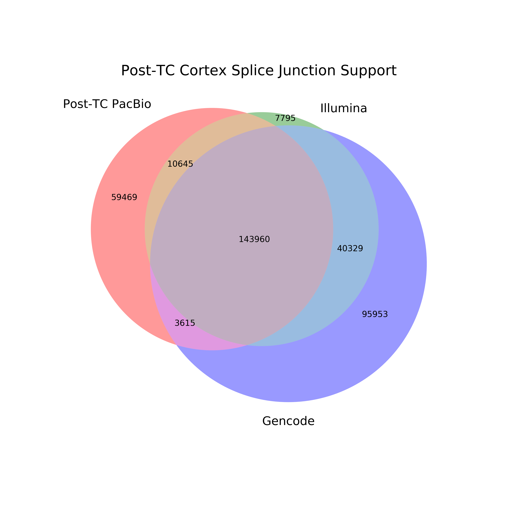
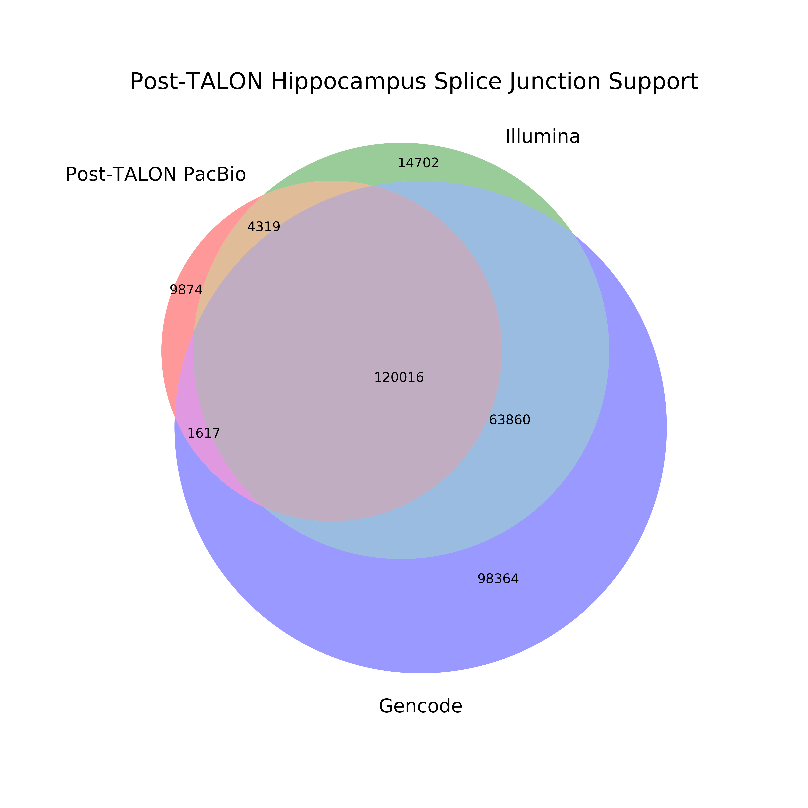

## Mouse brain splice junction support

We want to see what sort of short-read splice junction support our complex tissue samples have.

1. Get GTFs for both cortex and hippocampus from the TALON database
```
TPATH=~/mortazavi_lab/bin/TALON/post-TALON_tools/

# cortex
printf "PB82,PB84" > pairings_cortex
printf "PB82\nPB84" > datasets_cortex
python ${TPATH}filter_talon_transcripts.py \
	--db mm10_v21.db \
	--a v29 \
	--o whitelist_cortex \
	--pairings pairings_cortex 

python ${TPATH}create_GTF_from_database.py \
	--db mm10_v21.db \
	-a v29 \
	-b mm10 \
	--observed \
	--datasets datasets_cortex \
	--o cortex \
	--whitelist whitelist_cortex

# hippocampus
printf "PB83,PB85" > pairings_hippocampus
printf "PB83\nPB85" > datasets_hippocampus
python ${TPATH}filter_talon_transcripts.py \
	--db mm10_v21.db \
	--a v29 \
	--o whitelist_hippocampus \
	--pairings pairings_hippocampus 

python ${TPATH}create_GTF_from_database.py \
	--db mm10_v21.db \
	-a v29 \
	-b mm10 \
	--observed \
	--datasets datasets_hippocampus \
	--o hippocampus \
	--whitelist whitelist_hippocampus
```
2. Extract splice junctions from the mouse cortex and hippocampus TALON GTFs
```
TCPATH=~/mortazavi_lab/bin/TranscriptClean/accessory_scripts/
REF=~/mortazavi_lab/ref/mm10/mm10.fa

# cortex
python ${TCPATH}get_SJs_from_gtf.py \
	--f cortex_talon_observedOnly.gtf \
	--g $REF \
	--o pb_post_TALON_cortex_SJs.tab

# hippocampus
python ${TCPATH}get_SJs_from_gtf.py \
	--f hippocampus_talon_observedOnly.gtf \
	--g $REF \
	--o pb_post_TALON_hippocampus_SJs.tab
```
3. Extract splice junctions from the short-read cortex and hippocampus data
```
qsub run_STAR_illumina_cortex.sh
qsub run_STAR_illumina_hippocampus.sh
```

4. Extract splice junctions from pre-TALON sam files
```
# cortex
python ../extract_SJs_from_sam.py \
	--sam post_TC_sams/PacBio/Cortex/cortex_Rep1-Rep2_post-TC.sam \
	--genome ~/mortazavi_lab/ref/mm10/mm10.fa \
	--o pb_post_TC_cortex

# hippocampus
python ../extract_SJs_from_sam.py \
	--sam post_TC_sams/PacBio/Hippocampus/hippocampus_Rep1-Rep2_post-TC.sam \
	--genome ~/mortazavi_lab/ref/mm10/mm10.fa \
	--o pb_post_TC_hippocampus
```

5. Extract splice junctions from the mouse Gencode annotation, vM21
```
TCPATH=~/mortazavi_lab/bin/TranscriptClean/accessory_scripts/
REF=~/mortazavi_lab/ref/mm10/mm10.fa
ANN=~/mortazavi_lab/ref/gencode.vM21/gencode.vM21.annotation.gtf

# cortex
python ${TCPATH}get_SJs_from_gtf.py \
	--f $ANN \
	--g $REF \
	--o gencode_vM21_sjs.tab
```

6. Build a venn diagram illustrating splice junction support for those found *before* TALON from gencode and Illumina for each sample
```
mkdir figures

# cortex
python ../compare_sjs_venn_new.py \
	-sj_1 pb_post_TC_cortex_SJs.txt \
	-sj_1_name "Post-TC PacBio" \
	-sj_2 cortex_alignedSJ.out.tab \
	-sj_2_name "Illumina" \
	-sj_3 ../gencode_vM21_sjs.tab \
	-sj_3_name "Gencode" \
	-sample "Post-TC Cortex"

# hippocampus
python ../compare_sjs_venn_new.py \
	-sj_1 pb_post_TC_hippocampus_SJs.txt \
	-sj_1_name "Post-TC PacBio" \
	-sj_2 hippocampus_alignedSJ.out.tab \
	-sj_2_name "Illumina" \
	-sj_3 ../gencode_vM21_sjs.tab \
	-sj_3_name "Gencode" \
	-sample "Post-TC Hippocampus"
```




7. Build a venn diagram illustrating splice junction support for those found *after* TALON from gencode and Illumina for each sample
```
# cortex
python ../compare_sjs_venn_new.py \
	-sj_1 pb_post_TALON_cortex_SJs.tab \
	-sj_1_name "Post-TALON PacBio" \
	-sj_2 cortex_alignedSJ.out.tab \
	-sj_2_name "Illumina" \
	-sj_3 ../gencode_vM21_sjs.tab \
	-sj_3_name "Gencode" \
	-sample "Post-TALON Cortex"

# hippocampus
python ../compare_sjs_venn_new.py \
	-sj_1 pb_post_TALON_hippocampus_SJs.tab \
	-sj_1_name "Post-TALON PacBio" \
	-sj_2 hippocampus_alignedSJ.out.tab \
	-sj_2_name "Illumina" \
	-sj_3 ../gencode_vM21_sjs.tab \
	-sj_3_name "Gencode" \
	-sample "Post-TALON Hippocampus"
```




<!-- 
8. Build a venn diagram illustrating splice junction support for those found *after* TALON from gencode and Illumina for each sample
```
# cortex
python ../compare_sjs_venn_new.py \
	-sj_1 pb_post_TALON_cortex_SJs.txt \
	-sj_1_name "Post-TALON PacBio" \
	-sj_2 cortex_alignedSJ.out.tab \
	-sj_2_name "Illumina" \
	-sj_3 ../gencode_vM21_sjs.tab \
	-sj_3_name "Gencode" \
	-sample "Post-TALON Cortex"

# hippocampus
python ../compare_sjs_venn_new.py \
	-sj_1 pb_post_TC_hippocampus_SJs.txt \
	-sj_1_name "Post-TALON PacBio" \
	-sj_2 hippocampus_alignedSJ.out.tab \
	-sj_2_name "Illumina" \
	-sj_3 ../gencode_vM21_sjs.tab \
	-sj_3_name "Gencode" \
	-sample "Post-TALON Hippocampus"
``` -->