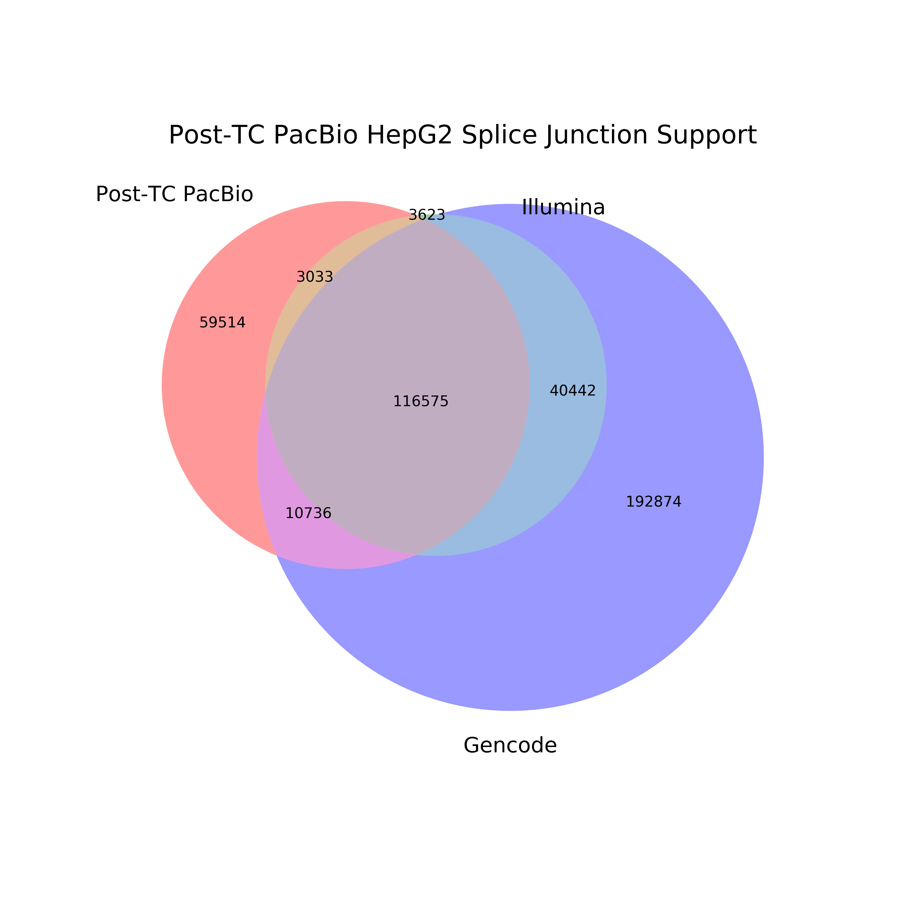
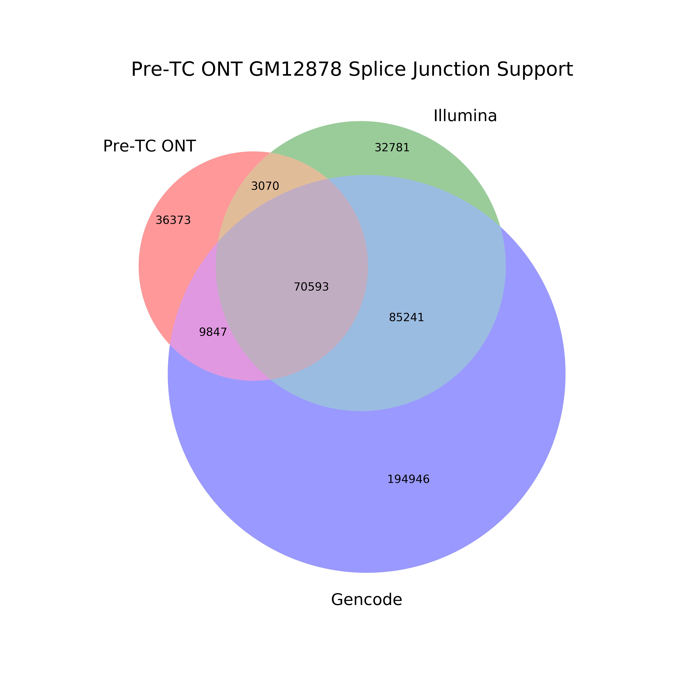
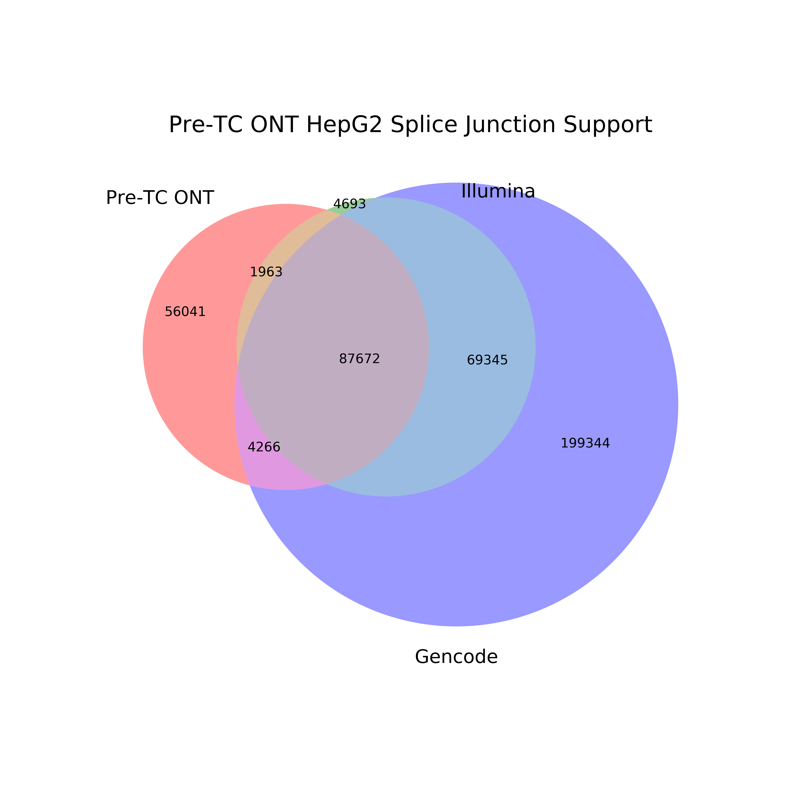

## How does TranscriptClean affect splice junction support?

We wanted to see how running TranscriptClean affects whether or not splice junctions are supported by Illumina or Gencode. 

1. Create pre-TranscriptClean splice junction files from our GM12878 sam files. 
```
python ../extract_SJs_from_sam.py \
	--sam pre_TC_sams/PacBio/GM12878/PacBio_GM12878_Rep1-Rep2_pre-TC.sam \
	--genome ~/mortazavi_lab/ref/hg38/hg38.fa \
	--o pb_pre_TC_GM12878
```

2. Create post-TranscriptClean splice junction files from our GM12878 sam files. 
```
python ../extract_SJs_from_sam.py \
	--sam post_TC_sams/PacBio/GM12878/GM12878_Rep1-Rep2_sorted_canonical.sam \
	--genome ~/mortazavi_lab/ref/hg38/hg38.fa \
	--o pb_post_TC_GM12878
```

3. We want to see how many pre-TranscriptClean splice junctions are supported by Illumina and Gencode. We'll generate a venn diagram to visualize the results.
```
mkdir figures 

python ../compare_sjs_venn_new.py \
	-sj_1 pb_pre_TC_GM12878_SJs.txt \
	-sj_1_name "Pre-TC PacBio" \
	-sj_2 ../GM12878_alignedSJ.out.tab \
	-sj_2_name "Illumina" \
	-sj_3 ../gencode_v29_sjs.tab \
	-sj_3_name "Gencode" \
	-sample "Pre-TC PacBio GM12878"
```


4. We then want to see how many splice junctions become supported when we use TranscriptClean to correct them 
```
python ../compare_sjs_venn_new.py \
	-sj_1 pb_post_TC_GM12878_SJs.txt \
	-sj_1_name "Post-TC PacBio" \
	-sj_2 ../GM12878_alignedSJ.out.tab \
	-sj_2_name "Illumina" \
	-sj_3 ../gencode_v29_sjs.tab \
	-sj_3_name "Gencode" \
	-sample "Post-TC PacBio GM12878"
```


For the other cell lines: 
```
# HepG2
python ../extract_SJs_from_sam.py \
	--sam pre_TC_sams/PacBio/HepG2/PacBio_HepG2_Rep1-Rep2_pre-TC.sam \
	--genome ~/mortazavi_lab/ref/hg38/hg38.fa \
	--o pb_pre_TC_HepG2

python ../extract_SJs_from_sam.py \
	--sam post_TC_sams/PacBio/HepG2/HepG2_Rep1-Rep2_sorted_canonical.sam \
	--genome ~/mortazavi_lab/ref/hg38/hg38.fa \
	--o pb_post_TC_HepG2

python ../compare_sjs_venn_new.py \
	-sj_1 pb_pre_TC_HepG2_SJs.txt \
	-sj_1_name "Pre-TC PacBio" \
	-sj_2 ../HepG2_alignedSJ.out.tab \
	-sj_2_name "Illumina" \
	-sj_3 ../gencode_v29_sjs.tab \
	-sj_3_name "Gencode" \
	-sample "Pre-TC PacBio HepG2"

python ../compare_sjs_venn_new.py \
	-sj_1 pb_post_TC_HepG2_SJs.txt \
	-sj_1_name "Post-TC PacBio" \
	-sj_2 ../HepG2_alignedSJ.out.tab \
	-sj_2_name "Illumina" \
	-sj_3 ../gencode_v29_sjs.tab \
	-sj_3_name "Gencode" \
	-sample "Post-TC PacBio HepG2"

# K562
python ../extract_SJs_from_sam.py \
	--sam pre_TC_sams/PacBio/K562/PacBio_K562_Rep1-Rep2_pre-TC.sam \
	--genome ~/mortazavi_lab/ref/hg38/hg38.fa \
	--o pb_pre_TC_K562

python ../extract_SJs_from_sam.py \
	--sam post_TC_sams/PacBio/K562/K562_Rep1-Rep2_sorted_canonical.sam \
	--genome ~/mortazavi_lab/ref/hg38/hg38.fa \
	--o pb_post_TC_K562

python ../compare_sjs_venn_new.py \
	-sj_1 pb_pre_TC_K562_SJs.txt \
	-sj_1_name "Pre-TC PacBio" \
	-sj_2 ../K562_alignedSJ.out.tab \
	-sj_2_name "Illumina" \
	-sj_3 ../gencode_v29_sjs.tab \
	-sj_3_name "Gencode" \
	-sample "Pre-TC PacBio K562"

python ../compare_sjs_venn_new.py \
	-sj_1 pb_post_TC_K562_SJs.txt \
	-sj_1_name "Post-TC PacBio" \
	-sj_2 ../K562_alignedSJ.out.tab \
	-sj_2_name "Illumina" \
	-sj_3 ../gencode_v29_sjs.tab \
	-sj_3_name "Gencode" \
	-sample "Post-TC PacBio K562"
```





For ONT
```
# GM12878
python ../extract_SJs_from_sam.py \
	--sam pre_TC_sams/ONT/GM12878/ONT_GM12878_Rep1-Rep2_pre-TC.sam \
	--genome ~/mortazavi_lab/ref/hg38/hg38.fa \
	--o ont_pre_TC_GM12878

python ../extract_SJs_from_sam.py \
	--sam post_TC_sams/ONT/GM12878/ONT_GM12878_Rep1-Rep2_post-TC.sam \
	--genome ~/mortazavi_lab/ref/hg38/hg38.fa \
	--o ont_post_TC_GM12878

python ../compare_sjs_venn_new.py \
	-sj_1 ont_pre_TC_GM12878_SJs.txt \
	-sj_1_name "Pre-TC ONT" \
	-sj_2 ../GM12878_alignedSJ.out.tab \
	-sj_2_name "Illumina" \
	-sj_3 ../gencode_v29_sjs.tab \
	-sj_3_name "Gencode" \
	-sample "Pre-TC ONT GM12878"

python ../compare_sjs_venn_new.py \
	-sj_1 ont_post_TC_GM12878_SJs.txt \
	-sj_1_name "Post-TC ONT" \
	-sj_2 ../GM12878_alignedSJ.out.tab \
	-sj_2_name "Illumina" \
	-sj_3 ../gencode_v29_sjs.tab \
	-sj_3_name "Gencode" \
	-sample "Post-TC ONT GM12878"

# HepG2
python ../extract_SJs_from_sam.py \
	--sam pre_TC_sams/ONT/HepG2/ONT_HepG2_Rep1-Rep3_pre-TC.sam \
	--genome ~/mortazavi_lab/ref/hg38/hg38.fa \
	--o ont_pre_TC_HepG2

python ../extract_SJs_from_sam.py \
	--sam post_TC_sams/ONT/HepG2/ONT_HepG2_Rep1-Rep3_post-TC.sam \
	--genome ~/mortazavi_lab/ref/hg38/hg38.fa \
	--o ont_post_TC_HepG2

python ../compare_sjs_venn_new.py \
	-sj_1 ont_pre_TC_HepG2_SJs.txt \
	-sj_1_name "Pre-TC ONT" \
	-sj_2 ../HepG2_alignedSJ.out.tab \
	-sj_2_name "Illumina" \
	-sj_3 ../gencode_v29_sjs.tab \
	-sj_3_name "Gencode" \
	-sample "Pre-TC ONT HepG2"

python ../compare_sjs_venn_new.py \
	-sj_1 ont_post_TC_HepG2_SJs.txt \
	-sj_1_name "Post-TC ONT" \
	-sj_2 ../HepG2_alignedSJ.out.tab \
	-sj_2_name "Illumina" \
	-sj_3 ../gencode_v29_sjs.tab \
	-sj_3_name "Gencode" \
	-sample "Post-TC ONT HepG2"

# K562
python ../extract_SJs_from_sam.py \
	--sam pre_TC_sams/ONT/K562/ONT_K562_Rep1-Rep2_pre-TC.sam \
	--genome ~/mortazavi_lab/ref/hg38/hg38.fa \
	--o ont_pre_TC_K562

python ../extract_SJs_from_sam.py \
	--sam post_TC_sams/ONT/K562/ONT_K562_Rep1-Rep2_post-TC.sam \
	--genome ~/mortazavi_lab/ref/hg38/hg38.fa \
	--o ont_post_TC_K562

python ../compare_sjs_venn_new.py \
	-sj_1 ont_pre_TC_K562_SJs.txt \
	-sj_1_name "Pre-TC ONT" \
	-sj_2 ../K562_alignedSJ.out.tab \
	-sj_2_name "Illumina" \
	-sj_3 ../gencode_v29_sjs.tab \
	-sj_3_name "Gencode" \
	-sample "Pre-TC ONT K562"

python ../compare_sjs_venn_new.py \
	-sj_1 ont_post_TC_K562_SJs.txt \
	-sj_1_name "Post-TC ONT" \
	-sj_2 ../K562_alignedSJ.out.tab \
	-sj_2_name "Illumina" \
	-sj_3 ../gencode_v29_sjs.tab \
	-sj_3_name "Gencode" \
	-sample "Post-TC ONT K562"
```






