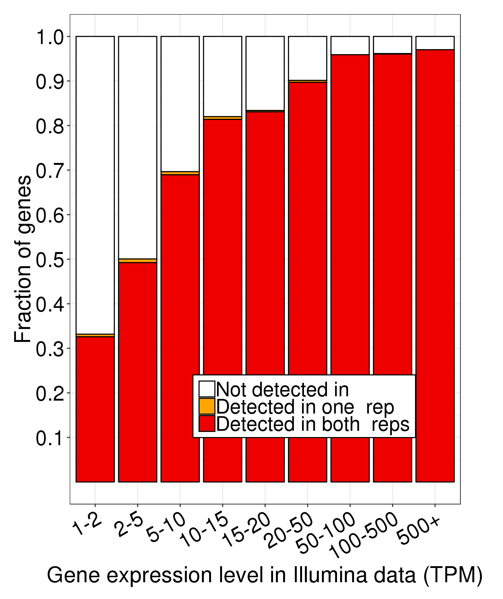

# Running FLAIR on K562 PacBio data

FLAIR was cloned from https://github.com/BrooksLabUCSC/flair on 8/5/2019.

1. Run align and correct steps separately on replicates
```
qsub D10/./run_FLAIR_align.sh
qsub D11/./run_FLAIR_align.sh
```
```
qsub D10/./run_FLAIR_correct.sh
qsub D11/./run_FLAIR_correct.sh
```
2. Then, run collapse step on concatenated files from both reps.
```
cat D10/flair_all_corrected.psl D11/flair_all_corrected.psl > D10-D11_flair_all_corrected.psl
cat D10/ENCFF281TNJ.fastq D11/D11/ENCFF475ORL.fastq > D10-D11-concat.fastq
qsub ./run_flair_collapse.sh
```
3. Finally, run quantify step. To do this, you need to create a tab-delimited config file with fields dataset name, condition, batch, and fastq reads file. This is what the K562 file looks like:
```
K562_Rep1	K562	batch1	/pub/dwyman/TALON-paper-2019/compare_to_FLAIR/K562/D10/ENCFF763VZC.fastq
K562_Rep2	K562	batch1	/pub/dwyman/TALON-paper-2019/compare_to_FLAIR/K562/D11/ENCFF694INI.fastq
```
```
qsub ./run_flair_quantify.sh
```

4. In order to determine how well PacBio + FLAIR detects genes known to be expressed in short-read data, we converted the FLAIR output to a TALON-like format, and then ran a custom R script:
```
python ../format_flair_matrix_like_talon.py counts_matrix.tsv counts_matrix_talon_abd.tsv

Rscript ../plot_detection_by_TPM_for_datasets.R \
      --f counts_matrix_talon_abd.tsv \
      --datasets K562_Rep1_K562_batch1,K562_Rep2_K562_batch1 \
      --ik1 ../Illumina/K562/Kallisto/Rep1/abundance.tsv \
      --ik2 ../Illumina/K562/Kallisto/Rep2/abundance.tsv \
      --color blue \
      -o .
```

