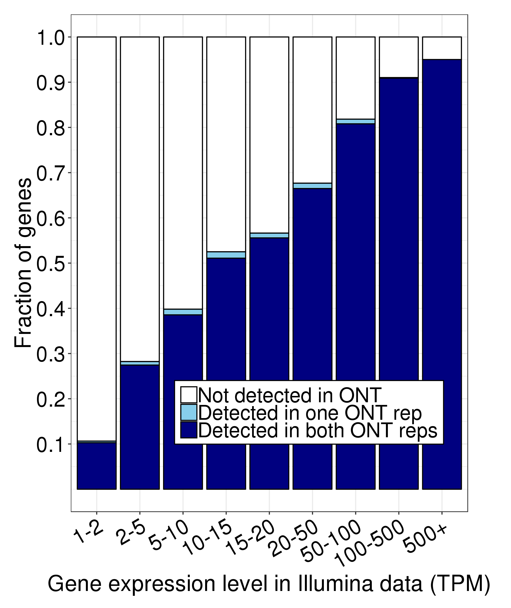
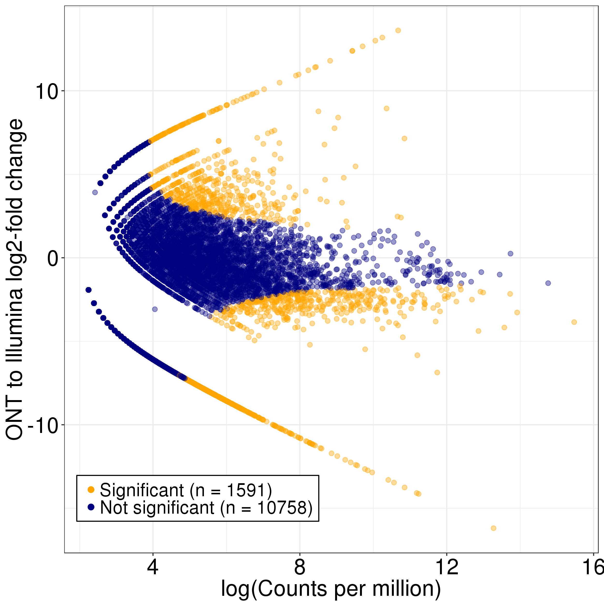

# Running FLAIR on GM12878 PacBio data

FLAIR was cloned from https://github.com/BrooksLabUCSC/flair on 8/5/2019.

1. Run align and correct steps separately on replicates
```
qsub ONT24/./run_FLAIR_align.sh
qsub ONT25/./run_FLAIR_align.sh
```
```
qsub ONT24/./run_FLAIR_correct.sh
qsub ONT25/./run_FLAIR_correct.sh
```
2. Then, run collapse step on concatenated files from both reps.
```
cat ONT24/flair_all_corrected.psl ONT25/flair_all_corrected.psl > ONT24-ONT25_flair_all_corrected.psl
cat ONT24/ONT_GM12878_1.fastq ONT25/ONT_GM12878_2.fastq > ONT24-ONT25-concat.fastq
qsub ./run_flair_collapse.sh
```
3. Finally, run quantify step. To do this, you need to create a tab-delimited config file with fields dataset name, condition, batch, and fastq reads file. This is what the GM12878 file looks like:
```
GM12878_Rep1	GM12878	batch1	/pub/dwyman/TALON-paper-2019/compare_to_FLAIR/ONT24/ONT_GM12878_1.fastq
GM12878_Rep2	GM12878	batch1	/pub/dwyman/TALON-paper-2019/compare_to_FLAIR/ONT25/ONT_GM12878_2.fastq
```
```
qsub ./run_flair_quantify.sh
```

4. In order to determine how well PacBio + FLAIR detects genes known to be expressed in short-read data, we converted the FLAIR output to a TALON-like format, and then ran a custom R script:
```
python ../format_flair_matrix_like_talon.py counts_matrix.tsv counts_matrix_talon_abd.tsv

mkdir FLAIR

Rscript ../plot_detection_by_TPM_for_datasets.R \
      --f counts_matrix_talon_abd.tsv \
      --datasets GM12878_ONT_Rep1_GM12878_batch1,GM12878_ONT_Rep2_GM12878_batch1 \
      --ik1 ~/mortazavi_lab/bin/TALON-paper-2019/Illumina/GM12878/Kallisto/Rep1/abundance.tsv \
      --ik2 ~/mortazavi_lab/bin/TALON-paper-2019/Illumina/GM12878/Kallisto/Rep2/abundance.tsv \
      --color blue \
      -o .

Rscript ../pacbio_v_illumina_edgeR.R \
    --f counts_matrix_talon_abd.tsv \
    --datasets GM12878_ONT_Rep1_GM12878_batch1,GM12878_ONT_Rep2_GM12878_batch1 \
    --ik1 ~/mortazavi_lab/bin/TALON-paper-2019/Illumina/GM12878/Kallisto/Rep1/abundance.tsv \
    --ik2 ~/mortazavi_lab/bin/TALON-paper-2019/Illumina/GM12878/Kallisto/Rep2/abundance.tsv \
    --color blue \
    -o FLAIR
```



