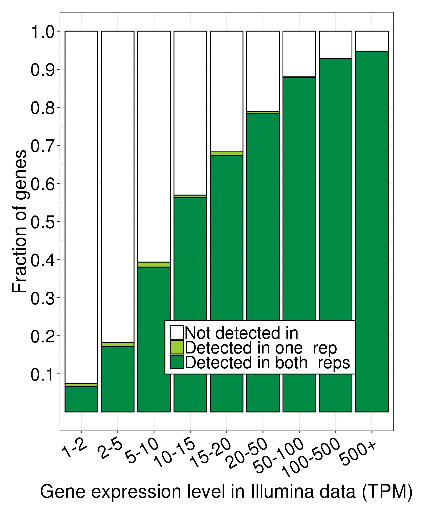
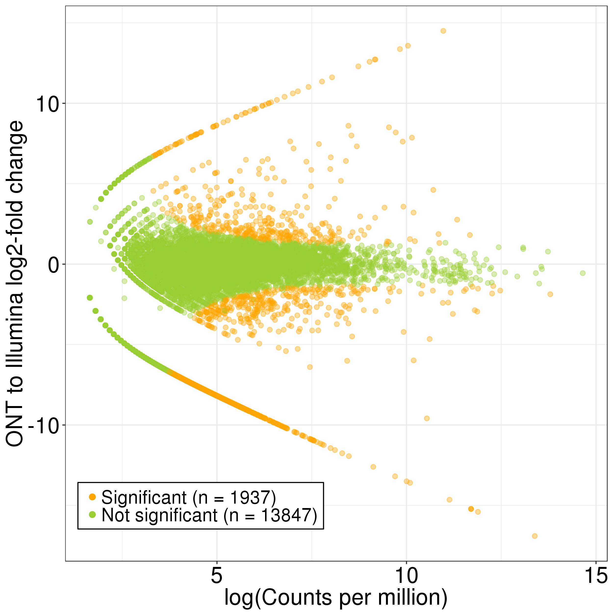

i# Running FLAIR on HepG2 PacBio data

FLAIR was cloned from https://github.com/BrooksLabUCSC/flair on 8/5/2019.

1. Run align and correct steps separately on replicates
```
qsub ONT32/./run_FLAIR_align.sh
qsub ONT33/./run_FLAIR_align.sh
```
```
qsub ONT32/./run_FLAIR_correct.sh
qsub ONT33/./run_FLAIR_correct.sh
```
2. Then, run collapse step on concatenated files from both reps.
```
cat ONT32/flair_all_corrected.psl ONT33/flair_all_corrected.psl > ONT32-ONT33_flair_all_corrected.psl
cat ONT32/ONT_HepG2_3.fastq ONT33/ONT_HepG2_1.fastq > ONT32-ONT33-concat.fastq
qsub ./run_flair_collapse.sh
```
3. Finally, run quantify step. To do this, you need to create a tab-delimited config file with fields dataset name, condition, batch, and fastq reads file. This is what the HepG2 file looks like:
```
HepG2_Rep1	HepG2	batch1	/pub/dwyman/TALON-paper-2019/compare_to_FLAIR/ONT32/ONT_HepG2_3.fastq
HepG2_Rep2	HepG2	batch1	/pub/dwyman/TALON-paper-2019/compare_to_FLAIR/ONT33/ONT_HepG2_1.fastq
```
```
qsub ./run_flair_quantify.sh
```

4. In order to determine how well PacBio + FLAIR detects genes known to be expressed in short-read data, we converted the FLAIR output to a TALON-like format, and then ran a custom R script:
```
python ../format_flair_matrix_like_talon.py counts_matrix.tsv counts_matrix_talon_abd.tsv

mkdir FLAIR

Rscript ../plot_detection_by_TPM_for_datasets.R \
      --f counts_matrix_talon_abd.tsv \
      --datasets HepG2_ONT_Rep1_HepG2_batch1,HepG2_ONT_Rep2_HepG2_batch1 \
      --ik1 ~/mortazavi_lab/bin/TALON-paper-2019/Illumina/HepG2/Kallisto/Rep1/abundance.tsv \
      --ik2 ~/mortazavi_lab/bin/TALON-paper-2019/Illumina/HepG2/Kallisto/Rep2/abundance.tsv \
      --color green \
      -o FLAIR
`
Rscript ../pacbio_v_illumina_edgeR.R \
    --f counts_matrix_talon_abd.tsv \
    --datasets HepG2_ONT_Rep1_HepG2_batch1,HepG2_ONT_Rep2_HepG2_batch1 \
    --ik1 ~/mortazavi_lab/bin/TALON-paper-2019/Illumina/HepG2/Kallisto/Rep1/abundance.tsv \
    --ik2 ~/mortazavi_lab/bin/TALON-paper-2019/Illumina/HepG2/Kallisto/Rep2/abundance.tsv \
    --color green \
    -o FLAIR
```



