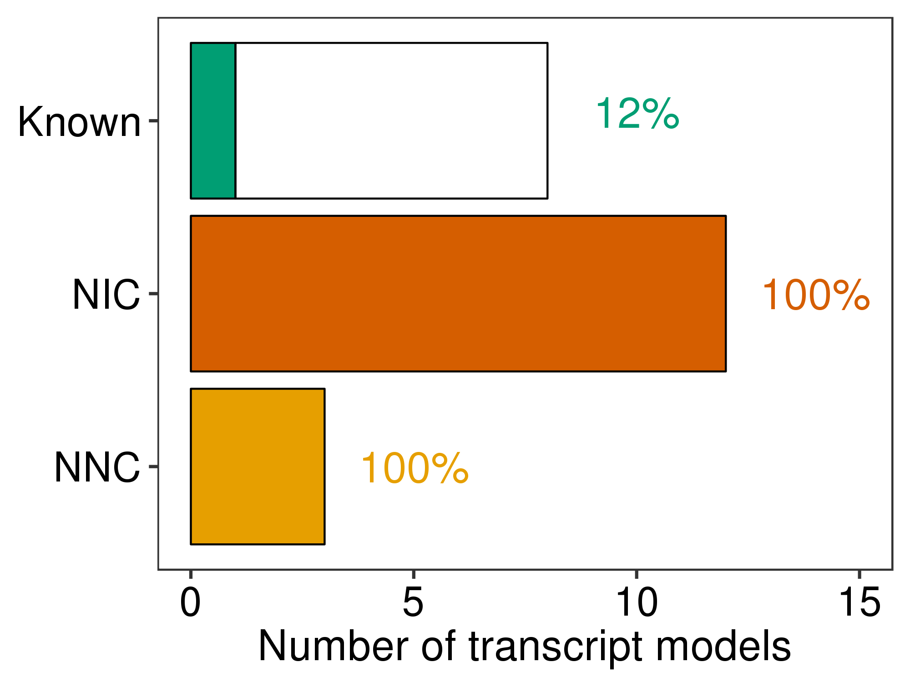
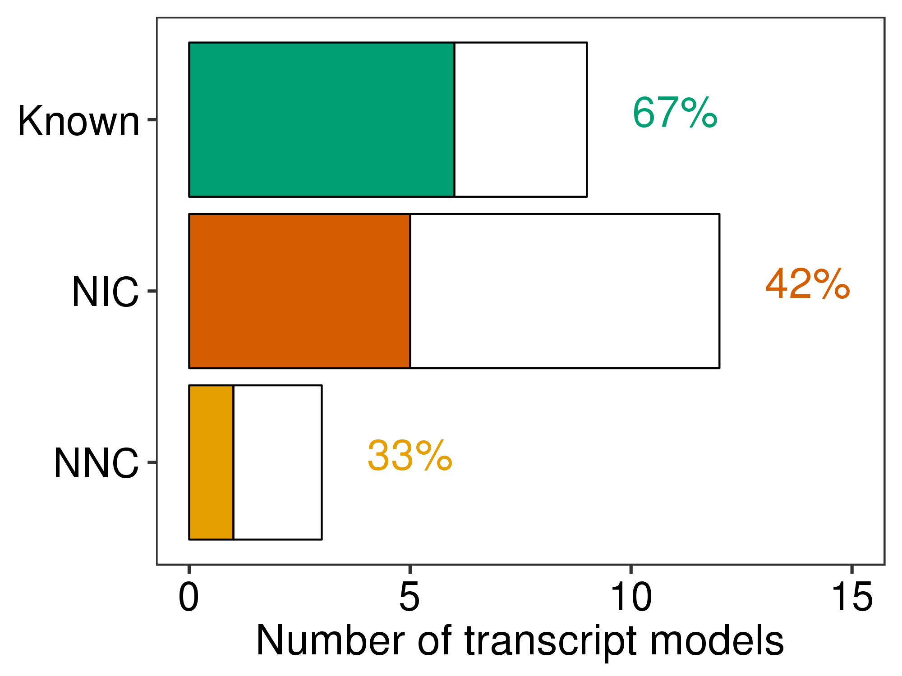

# EBV

We wanted to see if TALON and PacBio long-read sequencing could be used to detect, characterize, and quantify transcripts from the EBV chromosome used to immortalize the GM12878 cell line. 


## TALON
### Initialize TALON db with custom EBV gtf (using chr1 because sam files are fake mapped to chr1)
```bash
sed 's/chrEBV/chr1/' ebv.gtf > ebv_chr1.gtf
talon_initialize_database \
    --f ebv_chr1.gtf \
    --g HHV4 \
    --a HHV4 \
    --o ebv
```

### Run TALON on EBV reads extracted from mapped GM12878 sam files
```bash
talon \
    --f ebv_talon_config.csv \
    --db ebv.db \
    --build HHV4 \
    --o ebv
```

## Post-TALON files

### Get a whitelist of transcripts via TALON filtering
```bash
printf "PacBio_GM12878_1,PacBio_GM12878_2" > pairings
talon_filter_transcripts \
    --db ebv.db \
    -a HHV4 \
    -p pairings \
    --o ebv_whitelist
```

### Get filtered GTF file
```bash
talon_create_GTF \
      --db ebv.db \
      --b HHV4 \
      --a HHV4 \
      --o ebv \
      --whitelist ebv_whitelist \
      --observed
```

### Get unfiltered abundance file
```bash
talon_abundance \
    --db ebv.db \
    --a HHV4 \
    --b HHV4 \
    --o ebv
```

### Get filtered abundance file
```bash
talon_abundance \
    --db ebv.db \
    --a HHV4 \
    --b HHV4 \
    --whitelist ebv_whitelist \
    --o ebv
```

### GM12878 files to compare with 
```bash
sup_tables=/share/crsp/lab/seyedam/share/TALON_paper_data/revisions_10-19/human_TALON/analysis/supplementary_tables/
ln -s ${sup_tables}S2_GM12878_talon_observedOnly.gtf S2_GM12878_talon_observedOnly.gtf
ln -s ${sup_tables}S3_GM12878_talon_abundance.tsv S3_GM12878_talon_abundance.tsv
ln -s ${sup_tables}S4_GM12878_talon_abundance_filtered.tsv S4_GM12878_talon_abundance_filtered.tsv
```

## Plotting
### Generate EBV abundance violin plots
```bash
python ebv_compute_tpms.py --c ebv_expression_config.csv
Rscript plot_ebv_v_human_abundances.R \
          --gene_csv ebv_human_gene_abundance.csv \
          --transcript_csv ebv_human_transcript_abundance.csv \
          --datasets combined
```


## Genome browser trackline
### Generate tracklines using above GTF
```bash
python ../analysis_scripts/gen_novelty_tracks_gtf.py \
          --c ebv_gtf_track_config.csv
url=`cut -d, -f5 ebv_gtf_track_config.csv`
n=`cut -d, -f2 ebv_gtf_track_config.csv`
cp ebv_chr1.gtf ebv_talon_observedOnly_tracks/
printf 'track name="EBV Reference" visibility=pack color=0,0,128\n%s/ebv_chr1.gtf' "$url" >> ebv_talon_observedOnly_tracks/ebv_talon_observedOnly_${n}_tracks
```

From here, you can open the genome browser up and display your tracklines, and use the genome browser's PDF functionality or take a screenshot to get the genome browser shot. 


## CAGE support

<!-- 1. Install the (ENCODE long rna-seq pipeline)[https://github.com/ENCODE-DCC/long-rna-seq-pipeline] to get access to the rampage-idr peak-caller. 
```bash 
git clone https://github.com/ENCODE-DCC/long-rna-seq-pipeline
```

2. Replace long-rna-seq-pipeline/dnanexus/rampage/rampage-idr/resources/usr/bin/rampage_idr.sh with the modified version found in this directory (which has the line that throws out EBV stuff commented out).
```bash
cp rampage_idr.sh long-rna-seq-pipeline/dnanexus/rampage/rampage-idr/resources/usr/bin/
`` -->

1. Download the ENCODE CAGE GM12878 data in bed format, and extract only EBV TSSs, and cat them together
```bash
wget https://www.encodeproject.org/files/ENCFF383NVJ/@@download/ENCFF383NVJ.bed.gz
wget https://www.encodeproject.org/files/ENCFF016XXM/@@download/ENCFF016XXM.bed.gz
gunzip ENCFF383NVJ.bed.gz
gunzip ENCFF016XXM.bed.gz

grep chrEBV ENCFF383NVJ.bed > ENCFF383NVJ_ebv_only.bed
grep chrEBV ENCFF016XXM.bed > ENCFF016XXM_ebv_only.bed

cat ENCFF383NVJ_ebv_only.bed > cage_ebv_TSSs.bed
cat ENCFF016XXM_ebv_only.bed >> cage_ebv_TSSs.bed
```

2. Replace chr1 with chrEBV in output TALON gtf so that it matches up with the EBV CAGE peaks.
```bash
sed 's/chr1/chrEBV/g' ebv_talon_observedOnly.gtf > ebv_talon_observedOnly_ebv.gtf
```

3. Intersect EBV CAGE peaks with TSSs found in our GM12878 data and plot!
```bash
mkdir figures

python run_CAGE_analysis.py \
  --gtf ebv_talon_observedOnly_ebv.gtf \
  --cage cage_ebv_TSSs.bed \
  --maxdist 100 \
  --o ./ebv

Rscript plot_support_by_novelty_type.R \
  --f ebv_CAGE_results.csv \
  --t CAGE \
  --novelty transcript_beds/ebv_novelty.csv \
  --splitISM \
  --ymax 15 \
  -o figures/ebv
```



## Computational PAS analysis

See if TALON EBV transcript 3' ends are supported by poly-A recognition motifs.

```bash
python run_computational_PAS_analysis.py \
  --gtf ebv_talon_observedOnly_ebv.gtf \
  --genome ebv.fasta \
  --maxdist 35 \
  --o ./ebv

Rscript plot_support_by_novelty_type.R \
  --f ebv_polyA_motif.csv \
  --t PAS-comp \
  --novelty transcript_beds/ebv_novelty.csv \
  --ymax 15 \
  --splitISM \
  -o figures/ebv
```



<!-- 2. Run the rampage_idr script on both sets of EBV CAGE peaks
```bash
bash long-rna-seq-pipeline/dnanexus/rampage/rampage-idr/resources/usr/bin/rampage_idr.sh \
  ENCFF016XXM_ebv_only.bed \
  ENCFF383NVJ_ebv_only.bed \
  ebv_chrom_sizes \
  ebv 
```
 -->


