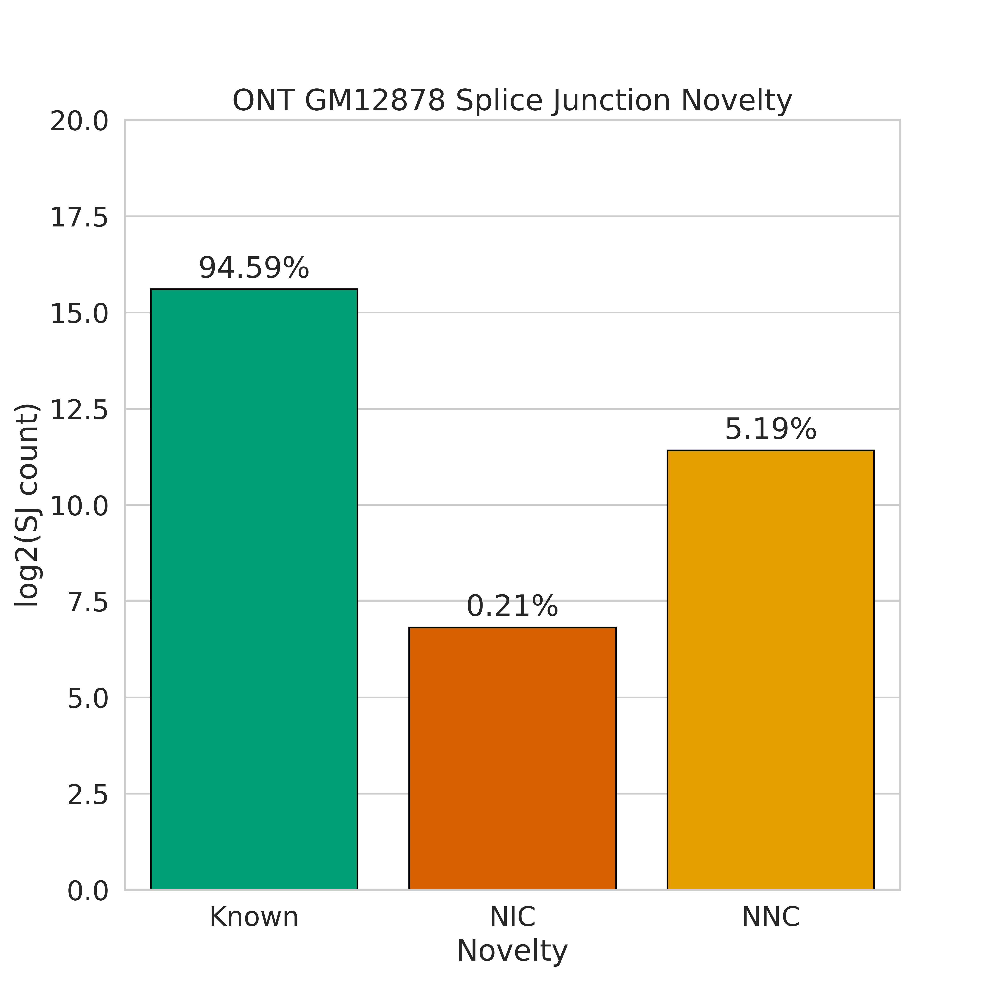
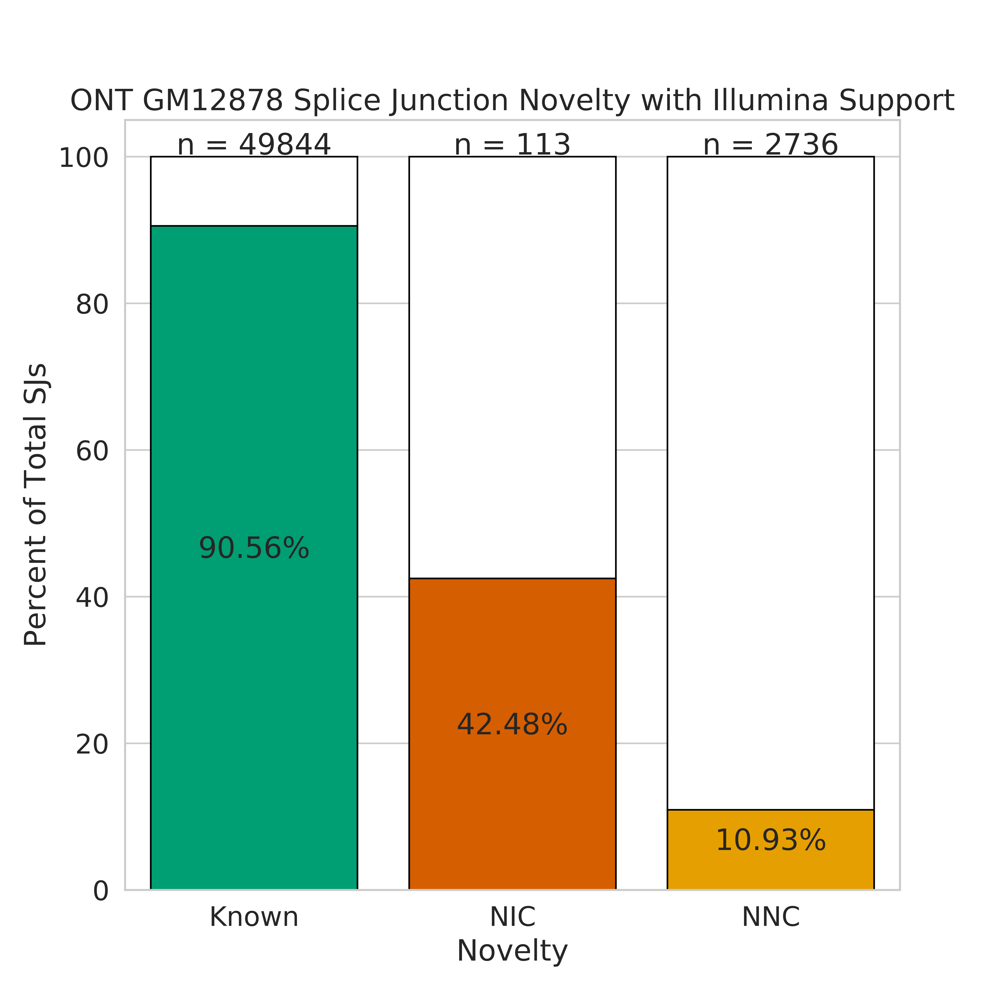

# SJ Novelty Analysis

** NOTE ** The analyses in this directory are dependent on having created sj files for illumina, pacbio, and ont datasets in https://github.com/dewyman/TALON-paper-2019/tree/master/splicing_analyses/technology_SJ_comparison first! 

We wanted to investigate the support for and percent makeup for splice junctions of different novelty types. In this case we define splice junction novelty as the following: 

* **Known junction:** A splice junction with the whole splice junction (splice donor and acceptor) seen in the Gencode annotation
* **NIC junction:** A splice junction where both the splice donor and acceptor individually are in the Gencode annotation, but are never seen together
* **NNC junction:** A splice junction where at least one of the splice donor or acceptor is not present in the Gencode annotation

1. Going off of this, we first obtain the splice junction file from Gencode v29 using get_SJs_from_gtf.py utility.
```bash
mkdir figures 

ANNPATH=~/mortazavi_lab/ref/gencode.v29/
REFPATH=~/mortazavi_lab/ref/hg38/

python ../get_SJs_from_gtf.py \
    --f ${ANNPATH}gencode.v29.annotation.gtf \
	--g ${REFPATH}hg38.fa \
	--o gencode_v29_sjs.tab
```

2. We then use the splice junctions we extracted from the PacBio GM12878 gtf to label each splice junction with its novelty type
```bash
ln -s ../technology_SJ_comparison/pb_talon_GM12878_sjs.tab pb_talon_GM12878_sjs.tab
python ../label_sj_novelty.py \
	-sj pb_talon_GM12878_sjs.tab \
	-ref_sj gencode_v29_sjs.tab 
```

3. Now we can look at the proportions of known, nnc, and nic splice junctions present in our data in the form of a bar chart
```bash
python ../plot_sj_novelty_counts.py \
	-sj pb_talon_GM12878_sjs_novelty.tab \
	-sample "PacBio GM12878"
```


4. Get splice junction novelty types for our Illumina splice junction file so we can look for support for novel splice junctions in our short-read data
```bash
ln -s ../technology_SJ_comparison/GM12878_alignedSJ.out.tab GM12878_alignedSJ.out.tab
python ../label_sj_novelty.py \
	-sj GM12878_alignedSJ.out.tab \
	-ref_sj gencode_v29_sjs.tab 
```

5. Let's see what percentage of novel splice junctions are supported by Illumina data. 
```bash
python ../plot_sj_novelty_counts.py \
	-sj pb_talon_GM12878_sjs_novelty.tab \
	-sample "PacBio GM12878" \
	--extra_support GM12878_alignedSJ.out_novelty.tab \
	--support_name Illumina
```

6. We can also visualize how known and novel splice junctions are supported by the different technologies (illumina, pacbio, ont)
```bash
# get the novel PacBio splice junctions
python ../compare_sjs_venn2.py \
	-sj_1 pb_talon_GM12878_sjs_novelty.tab \
	-sj_1_name "PacBio" \
	-sj_2 gencode_v29_sjs.tab \
	-sj_2_name "Gencode" \
	-sample "PacBio GM12878"

# get the novel Illumina splice junctions
python ../compare_sjs_venn2.py \
 	-sj_1 GM12878_alignedSJ.out_novelty.tab \
	-sj_1_name "Illumina" \
	-sj_2 gencode_v29_sjs.tab \
	-sj_2_name "Gencode" \
	-sample "Illumina GM12878"

# get the novel ONT splice junctions
python ../label_sj_novelty.py \
	-sj ont_talon_GM12878_sjs.tab \
	-ref_sj gencode_v29_sjs.tab 

python ../plot_sj_novelty_counts.py \
	-sj ont_talon_GM12878_sjs_novelty.tab \
	-sample "ONT GM12878"

python ../plot_sj_novelty_counts.py \
	-sj ont_talon_GM12878_sjs_novelty.tab \
	-sample "ONT GM12878" \
	--extra_support GM12878_alignedSJ.out_novelty.tab \
	--support_name Illumina

python ../compare_sjs_venn2.py \
	-sj_1 ont_talon_GM12878_sjs_novelty.tab \
	-sj_1_name "ONT" \
	-sj_2 gencode_v29_sjs.tab \
	-sj_2_name "Gencode" \
	-sample "ONT GM12878"

# compare novel splice junctions between 3 technologies
python ../compare_sjs_venn_new.py \
	-sj_1 PacBio_GM12878_unsupported_sjs.tab \
	-sj_1_name "Novel PacBio SJs" \
	-sj_3 Illumina_GM12878_unsupported_sjs.tab \
	-sj_3_name "Novel Illumina SJs" \
	-sj_2 ONT_GM12878_unsupported_sjs.tab  \
	-sj_2_name "Novel ONT SJs" \
	-sample "Novel GM12878" \
	--log

# compare known splice junctions between 3 technologies
python ../compare_sjs_venn_new.py \
	-sj_1 PacBio_GM12878_supported_sjs.tab \
	-sj_1_name "Known PacBio SJs" \
	-sj_3 Illumina_GM12878_supported_sjs.tab \
	-sj_3_name "Known Illumina SJs" \
	-sj_2 ONT_GM12878_supported_sjs.tab  \
	-sj_2_name "Known ONT SJs" \
	-sample "Known GM12878" \
	--log
```

  

7. Also perform the above analysis for HepG2 and K562
```bash
# HepG2
python label_sj_novelty.py \
	-sj pb_talon_HepG2_sjs.tab \
	-ref_sj gencode_v29_sjs.tab 

python plot_sj_novelty_counts.py \
	-sj pb_talon_HepG2_sjs_novelty.tab \
	-sample "PacBio HepG2"

python label_sj_novelty.py \
	-sj HepG2_alignedSJ.out.tab \
	-ref_sj gencode_v29_sjs.tab 

python plot_sj_novelty_counts.py \
	-sj pb_talon_HepG2_sjs_novelty.tab \
	-sample "PacBio HepG2" \
	--extra_support HepG2_alignedSJ.out_novelty.tab \
	--support_name Illumina

# get the novel PacBio splice junctions
python compare_sjs_venn2.py \
	-sj_1 pb_talon_HepG2_sjs_novelty.tab \
	-sj_1_name "PacBio" \
	-sj_2 gencode_v29_sjs.tab \
	-sj_2_name "Gencode" \
	-sample "PacBio HepG2"

# get the novel Illumina splice junctions
python compare_sjs_venn2.py \
 	-sj_1 HepG2_alignedSJ.out_novelty.tab \
	-sj_1_name "Illumina" \
	-sj_2 gencode_v29_sjs.tab \
	-sj_2_name "Gencode" \
	-sample "Illumina HepG2"

# get the novel ONT splice junctions
python label_sj_novelty.py \
	-sj ont_talon_HepG2_sjs.tab \
	-ref_sj gencode_v29_sjs.tab 

python plot_sj_novelty_counts.py \
	-sj ont_talon_HepG2_sjs_novelty.tab \
	-sample "ONT HepG2"

python plot_sj_novelty_counts.py \
	-sj ont_talon_HepG2_sjs_novelty.tab \
	-sample "ONT HepG2" \
	--extra_support HepG2_alignedSJ.out_novelty.tab \
	--support_name Illumina

python compare_sjs_venn2.py \
	-sj_1 ont_talon_HepG2_sjs_novelty.tab \
	-sj_1_name "ONT" \
	-sj_2 gencode_v29_sjs.tab \
	-sj_2_name "Gencode" \
	-sample "ONT HepG2"

# compare novel splice junctions between 3 technologies
python compare_sjs_venn_new.py \
	-sj_1 PacBio_HepG2_unsupported_sjs.tab \
	-sj_1_name "Novel PacBio SJs" \
	-sj_3 Illumina_HepG2_unsupported_sjs.tab \
	-sj_3_name "Novel Illumina SJs" \
	-sj_2 ONT_HepG2_unsupported_sjs.tab  \
	-sj_2_name "Novel ONT SJs" \
	-sample "Novel HepG2" \
	--log

# compare known splice junctions between 3 technologies
python compare_sjs_venn_new.py \
	-sj_1 PacBio_HepG2_supported_sjs.tab \
	-sj_1_name "Known PacBio SJs" \
	-sj_3 Illumina_HepG2_supported_sjs.tab \
	-sj_3_name "Known Illumina SJs" \
	-sj_2 ONT_HepG2_supported_sjs.tab  \
	-sj_2_name "Known ONT SJs" \
	-sample "Known HepG2" \
	--log
```

 

   

```bash
# K562
python label_sj_novelty.py \
	-sj pb_talon_K562_sjs.tab \
	-ref_sj gencode_v29_sjs.tab 

python plot_sj_novelty_counts.py \
	-sj pb_talon_K562_sjs_novelty.tab \
	-sample "PacBio K562"

python label_sj_novelty.py \
	-sj K562_alignedSJ.out.tab \
	-ref_sj gencode_v29_sjs.tab 

python plot_sj_novelty_counts.py \
	-sj pb_talon_K562_sjs_novelty.tab \
	-sample "PacBio K562" \
	--extra_support K562_alignedSJ.out_novelty.tab \
	--support_name Illumina

# get the novel PacBio splice junctions
python compare_sjs_venn2.py \
	-sj_1 pb_talon_K562_sjs_novelty.tab \
	-sj_1_name "PacBio" \
	-sj_2 gencode_v29_sjs.tab \
	-sj_2_name "Gencode" \
	-sample "PacBio K562"

# get the novel Illumina splice junctions
python compare_sjs_venn2.py \
 	-sj_1 K562_alignedSJ.out_novelty.tab \
	-sj_1_name "Illumina" \
	-sj_2 gencode_v29_sjs.tab \
	-sj_2_name "Gencode" \
	-sample "Illumina K562"

# get the novel ONT splice junctions
python label_sj_novelty.py \
	-sj ont_talon_K562_sjs.tab \
	-ref_sj gencode_v29_sjs.tab 

python plot_sj_novelty_counts.py \
	-sj ont_talon_K562_sjs_novelty.tab \
	-sample "ONT K562"

python plot_sj_novelty_counts.py \
	-sj ont_talon_K562_sjs_novelty.tab \
	-sample "ONT K562" \
	--extra_support K562_alignedSJ.out_novelty.tab \
	--support_name Illumina

python compare_sjs_venn2.py \
	-sj_1 ont_talon_K562_sjs_novelty.tab \
	-sj_1_name "ONT" \
	-sj_2 gencode_v29_sjs.tab \
	-sj_2_name "Gencode" \
	-sample "ONT K562"

# compare novel splice junctions between 3 technologies
python compare_sjs_venn_new.py \
	-sj_1 PacBio_K562_unsupported_sjs.tab \
	-sj_1_name "Novel PacBio SJs" \
	-sj_3 Illumina_K562_unsupported_sjs.tab \
	-sj_3_name "Novel Illumina SJs" \
	-sj_2 ONT_K562_unsupported_sjs.tab  \
	-sj_2_name "Novel ONT SJs" \
	-sample "Novel K562" \
	--log	

# compare known splice junctions between 3 technologies
python compare_sjs_venn_new.py \
	-sj_1 PacBio_K562_supported_sjs.tab \
	-sj_1_name "Known PacBio SJs" \
	-sj_3 Illumina_K562_supported_sjs.tab \
	-sj_3_name "Known Illumina SJs" \
	-sj_2 ONT_K562_supported_sjs.tab  \
	-sj_2_name "Known ONT SJs" \
	-sample "Known K562" \
	--log
```


  

8. Also perform this analysis for the ONT data.
```bash
# GM12878
python plot_sj_novelty_counts.py \
	-sj ont_talon_GM12878_sjs_novelty.tab \
	-sample "ONT GM12878"

python plot_sj_novelty_counts.py \
	-sj ont_talon_GM12878_sjs_novelty.tab \
	-sample "ONT GM12878" \
	--extra_support GM12878_alignedSJ.out_novelty.tab \
	--support_name Illumina

python compare_sjs_venn2.py \
	-sj_1 ont_talon_GM12878_sjs_novelty.tab \
	-sj_1_name "ONT" \
	-sj_2 gencode_v29_sjs.tab \
	-sj_2_name "Gencode" \
	-sample "ONT GM12878"

python compare_sjs_venn_new.py \
	-sj_1 ONT_GM12878_unsupported_sjs.tab \
	-sj_1_name "Novel ONT SJs" \
	-sj_2 GM12878_alignedSJ.out.tab \
	-sj_2_name "Illumina" \
	-sj_3 pb_talon_GM12878_sjs_novelty.tab  \
	-sj_3_name "PacBio" \
	-sample "Novel ONT GM12878 SJs" \
	--log
```

 


```bash
# HepG2
python plot_sj_novelty_counts.py \
	-sj ont_talon_HepG2_sjs_novelty.tab \
	-sample "ONT HepG2"

python plot_sj_novelty_counts.py \
	-sj ont_talon_HepG2_sjs_novelty.tab \
	-sample "ONT HepG2" \
	--extra_support HepG2_alignedSJ.out_novelty.tab \
	--support_name Illumina

python compare_sjs_venn2.py \
	-sj_1 ont_talon_HepG2_sjs_novelty.tab \
	-sj_1_name "ONT" \
	-sj_2 gencode_v29_sjs.tab \
	-sj_2_name "Gencode" \
	-sample "ONT HepG2"

python compare_sjs_venn_new.py \
	-sj_1 ONT_HepG2_unsupported_sjs.tab \
	-sj_1_name "Novel ONT SJs" \
	-sj_2 HepG2_alignedSJ.out.tab \
	-sj_2_name "Illumina" \
	-sj_3 pb_talon_HepG2_sjs_novelty.tab  \
	-sj_3_name "PacBio" \
	-sample "Novel ONT HepG2 SJs" \
	--log
```

 


```bash
# K562
python plot_sj_novelty_counts.py \
	-sj ont_talon_K562_sjs_novelty.tab \
	-sample "ONT K562"

python plot_sj_novelty_counts.py \
	-sj ont_talon_K562_sjs_novelty.tab \
	-sample "ONT K562" \
	--extra_support K562_alignedSJ.out_novelty.tab \
	--support_name Illumina

python compare_sjs_venn2.py \
	-sj_1 ont_talon_K562_sjs_novelty.tab \
	-sj_1_name "ONT" \
	-sj_2 gencode_v29_sjs.tab \
	-sj_2_name "Gencode" \
	-sample "ONT K562"

python compare_sjs_venn_new.py \
	-sj_1 ONT_K562_unsupported_sjs.tab \
	-sj_1_name "Novel ONT SJs" \
	-sj_2 K562_alignedSJ.out.tab \
	-sj_2_name "Illumina" \
	-sj_3 pb_talon_K562_sjs_novelty.tab  \
	-sj_3_name "PacBio" \
	-sample "Novel ONT K562 SJs" \
	--log
```

 


