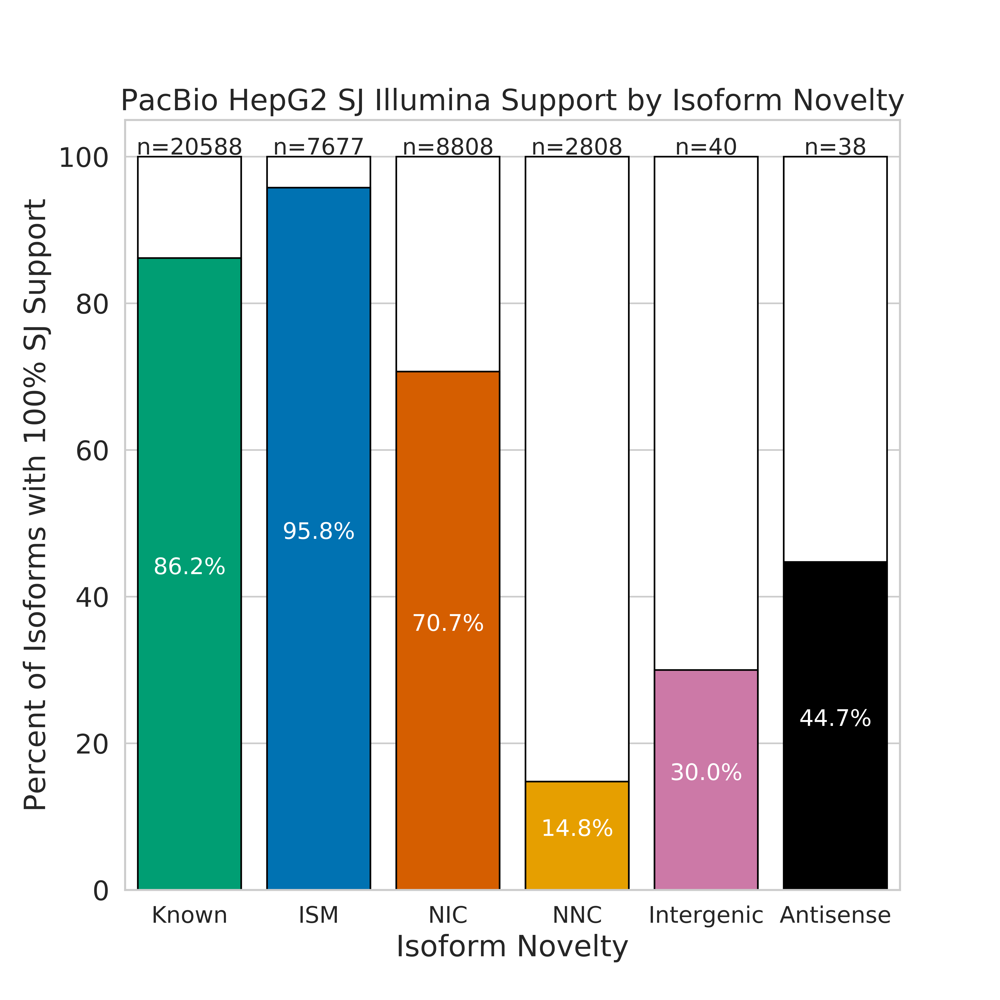
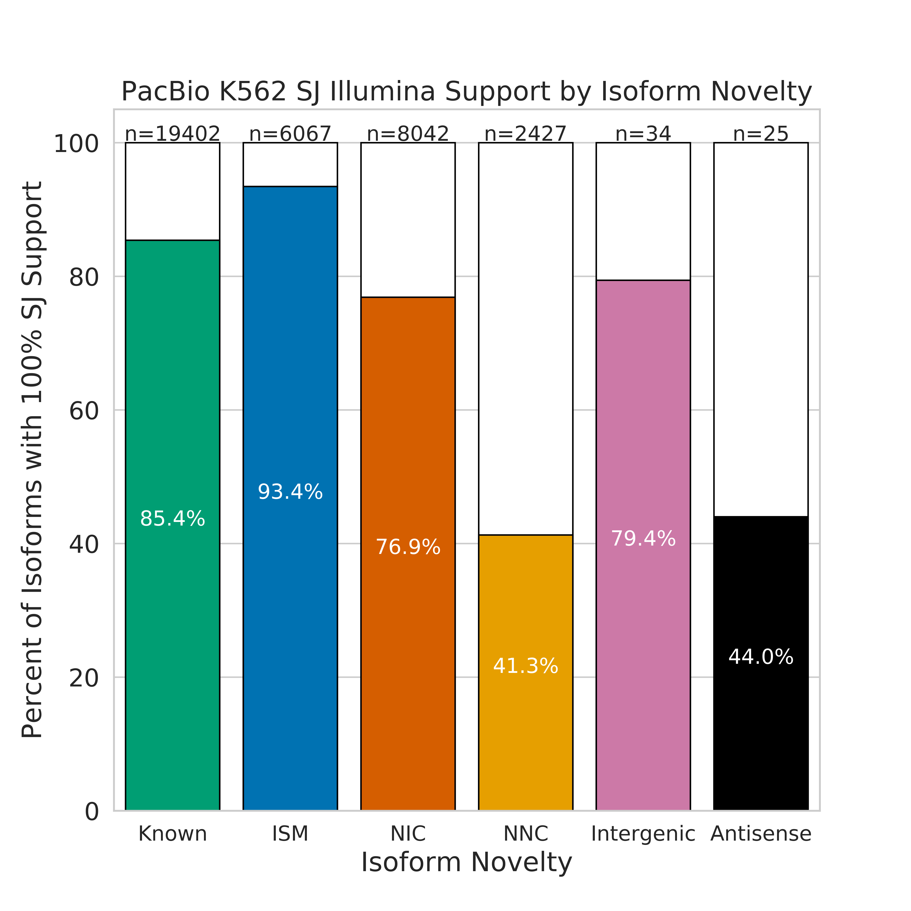
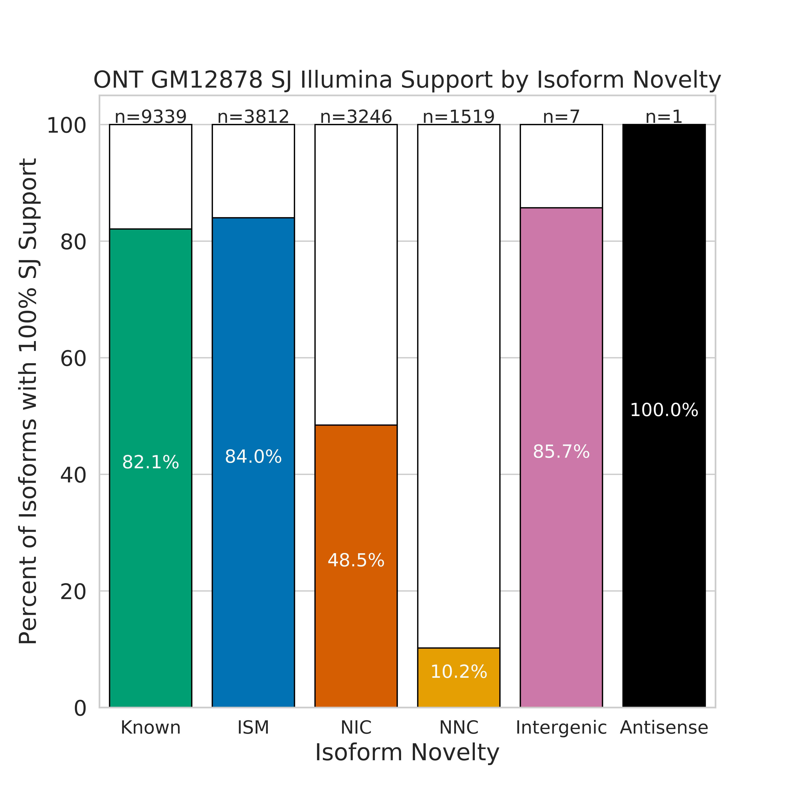
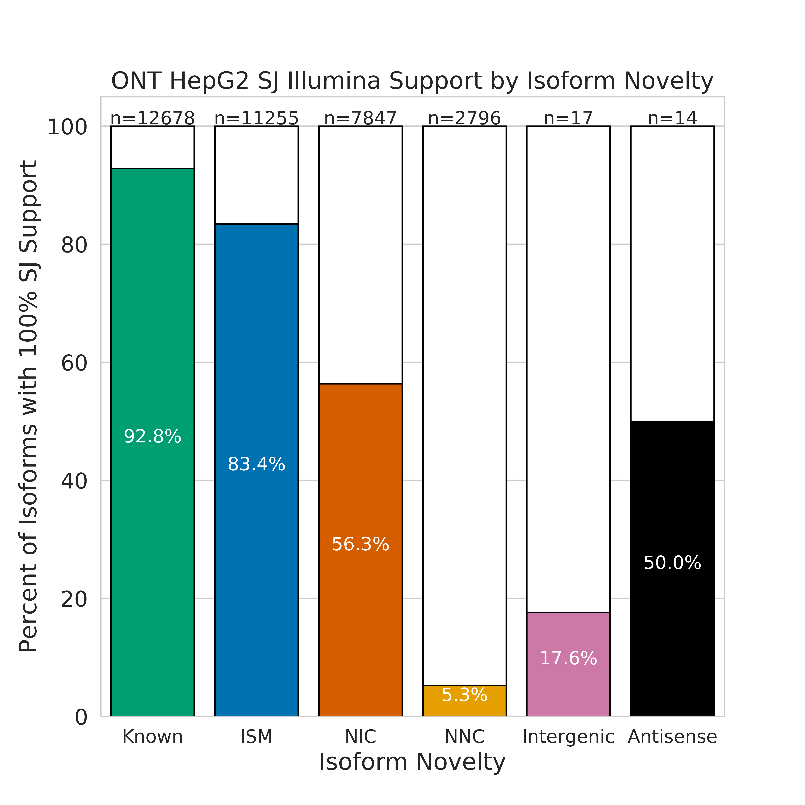
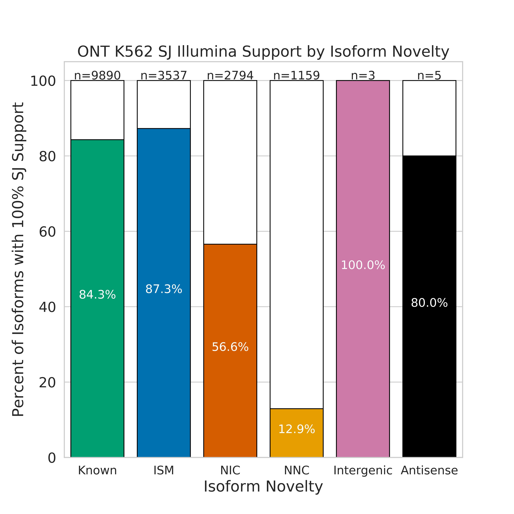

## Illumina/Gencode splice junction support for whole transcripts

We want to determine what the percentage of PacBio TALON transcripts with all of their splice junctions supported by short-read data is. We decided to subset on novelty to provide some more insight. We'll show this step-by-step example for GM12878 first. 

**NOTE** The analyses in this directory are dependent on having created sj files for illumina, pacbio, and ont datasets in https://github.com/dewyman/TALON-paper-2019/tree/master/splicing_analyses/technology_SJ_comparison first, and the first step here https://github.com/dewyman/TALON-paper-2019/tree/master/splicing_analyses/SJ_novelty_analysis, which makes the splice junction file from the GENCODE annotation.

1. Use the GM12878 PacBio GTF and Illumina SJs to see how many transcripts of each category have all of their splice junctions supported by Illumina data.
```bash
mkdir figures

sup_tables=/share/crsp/lab/seyedam/share/TALON_paper_data/revisions_10-19/human_TALON/analysis/supplementary_tables/
gm_gtf=${sup_tables}S2_GM12878_talon_observedOnly.gtf 
ln -s ../technology_SJ_comparison/GM12878_alignedSJ.out.tab GM12878_alignedSJ.out.tab
ln -s ../SJ_novelty_analysis/gencode_v29_sjs.tab gencode_v29_sjs.tab

python get_isoform_sj_support.py \
	-gtf ${gm_gtf} \
	-ref_sj_1 GM12878_alignedSJ.out.tab \
	-ref_sj_2 gencode_v29_sjs.tab \
	-sample pb_GM12878
```

2. Generate a summary table counting how many transcripts in each novelty category are supported by GENCODE or Illumina
```bash
python gen_isoform_support_table.py \
	-csv pb_GM12878_isoform_sj_support.csv \
	-sample pb_GM12878
```

3. Visualize Illumina support vs. isoform novelty type. Keep in mind that a transcript towards having Illumina support must have ALL of its splice junctions supported by the Illumina data.
```bash
python plot_isoform_sj_support_by_novelty.py \
	-c pb_GM12878_isoform_sj_support_summary.csv \
	-s "PacBio GM12878"
```


4. Also run this in HepG2 and K562, as well as on the ONT data.
<!-- TODO add calls other than get_isoform_sj_support -->
```bash
# PacBio HepG2
h_gtf=${sup_tables}S5_HepG2_talon_observedOnly.gtf
ln -s ../technology_SJ_comparison/HepG2_alignedSJ.out.tab HepG2_alignedSJ.out.tab
python get_isoform_sj_support.py \
	-gtf ${h_gtf} \
	-ref_sj_1 HepG2_alignedSJ.out.tab \
	-ref_sj_2 gencode_v29_sjs.tab \
	-sample pb_HepG2

python gen_isoform_support_table.py \
	-csv pb_HepG2_isoform_sj_support.csv \
	-sample pb_HepG2

python plot_isoform_sj_support_by_novelty.py \
	-c pb_HepG2_isoform_sj_support_summary.csv \
	-s "PacBio HepG2"
```



```bash
# PacBio K562
k_gtf=${sup_tables}S8_K562_talon_observedOnly.gtf
ln -s ../technology_SJ_comparison/K562_alignedSJ.out.tab K562_alignedSJ.out.tab
python get_isoform_sj_support.py \
	-gtf ${k_gtf} \
	-ref_sj_1 K562_alignedSJ.out.tab \
	-ref_sj_2 gencode_v29_sjs.tab \
	-sample pb_K562

python gen_isoform_support_table.py \
	-csv pb_K562_isoform_sj_support.csv \
	-sample pb_K562

python plot_isoform_sj_support_by_novelty.py \
	-c pb_K562_isoform_sj_support_summary.csv \
	-s "PacBio K562"
```



```bash
# ONT GM12878
ont_g_gtf=${sup_tables}S18_GM12878_ont_talon_observedOnly.gtf
python get_isoform_sj_support.py \
	-gtf ${ont_g_gtf} \
	-ref_sj_1 GM12878_alignedSJ.out.tab \
	-ref_sj_2 gencode_v29_sjs.tab \
	-sample ont_GM12878

python gen_isoform_support_table.py \
	-csv ont_GM12878_isoform_sj_support.csv \
	-sample ont_GM12878

python plot_isoform_sj_support_by_novelty.py \
	-c ont_GM12878_isoform_sj_support_summary.csv \
	-s "ONT GM12878"
```



```bash
# ONT HepG2
ont_h_gtf=${sup_tables}S21_HepG2_ont_talon_observedOnly.gtf
python get_isoform_sj_support.py \
	-gtf ${ont_h_gtf} \
	-ref_sj_1 HepG2_alignedSJ.out.tab \
	-ref_sj_2 gencode_v29_sjs.tab \
	-sample ont_HepG2

python gen_isoform_support_table.py \
	-csv ont_HepG2_isoform_sj_support.csv \
	-sample ont_HepG2

python plot_isoform_sj_support_by_novelty.py \
	-c ont_HepG2_isoform_sj_support_summary.csv \
	-s "ONT HepG2"
```



```bash
# ONT K562
ont_k_gtf=${sup_tables}S24_K562_ont_talon_observedOnly.gtf
python get_isoform_sj_support.py \
	-gtf ${ont_k_gtf} \
	-ref_sj_1 K562_alignedSJ.out.tab \
	-ref_sj_2 gencode_v29_sjs.tab \
	-sample ont_K562

python gen_isoform_support_table.py \
	-csv ont_K562_isoform_sj_support.csv \
	-sample ont_K562

python plot_isoform_sj_support_by_novelty.py \
	-c ont_K562_isoform_sj_support_summary.csv \
	-s "ONT K562"
```

