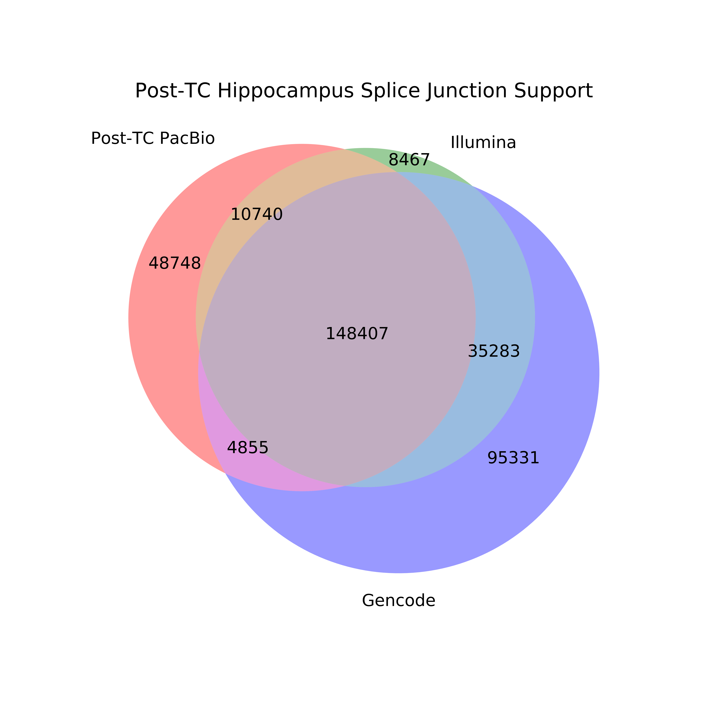
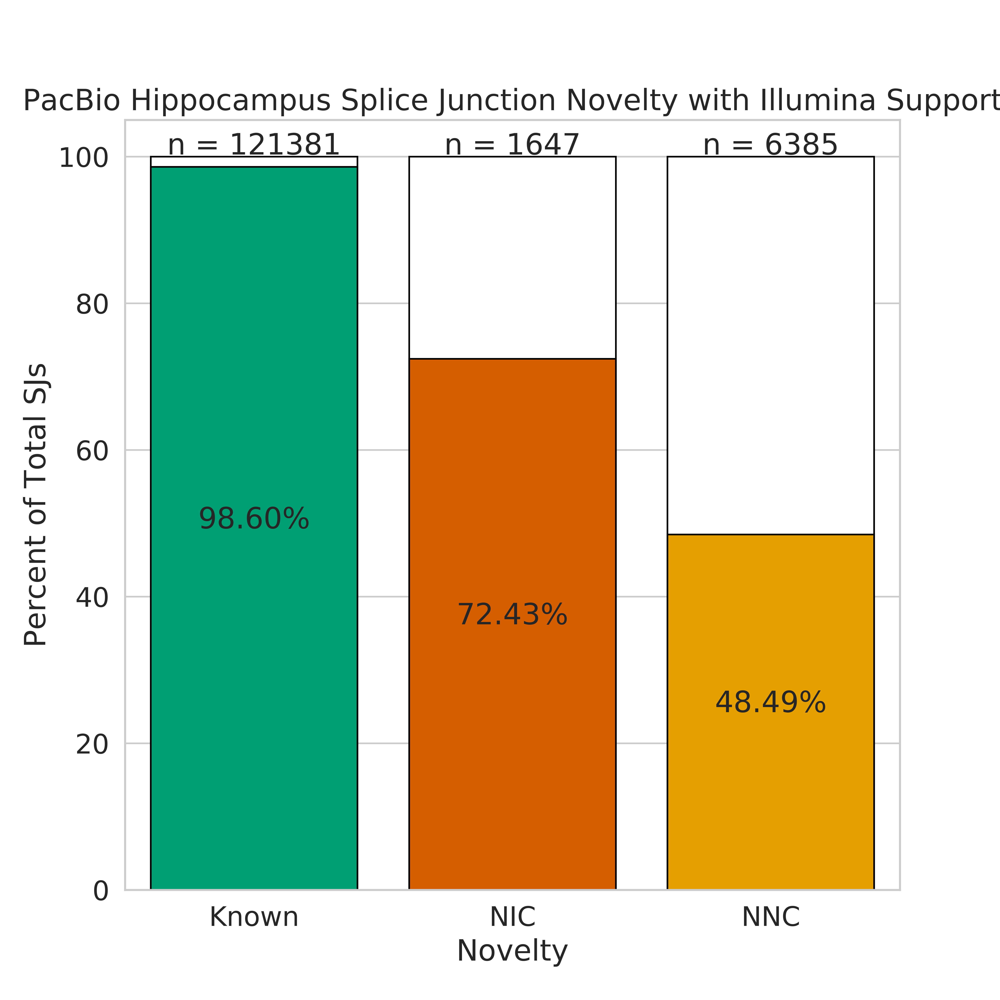

## How do TranscriptClean and TALON affect splice junction support?

We wanted to see how running TranscriptClean and TALON affects whether or not splice junctions are supported by Illumina or Gencode. 

1. Get mouse brain (hippocampus and cortex) Illumina splice junctions by mapping with STAR.
```bash
qsub ../run_STAR_illumina_cortex_Rep1.sh
qsub ../run_STAR_illumina_cortex_Rep2.sh
qsub ../run_STAR_illumina_hippocampus_Rep1.sh
qsub ../run_STAR_illumina_hippocampus_Rep2.sh
```

2. Filter each mouse brain sample as was done with the cell line samples
```bash
python ../filter_illumina_sjs.py \
	-sj_1 cortex_Rep1_alignedSJ.out.tab \
	-sj_2 cortex_Rep2_alignedSJ.out.tab

python ../filter_illumina_sjs.py \
	-sj_1 hippocampus_Rep1_alignedSJ.out.tab \
	-sj_2 hippocampus_Rep2_alignedSJ.out.tab
```

3. Get splice junctions from cortex and hippocampus GTFs (post-TALON SJs)
```bash
REF=~/mortazavi_lab/ref/mm10/mm10.fa
sup_tables=/share/crsp/lab/seyedam/share/TALON_paper_data/revisions_10-19/human_TALON/analysis/supplementary_tables/
ln -s ${sup_tables}S42_cortex_talon_observedOnly.gtf S42_cortex_talon_observedOnly.gtf
ln -s ${sup_tables}S43_hippocampus_talon_observedOnly.gtf S43_hippocampus_talon_observedOnly.gtf

python ../get_SJs_from_gtf.py \
	--f S42_cortex_talon_observedOnly.gtf \
	--g $REF \
	--o pb_post_TALON_cortex_SJs.tab

python ../get_SJs_from_gtf.py \
	--f S43_hippocampus_talon_observedOnly.gtf \
	--g $REF \
	--o pb_post_TALON_hippocampus_SJs.tab
```

4. Get splice junctions from the mouse GENCODE annotation vM21
```bash
ANN=~/mortazavi_lab/ref/gencode.vM21/gencode.vM21.annotation.gtf
python ../get_SJs_from_gtf.py \
	--f $ANN \
	--g $REF \
	--o gencode_vM21_sjs.tab
```

5. Get splice junctions from cortex and hippocampus post-TranscriptClean sam files (post-TC SJs)
```bash
sams=/share/crsp/lab/seyedam/share/TALON_paper_data/post_TranscriptClean/

python ../extract_SJs_from_sam.py \
	--sam ${sams}PacBio/Cortex/cortex_Rep1-Rep2_post-TC.sam \
	--genome $REF \
	--o pb_post_TC_cortex

python ../extract_SJs_from_sam.py \
	--sam ${sams}PacBio/Hippocampus/hippocampus_Rep1-Rep2_post-TC.sam \
	--genome $REF \
	--o pb_post_TC_hippocampus
```

6. Build a venn diagram illustrating splice junction support for those found *before* TALON from GENCODE and Illumina from each sample
```bash
# cortex
python ../compare_sjs_venn_new.py \
	-sj_1 pb_post_TC_cortex_SJs.txt \
	-sj_1_name "Post-TC PacBio" \
	-sj_2 cortex_alignedSJ.out.tab \
	-sj_2_name "Illumina" \
	-sj_3 gencode_vM21_sjs.tab \
	-sj_3_name "Gencode" \
	-sample "Post-TC Cortex"

# hippocampus
python ../compare_sjs_venn_new.py \
	-sj_1 pb_post_TC_hippocampus_SJs.txt \
	-sj_1_name "Post-TC PacBio" \
	-sj_2 hippocampus_alignedSJ.out.tab \
	-sj_2_name "Illumina" \
	-sj_3 gencode_vM21_sjs.tab \
	-sj_3_name "Gencode" \
	-sample "Post-TC Hippocampus"
```




7. Build a venn diagram illustrating splice junction support for those found *after* TALON from gencode and Illumina for each sample
```bash
# cortex
python ../compare_sjs_venn_new.py \
	-sj_1 pb_post_TALON_cortex_SJs.tab \
	-sj_1_name "Post-TALON PacBio" \
	-sj_2 cortex_alignedSJ.out.tab \
	-sj_2_name "Illumina" \
	-sj_3 gencode_vM21_sjs.tab \
	-sj_3_name "Gencode" \
	-sample "Post-TALON Cortex"

# hippocampus
python ../compare_sjs_venn_new.py \
	-sj_1 pb_post_TALON_hippocampus_SJs.tab \
	-sj_1_name "Post-TALON PacBio" \
	-sj_2 hippocampus_alignedSJ.out.tab \
	-sj_2_name "Illumina" \
	-sj_3 gencode_vM21_sjs.tab \
	-sj_3_name "Gencode" \
	-sample "Post-TALON Hippocampus"
```


8. We will also look at support for splice junctions of different splice junction novelty types. First, we'll label each splice junction from the PacBio data with its novelty type.

* **Known junction:** A splice junction with the whole splice junction (splice donor and acceptor) seen in the Gencode annotation
* **NIC junction:** A splice junction where both the splice donor and acceptor individually are in the Gencode annotation, but are never seen together
* **NNC junction:** A splice junction where at least one of the splice donor or acceptor is not present in the Gencode annotation
```bash
python ../label_sj_novelty.py \
	-sj pb_post_TALON_cortex_SJs.tab \
	-ref_sj gencode_vM21_sjs.tab

python ../label_sj_novelty.py \
	-sj pb_post_TALON_hippocampus_SJs.tab \
	-ref_sj gencode_vM21_sjs.tab
```

9. Also determine the novelty of the Illumina splice junctions
```bash
python ../label_sj_novelty.py \
	-sj cortex_alignedSJ.out.tab \
	-ref_sj gencode_vM21_sjs.tab 

python ../label_sj_novelty.py \
	-sj hippocampus_alignedSJ.out.tab \
	-ref_sj gencode_vM21_sjs.tab 
```

10. Now, we'll build the splice junctions by novelty Illumina support bar plots
```bash
python ../plot_sj_novelty_counts.py \
	-sj pb_post_TALON_cortex_SJs_novelty.tab \
	-sample "PacBio Cortex"

python ../plot_sj_novelty_counts.py \
	-sj pb_post_TALON_cortex_SJs_novelty.tab \
	-sample "PacBio Cortex" \
	--extra_support cortex_alignedSJ.out_novelty.tab \
	--support_name Illumina

python ../plot_sj_novelty_counts.py \
	-sj pb_post_TALON_hippocampus_SJs_novelty.tab \
	-sample "PacBio Hippocampus"

python ../plot_sj_novelty_counts.py \
	-sj pb_post_TALON_hippocampus_SJs_novelty.tab \
	-sample "PacBio Hippocampus" \
	--extra_support hippocampus_alignedSJ.out_novelty.tab \
	--support_name Illumina
```




