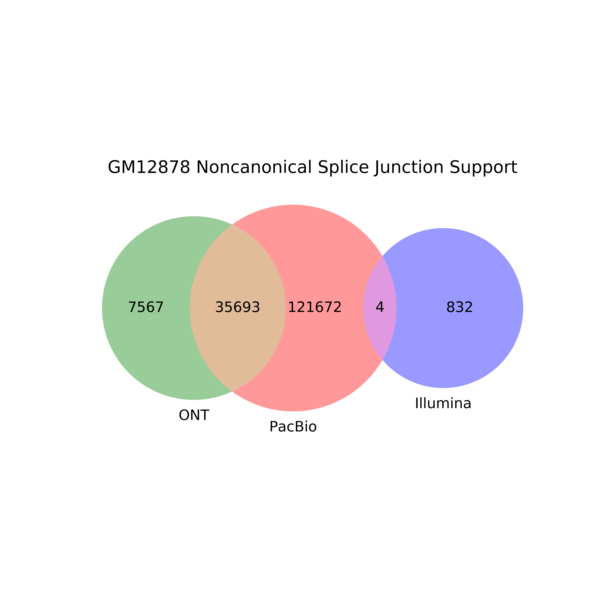

# Analysis of noncanonical splice junctions in GM12878

The goal is to look at the splice junctions in GM12878 long reads before TranscriptClean and examine:
1) Their reproducibility or lack thereof across the PacBio, ONT, and Illumina platforms.

## Data processing

1) Obtain PacBio GM12878 splice junctions (rep1 and 2) in pre-TranscriptClean reads. Note: this is slow when you have a lot of reads.
```
data_dir=/share/crsp/lab/seyedam/share/TALON_paper_data/revisions_10-19/data
cat ${data_dir}/PacBio_GM12878_1/Minimap2/all_mapped_FLNC_noScaff.sam \
    ${data_dir}/PacBio_GM12878_2/Minimap2/all_mapped_FLNC_noScaff.sam \
    | grep -v "^@" > PacBio_GM12878_pre-TC.sam

time python ../../extract_SJs_from_sam.py \
    --sam PacBio_GM12878_pre-TC.sam \
    --genome ../../../refs/hg38/hg38.fa \
    --o PacBio_GM12878_pre-TC

```

2) Obtain ONT GM12878 splice junctions in pre-TranscriptClean reads
```
data_dir=/share/crsp/lab/seyedam/share/TALON_paper_data/revisions_10-19/data
cat ${data_dir}/ONT_GM12878_1/Minimap2/sorted_all_mapped_noScaff.sam \
    ${data_dir}/ONT_GM12878_2/Minimap2/sorted_all_mapped_noScaff.sam \
    | grep -v "^@" > ONT_GM12878_pre-TC.sam


time python ../../extract_SJs_from_sam.py \
    --sam ONT_GM12878_pre-TC.sam \
    --genome ../../../refs/hg38/hg38.fa \
    --o ONT_GM12878_pre-TC
```

3) Use the splice junctions we extracted for Illumina using STAR:
```
/share/crsp/lab/seyedam/share/TALON_paper_data/illumina_sjs/GM12878_alignedSJ.out.tab
```

## Analysis

### Reproducibility

1) Extract only noncanonical SJs from each file:
```
awk '{if($5 == 0) print $0}' PacBio_GM12878_pre-TC_SJs.txt > ncsj_PacBio_GM12878_pre-TC_SJs.txt
awk '{if($5 == 0) print $0}' ONT_GM12878_pre-TC_SJs.txt > ncsj_ONT_GM12878_pre-TC_SJs.txt
awk '{if($5 == 0) print $0}' /share/crsp/lab/seyedam/share/TALON_paper_data/illumina_sjs/GM12878_alignedSJ.out.tab > ncsj_Illumina_GM12878_pre-TC_SJs.txt
```

2) Run comparison across platforms
```
source activate mypython3.7.2
mkdir -p figures
python ../../compare_sjs_venn.py \
        -pb ncsj_PacBio_GM12878_pre-TC_SJs.txt \
	-ont ncsj_ONT_GM12878_pre-TC_SJs.txt \
	-illumina ncsj_Illumina_GM12878_pre-TC_SJs.txt \
	-sample "GM12878 Noncanonical" \
        --log
source deactivate
```


