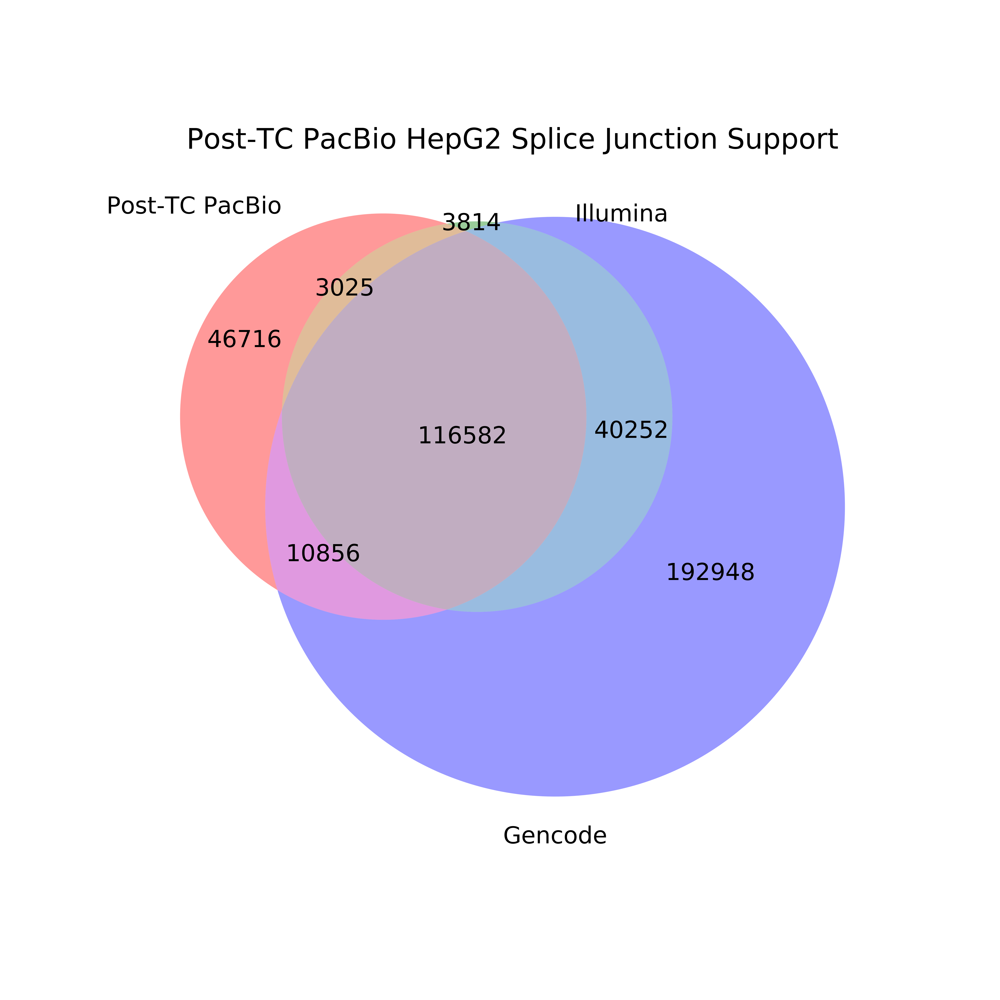

## Examining the effect of TALON and TranscriptClean on proportion of known and novel splice junctions

We want to see what the effect of running TALON has on GENCODE and Illumina support for splice junctions. To do this, we obtain the splice junctions from before and after TALON runs and see how much the corresponding Illumina and GENCODE data supports them.

**NOTE** The analyses in this directory are dependent on having created sj files for illumina, pacbio, and ont datasets in https://github.com/dewyman/TALON-paper-2019/tree/master/splicing_analyses/technology_SJ_comparison first, and the first step here https://github.com/dewyman/TALON-paper-2019/tree/master/splicing_analyses/SJ_novelty_analysis, which makes the splice junction file from the GENCODE annotation.

1. Create pre-TranscriptClean splice junction files for PacBio GM12878 
```bash
mkdir figures
module load samtools
data=/share/crsp/lab/seyedam/share/TALON_paper_data/revisions_10-19/data/
pre_TC=/Minimap2/sorted_all_mapped_FLNC_noScaff.sam
post_TC=/TC_v2.0.2/TC_clean.sam
REF=/data/users/freese/mortazavi_lab/ref/hg38/hg38.fa

rep1=PacBio_GM12878_1
rep2=PacBio_GM12878_2
cat ${data}${rep1}${pre_TC} <(samtools view ${data}${rep2}${pre_TC}) > ${data}${rep1}/${rep1}-${rep2}_preTC.sam
python ../extract_SJs_from_sam.py \
	--sam ${data}${rep1}/${rep1}-${rep2}_preTC.sam \
	--genome $REF \
	--o pb_pre_TC_GM12878
```

2. Create post-TranscriptClean splice junction files for PacBio GM12878
```bash
cat ${data}${rep1}${post_TC} <(samtools view ${data}${rep2}${post_TC}) > ${data}${rep1}/${rep1}-${rep2}_postTC.sam
python ../extract_SJs_from_sam.py \
	--sam ${data}${rep1}/${rep1}-${rep2}_postTC.sam \
	--genome $REF \
	--o pb_post_TC_GM12878
```

3. Visualize how many pre-TranscriptClean splice junctions are supported by Illumina and GENCODE.
```bash
python ../compare_sjs_venn_new.py \
	-sj_1 pb_pre_TC_GM12878_SJs.txt \
	-sj_1_name "Pre-TC PacBio" \
	-sj_2 ../technology_SJ_comparison/GM12878_alignedSJ.out.tab \
	-sj_2_name "Illumina" \
	-sj_3 ../SJ_novelty_analysis/gencode_v29_sjs.tab \
	-sj_3_name "Gencode" \
	-sample "Pre-TC PacBio GM12878"
```


4. Visualize how many splice junctions become supported when we use TranscriptClean to correct them
```bash
python ../compare_sjs_venn_new.py \
	-sj_1 pb_post_TC_GM12878_SJs.txt \
	-sj_1_name "Post-TC PacBio" \
	-sj_2 ../technology_SJ_comparison/GM12878_alignedSJ.out.tab \
	-sj_2_name "Illumina" \
	-sj_3 ../SJ_novelty_analysis/gencode_v29_sjs.tab \
	-sj_3_name "Gencode" \
	-sample "Post-TC PacBio GM12878"
```


5. Finally, we want to see what changes in terms of SJ support when we look at post-TALON SJs.
```bash
python ../compare_sjs_venn_new.py \
	-sj_1 ../technology_SJ_comparison/pb_talon_GM12878_sjs.tab \
	-sj_1_name "Post-TALON PacBio" \
	-sj_2 ../technology_SJ_comparison/GM12878_alignedSJ.out.tab \
	-sj_2_name "Illumina" \
	-sj_3 ../SJ_novelty_analysis/gencode_v29_sjs.tab \
	-sj_3_name "Gencode" \
	-sample "Post-TALON PacBio GM12878"
```


6. Also do this analysis for HepG2 and K562 as well as ONT data.
```bash
# PacBio HepG2
rep1=PacBio_HepG2_1
rep2=PacBio_HepG2_2
cat ${data}${rep1}${pre_TC} <(samtools view ${data}${rep2}${pre_TC}) > ${data}${rep1}/${rep1}-${rep2}_preTC.sam
python ../extract_SJs_from_sam.py \
	--sam ${data}${rep1}/${rep1}-${rep2}_preTC.sam \
	--genome $REF \
	--o pb_pre_TC_HepG2

cat ${data}${rep1}${post_TC} <(samtools view ${data}${rep2}${post_TC}) > ${data}${rep1}/${rep1}-${rep2}_postTC.sam
python ../extract_SJs_from_sam.py \
	--sam ${data}${rep1}/${rep1}-${rep2}_postTC.sam \
	--genome $REF \
	--o pb_pre_TC_HepG2

python ../compare_sjs_venn_new.py \
	-sj_1 pb_pre_TC_HepG2_SJs.txt \
	-sj_1_name "Pre-TC PacBio" \
	-sj_2 ../technology_SJ_comparison/HepG2_alignedSJ.out.tab \
	-sj_2_name "Illumina" \
	-sj_3 ../SJ_novelty_analysis/gencode_v29_sjs.tab \
	-sj_3_name "Gencode" \
	-sample "Pre-TC PacBio HepG2"

python ../compare_sjs_venn_new.py \
	-sj_1 pb_post_TC_HepG2_SJs.txt \
	-sj_1_name "Post-TC PacBio" \
	-sj_2 ../technology_SJ_comparison/HepG2_alignedSJ.out.tab \
	-sj_2_name "Illumina" \
	-sj_3 ../SJ_novelty_analysis/gencode_v29_sjs.tab \
	-sj_3_name "Gencode" \
	-sample "Post-TC PacBio HepG2"

python ../compare_sjs_venn_new.py \
	-sj_1 ../technology_SJ_comparison/pb_talon_HepG2_sjs.tab \
	-sj_1_name "Post-TALON PacBio" \
	-sj_2 ../technology_SJ_comparison/HepG2_alignedSJ.out.tab \
	-sj_2_name "Illumina" \
	-sj_3 ../SJ_novelty_analysis/gencode_v29_sjs.tab \
	-sj_3_name "Gencode" \
	-sample "Post-TALON PacBio HepG2"	
```



```bash
# PacBio K562
rep1=PacBio_K562_1
rep2=PacBio_K562_2
cat ${data}${rep1}${pre_TC} <(samtools view ${data}${rep2}${pre_TC}) > ${data}${rep1}/${rep1}-${rep2}_preTC.sam
python ../extract_SJs_from_sam.py \
	--sam ${data}${rep1}/${rep1}-${rep2}_preTC.sam \
	--genome $REF \
	--o pb_pre_TC_K562

cat ${data}${rep1}${post_TC} <(samtools view ${data}${rep2}${post_TC}) > ${data}${rep1}/${rep1}-${rep2}_postTC.sam
python ../extract_SJs_from_sam.py \
	--sam ${data}${rep1}/${rep1}-${rep2}_postTC.sam \
	--genome $REF \
	--o pb_post_TC_K562

python ../compare_sjs_venn_new.py \
	-sj_1 pb_pre_TC_K562_SJs.txt \
	-sj_1_name "Pre-TC PacBio" \
	-sj_2 ../technology_SJ_comparison/K562_alignedSJ.out.tab \
	-sj_2_name "Illumina" \
	-sj_3 ../SJ_novelty_analysis/gencode_v29_sjs.tab \
	-sj_3_name "Gencode" \
	-sample "Pre-TC PacBio K562"

python ../compare_sjs_venn_new.py \
	-sj_1 pb_post_TC_K562_SJs.txt \
	-sj_1_name "Post-TC PacBio" \
	-sj_2 ../technology_SJ_comparison/K562_alignedSJ.out.tab \
	-sj_2_name "Illumina" \
	-sj_3 ../SJ_novelty_analysis/gencode_v29_sjs.tab \
	-sj_3_name "Gencode" \
	-sample "Post-TC PacBio K562"

python ../compare_sjs_venn_new.py \
	-sj_1 ../technology_SJ_comparison/pb_talon_K562_sjs.tab \
	-sj_1_name "Post-TALON PacBio" \
	-sj_2 ../technology_SJ_comparison/K562_alignedSJ.out.tab \
	-sj_2_name "Illumina" \
	-sj_3 ../SJ_novelty_analysis/gencode_v29_sjs.tab \
	-sj_3_name "Gencode" \
	-sample "Post-TALON PacBio K562"
```


```bash
# ONT GM12878
pre_TC=/Minimap2/sorted_all_mapped_noScaff.sam
rep1=ONT_GM12878_1
rep2=ONT_GM12878_2
cat ${data}${rep1}${pre_TC} <(samtools view ${data}${rep2}${pre_TC}) > ${data}${rep1}/${rep1}-${rep2}_preTC.sam
python ../extract_SJs_from_sam.py \
	--sam ${data}${rep1}/${rep1}-${rep2}_preTC.sam \
	--genome $REF \
	--o ont_pre_TC_GM12878

cat ${data}${rep1}${post_TC} <(samtools view ${data}${rep2}${post_TC}) > ${data}${rep1}/${rep1}-${rep2}_postTC.sam
python ../extract_SJs_from_sam.py \
	--sam ${data}${rep1}/${rep1}-${rep2}_postTC.sam \
	--genome $REF \
	--o ont_post_TC_GM12878

python ../compare_sjs_venn_new.py \
	-sj_1 ont_pre_TC_GM12878_SJs.txt \
	-sj_1_name "Pre-TC ONT" \
	-sj_2 ../technology_SJ_comparison/GM12878_alignedSJ.out.tab \
	-sj_2_name "Illumina" \
	-sj_3 ../SJ_novelty_analysis/gencode_v29_sjs.tab \
	-sj_3_name "Gencode" \
	-sample "Pre-TC ONT GM12878"

python ../compare_sjs_venn_new.py \
	-sj_1 ont_post_TC_GM12878_SJs.txt \
	-sj_1_name "Post-TC ONT" \
	-sj_2 ../technology_SJ_comparison/GM12878_alignedSJ.out.tab \
	-sj_2_name "Illumina" \
	-sj_3 ../SJ_novelty_analysis/gencode_v29_sjs.tab \
	-sj_3_name "Gencode" \
	-sample "Post-TC ONT GM12878"

python ../compare_sjs_venn_new.py \
	-sj_1 ../technology_SJ_comparison/ont_talon_GM12878_sjs.tab \
	-sj_1_name "Post-TALON ONT" \
	-sj_2 ../technology_SJ_comparison/GM12878_alignedSJ.out.tab \
	-sj_2_name "Illumina" \
	-sj_3 ../SJ_novelty_analysis/gencode_v29_sjs.tab \
	-sj_3_name "Gencode" \
	-sample "Post-TALON ONT GM12878"
```


```bash
# ONT HepG2
pre_TC=/Minimap2/sorted_all_mapped_noScaff.sam
rep1=ONT_HepG2_1
rep2=ONT_HepG2_2
cat ${data}${rep1}${pre_TC} <(samtools view ${data}${rep2}${pre_TC}) > ${data}${rep1}/${rep1}-${rep2}_preTC.sam
python ../extract_SJs_from_sam.py \
	--sam ${data}${rep1}/${rep1}-${rep2}_preTC.sam \
	--genome $REF \
	--o ont_pre_TC_HepG2

cat ${data}${rep1}${post_TC} <(samtools view ${data}${rep2}${post_TC}) > ${data}${rep1}/${rep1}-${rep2}_postTC.sam
python ../extract_SJs_from_sam.py \
	--sam ${data}${rep1}/${rep1}-${rep2}_postTC.sam \
	--genome $REF \
	--o ont_post_TC_HepG2

python ../compare_sjs_venn_new.py \
	-sj_1 ont_pre_TC_HepG2_SJs.txt \
	-sj_1_name "Pre-TC ONT" \
	-sj_2 ../technology_SJ_comparison/HepG2_alignedSJ.out.tab \
	-sj_2_name "Illumina" \
	-sj_3 ../SJ_novelty_analysis/gencode_v29_sjs.tab \
	-sj_3_name "Gencode" \
	-sample "Pre-TC ONT HepG2"

python ../compare_sjs_venn_new.py \
	-sj_1 ont_post_TC_HepG2_SJs.txt \
	-sj_1_name "Post-TC ONT" \
	-sj_2 ../technology_SJ_comparison/HepG2_alignedSJ.out.tab \
	-sj_2_name "Illumina" \
	-sj_3 ../SJ_novelty_analysis/gencode_v29_sjs.tab \
	-sj_3_name "Gencode" \
	-sample "Post-TC ONT HepG2"

python ../compare_sjs_venn_new.py \
	-sj_1 ../technology_SJ_comparison/ont_talon_HepG2_sjs.tab \
	-sj_1_name "Post-TALON ONT" \
	-sj_2 ../technology_SJ_comparison/HepG2_alignedSJ.out.tab \
	-sj_2_name "Illumina" \
	-sj_3 ../SJ_novelty_analysis/gencode_v29_sjs.tab \
	-sj_3_name "Gencode" \
	-sample "Post-TALON ONT HepG2"
```


```bash
# ONT K562
pre_TC=/Minimap2/sorted_all_mapped_noScaff.sam
rep1=ONT_K562_1
rep2=ONT_K562_2
cat ${data}${rep1}${pre_TC} <(samtools view ${data}${rep2}${pre_TC}) > ${data}${rep1}/${rep1}-${rep2}_preTC.sam
python ../extract_SJs_from_sam.py \
	--sam ${data}${rep1}/${rep1}-${rep2}_preTC.sam \
	--genome $REF \
	--o ont_pre_TC_K562

cat ${data}${rep1}${post_TC} <(samtools view ${data}${rep2}${post_TC}) > ${data}${rep1}/${rep1}-${rep2}_postTC.sam
python ../extract_SJs_from_sam.py \
	--sam ${data}${rep1}/${rep1}-${rep2}_postTC.sam \
	--genome $REF \
	--o ont_post_TC_K562

python ../compare_sjs_venn_new.py \
	-sj_1 ont_pre_TC_K562_SJs.txt \
	-sj_1_name "Pre-TC ONT" \
	-sj_2 ../technology_SJ_comparison/K562_alignedSJ.out.tab \
	-sj_2_name "Illumina" \
	-sj_3 ../SJ_novelty_analysis/gencode_v29_sjs.tab \
	-sj_3_name "Gencode" \
	-sample "Pre-TC ONT K562"

python ../compare_sjs_venn_new.py \
	-sj_1 ont_post_TC_K562_SJs.txt \
	-sj_1_name "Post-TC ONT" \
	-sj_2 ../technology_SJ_comparison/K562_alignedSJ.out.tab \
	-sj_2_name "Illumina" \
	-sj_3 ../SJ_novelty_analysis/gencode_v29_sjs.tab \
	-sj_3_name "Gencode" \
	-sample "Post-TC ONT K562"

python ../compare_sjs_venn_new.py \
	-sj_1 ../technology_SJ_comparison/ont_talon_K562_sjs.tab \
	-sj_1_name "Post-TALON ONT" \
	-sj_2 ../technology_SJ_comparison/K562_alignedSJ.out.tab \
	-sj_2_name "Illumina" \
	-sj_3 ../SJ_novelty_analysis/gencode_v29_sjs.tab \
	-sj_3_name "Gencode" \
	-sample "Post-TALON ONT K562"
```


