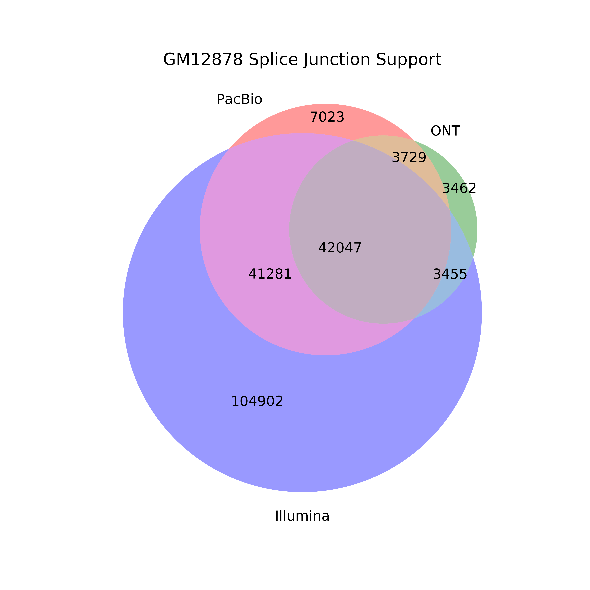

## Technology (PacBio vs. ONT vs. Illumina) splice junction comparison

1. Get the tables from the supplemental tables file that we'll be using, and set other paths that we'll be using (to the hg38 reference genome).
```bash
mkdir figures

# download the supplementary tables and change this path!
sup_tables=/share/crsp/lab/seyedam/share/TALON_paper_data/revisions_10-19/human_TALON/analysis/supplementary_tables/

gm_pb_gtf=${sup_tables}S2_GM12878_talon_observedOnly.gtf
gm_ont_gtf=${sup_tables}S18_GM12878_ont_talon_observedOnly.gtf

REFPATH=~/mortazavi_lab/ref/hg38/
```

2. Extract splice junctionss from GM12878 PacBio and ONT gtfs using TranscriptClean
```bash
python ../get_SJs_from_gtf.py \
	--f ${gm_pb_gtf} \
	--g ${REFPATH}hg38.fa \
	--o pb_talon_GM12878_sjs.tab

python ../get_SJs_from_gtf.py \
	--f ${gm_ont_gtf} \
	--g ${REFPATH}hg38.fa \
	--o ont_talon_GM12878_sjs.tab
```

3. Now, let's get the splice junctions present in the Illumina data by mapping with STAR. 
```bash
qsub run_STAR_illumina_GM12878_Rep1.sh
qsub run_STAR_illumina_GM12878_Rep2.sh
```

4. Filter out novel Illumina SJs that don't have support from both reps and known Illumina SJs that have no read support.
```bash
python ../filter_illumina_sjs.py \
	-sj_1 GM12878_Rep1_alignedSJ.out.tab \
	-sj_2 GM12878_Rep2_alignedSJ.out.tab 
```

5. Create a venn diagram demonstrating which splice junctions are present in which dataset.
```bash
python ../compare_sjs_venn.py \
	-pb pb_talon_GM12878_sjs.tab \
	-ont ont_talon_GM12878_sjs.tab \
	-illumina GM12878_alignedSJ.out.tab \
	-sample GM12878
```

6. We also ran the above analysis for the other 2 cell lines:
 ```bash
# HepG2 
h_pb_gtf=${sup_tables}S5_HepG2_talon_observedOnly.gtf
h_ont_gtf=${sup_tables}S21_HepG2_ont_talon_observedOnly.gtf

python ../get_SJs_from_gtf.py \
	--f ${h_pb_gtf} \
	--g ${REFPATH}hg38.fa \
	--o pb_talon_HepG2_sjs.tab

python ../get_SJs_from_gtf.py \
	--f ${h_ont_gtf} \
	--g ${REFPATH}hg38.fa \
	--o ont_talon_HepG2_sjs.tab

qsub run_STAR_illumina_HepG2_Rep1.sh
qsub run_STAR_illumina_HepG2_Rep2.sh

python ../filter_illumina_sjs.py \
	-sj_1 HepG2_Rep1_alignedSJ.out.tab \
	-sj_2 HepG2_Rep2_alignedSJ.out.tab 

python ../compare_sjs_venn.py \
	-pb pb_talon_HepG2_sjs.tab \
	-ont ont_talon_HepG2_sjs.tab \
	-illumina HepG2_alignedSJ.out.tab \
	-sample HepG2
```

```bash
# K562 
k_pb_gtf=${sup_tables}S8_K562_talon_observedOnly.gtf
k_ont_gtf=${sup_tables}S24_K562_ont_talon_observedOnly.gtf

python ../get_SJs_from_gtf.py \
	--f ${k_pb_gtf} \
	--g ${REFPATH}hg38.fa \
	--o pb_talon_K562_sjs.tab

python ../get_SJs_from_gtf.py \
	--f ${k_ont_gtf} \
	--g ${REFPATH}hg38.fa \
	--o ont_talon_K562_sjs.tab

qsub run_STAR_illumina_K562_Rep1.sh
qsub run_STAR_illumina_K562_Rep2.sh

python ../filter_illumina_sjs.py \
	-sj_1 K562_Rep1_alignedSJ.out.tab \
	-sj_2 K562_Rep2_alignedSJ.out.tab 

python ../compare_sjs_venn.py \
	-pb pb_talon_K562_sjs.tab \
	-ont ont_talon_K562_sjs.tab \
	-illumina K562_alignedSJ.out.tab \
	-sample K562 
 ```

Here are the results for each of the comparisons: 

   
